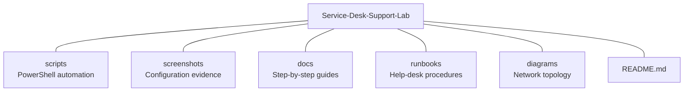
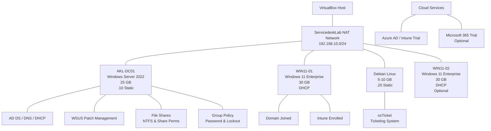

# Service Desk Support Lab

-green?logo=opensourceinitiative&logoColor=white)

Author: Emilio Mardones

---

## About the lab

This is a hands-on lab that simulates the IT infrastructure you'd find inside a real company. I built it to practise the kind of work a service desk analyst does every day. Once you set up your lab, you will be ready to start managing users, resetting passwords, fixing access issues, implement group policies, do patch management, and manage ticketing services. Everything runs using VirtualBox and free or open-source tools.

---

## Who is this lab for?

Anyone who wants to break into IT support, sharpen their Active Directory skills, or build a portfolio that proves they can actually do the job. By the end you'll have touched nearly every core technology a Level 1 or Level 2 service desk role expects.

---

## Learning path

- Installing Windows Server and promoting it to a Domain Controller
- Configuring DNS and DHCP so your network actually works
- Structuring Active Directory with OUs, Security Groups, and real user accounts
- Everyday help-desk tickets: password resets, account unlocks, onboarding, offboarding, department transfers
- NTFS permissions and shared folders — the right people get in, the wrong ones don't
- PowerShell scripts that automate the boring stuff
- Writing runbooks someone else could follow
- Using a ticketing system to log and track issues properly
- WSUS for patch management to keep servers and workstations up to date
- Enrolling devices into Microsoft Intune for modern device management

---

## Lab Architecture

| VM | OS | Hostname | IP | Role |
|---|---|---|---|---|
| 1 | Windows Server 2022 | AKL-DC01 | 192.168.10.10 | Domain Controller, DNS, DHCP, WSUS |
| 2 | Windows 11 Enterprise | WIN11-01 | DHCP | Domain-joined client |
| 3 | Windows 11 Enterprise (optional) | WIN11-02 | DHCP | Domain-joined client |
| 4 | Debian Linux | Debian-SRV | 192.168.10.20 | osTicket ticketing system |

NOTE: we are using Windows 11 instead of Windows 10 because expired October 2025. I want you to use current software to be familiar with rather than using legacy. Be aware that some companies stiull rely on legacy software these days.

---

## Repository Structure

---

## Documentation

- [Lab Environment Setup](docs/00-lab-environment.md)
- [Initial Server Setup](docs/01-initial-server-setup.md)
- [Active Directory Setup](docs/02-active-directory-setup.md)
- [DHCP Configuration](docs/03-dhcp-configuration.md)
- [Organisational Units](docs/04-organisational-units.md)
- [Groups and Users](docs/05-groups-and-users.md)
- more to come

## PowerShell Scripts

| Script | Purpose |
|---|---|
| [01-configure-static-ip.ps1](scripts/01-configure-static-ip.ps1) | Set static IP and DNS on DC01 |
| [02-install-ad-ds.ps1](scripts/02-install-ad-ds.ps1) | Install AD DS, DNS, DHCP roles |
| [03-promote-dc.ps1](scripts/03-promote-dc.ps1) | Promote server to Domain Controller |
| [04-verify-domain.ps1](scripts/04-verify-domain.ps1) | Post-promotion verification checks |
| [05-configure-dhcp.ps1](scripts/05-configure-dhcp.ps1) | Configure DHCP scope and options |
| [06-create-ous.ps1](scripts/06-create-ous.ps1) | Create Organisational Units |
| [07-create-groups.ps1](scripts/07-create-groups.ps1) | Create Security Groups |
| [08-create-users.ps1](scripts/08-create-users.ps1) | Create 15 users across 3 departments |

## Final Lab Environment Overview

