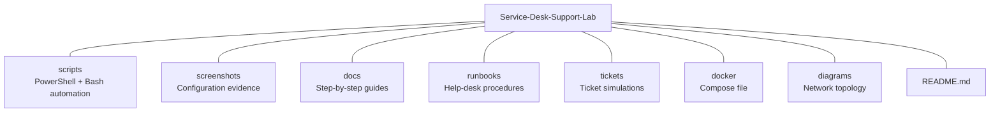
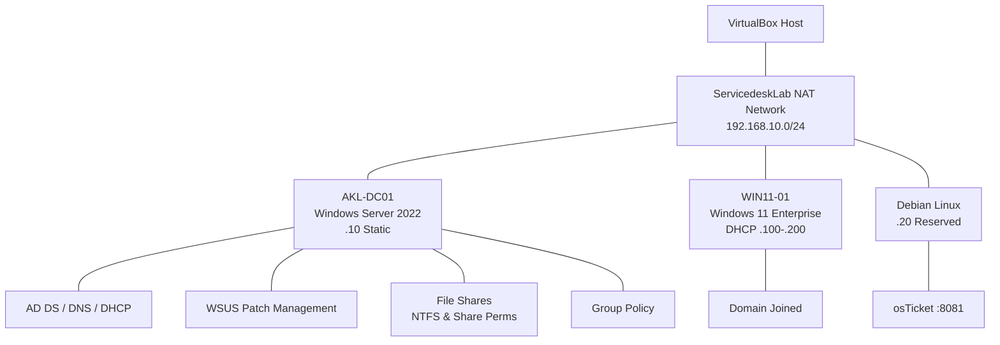

# Service Desk Support Lab 2026

-green?logo=opensourceinitiative&logoColor=white)

Author: Emilio Mardones

Kia ora,
Welcome to my Service Desk Support lab! 

---

## About the lab

This is a hands-on lab that simulates the IT infrastructure you'd find inside a real company. I built it to practise the kind of work a service desk analyst does every day. Once you set up your lab, you will be ready to start managing users, resetting passwords, fixing access issues, implement group policies, do patch management, and manage ticketing services. Everything runs using VirtualBox and free or open-source tools.

---

## Who is this lab for?

Anyone who wants to break into IT support, sharpen their Active Directory skills, or build a portfolio that proves they can actually do the job. By the end you'll have touched nearly every core technology a Level 1 or Level 2 service desk role expects.

---

## Learning path

- Installing Windows Server and promoting it to a Domain Controller
- Configuring DNS and DHCP so your network actually works
- Structuring Active Directory with OUs, Security Groups, and real user accounts
- Everyday help-desk tickets: password resets, account unlocks, onboarding, offboarding, department transfers
- NTFS permissions and shared folders — the right people get in, the wrong ones don't
- PowerShell scripts that automate the boring stuff
- Writing runbooks someone else could follow
- Using a ticketing system to log and track issues properly
- WSUS for patch management to keep servers and workstations up to date
- Enrolling devices into Microsoft Intune for modern device management

---

## Lab Architecture

| VM | OS | Hostname | IP | Role |
|---|---|---|---|---|
| 1 | Windows Server 2022 | AKL-DC01 | 192.168.10.10 | Domain Controller, DNS, DHCP, WSUS |
| 2 | Windows 11 Enterprise | WIN11-01 | DHCP (192.168.10.100–200) | Domain-joined client |
| 3 | Debian Linux | Debian-SRV | 192.168.10.20 (reserved) | osTicket ticketing system |

NOTE: This lab uses Windows 11 instead of Windows 10, since Windows 10 reached end of support in October 2025. The goal is to stay current rather than rely on legacy software — though be aware many companies still run legacy systems in production.

---

## Repository Structure

Note: This is subject to changes

---

## Documentation

- [Lab Environment Setup](docs/00-lab-environment.md)
- [Initial Server Setup](docs/01-initial-server-setup.md)
- [Active Directory Setup](docs/02-active-directory-setup.md)
- [DHCP Configuration](docs/03-dhcp-configuration.md)
- [Organisational Units](docs/04-organisational-units.md)
- [Groups and Users](docs/05-groups-and-users.md)
- [Domain join for WIN11-01 Virtual Machine](docs/06-domain-join-WIN11-01.md)
- [Implementing basic group policies](docs/07-group-policy.md)
- [Setting Logon hours restrictions for a single user](docs/08-logon-hours-restrictions.md)
- [WSUS Patch Management Setup](docs/09-wsus-setup.md)
- [osTicket Ticketing System Setup](docs/10-osticket-setup.md)
- [osTicket Configuration – Agents, Users, SLAs & Email](docs/11-osticket-configuration.md)
- Runbooks (coming soon)

## PowerShell Scripts

| Script | Purpose |
|---|---|
| [01-configure-static-ip.ps1](scripts/01-configure-static-ip.ps1) | Set static IP and DNS on DC01 |
| [02-install-ad-ds.ps1](scripts/02-install-ad-ds.ps1) | Install AD DS, DNS, DHCP roles |
| [03-promote-dc.ps1](scripts/03-promote-dc.ps1) | Promote server to Domain Controller |
| [04-verify-domain.ps1](scripts/04-verify-domain.ps1) | Post-promotion verification checks |
| [05-configure-dhcp.ps1](scripts/05-configure-dhcp.ps1) | Configure DHCP scope and options |
| [06-create-ous.ps1](scripts/06-create-ous.ps1) | Create Organisational Units |
| [07-create-groups.ps1](scripts/07-create-groups.ps1) | Create Security Groups |
| [08-create-users.ps1](scripts/08-create-users.ps1) | Create 15 users across 3 departments |
| [09-join-domain.ps1](scripts/09-join-domain.ps1) | Joining WIN11=01 VM to the Server Domain | 
| [10-move-computer.ps1](scripts/10-move-computer.ps1) | Move computer to Workstations OU |
| [11-create-password-policy.ps1](scripts/11-create-password-policy.ps1) | Create and link Password Policy GPO |
| [12-create-lockout-policy.ps1](scripts/12-create-lockout-policy.ps1) | Create and link Account Lockout Policy GPO |
| [13-create-sales-share.ps1](scripts/13-create-sales-share.ps1) | Create Sales shared folder |
| [14-link-sales-drive-gpo.ps1](scripts/14-link-sales-drive-gpo.ps1) | Link Sales Drive Mapping GPO to Sales OU |
| [15-set-logon-hours.ps1](scripts/15-set-logon-hours.ps1) | Set logon hours for a single user |
| [16-set-department-logon-hours.ps1](scripts/16-set-department-logon-hours.ps1) | Bulk logon hours per department (reference) |
| [17-install-wsus.ps1](scripts/17-install-wsus.ps1) | Install WSUS role |
| [18-create-wsus-gpo.ps1](scripts/18-create-wsus-gpo.ps1) | Create WSUS client GPO |
| [18-create-wsus-gpo-(alternative).ps1](scripts/18-create-wsus-gpo-(alternative).ps1) | Create WSUS client GPO (GUI alternative) |
| [19-wsus-sync-bottleneck-fix.ps1](scripts/19-wsus-sync-bottleneck-fix.ps1) | Fix frozen WSUS sync and database deadlocks |
| [20-network-restoration-script.ps1](scripts/20-network-restoration-script.ps1) | Restore static IP after NAT switch |
| [23-setup-support-dns.sh](scripts/23-setup-support-dns.ps1) | Create DNS record for support.servicedesk.lab |
| [24-osticket-healthcheck-DC01Server.ps1](scripts/24-osticket-healthcheck-DC01Server.ps1) | Domain-side osTicket health check (DNS + port + HTTP) |

---

## Bash Scripts (Debian)

| Script | Purpose |
|---|---|
| [21-debian-network.sh](scripts/21-debian-network.sh) | Debian network setup reference |
| [22-osticket-docker-setup.sh](scripts/22-osticket-docker-setup.sh) | Automated osTicket Docker deployment |
| [25-osticket-healthcheck-Debian.sh](scripts/25-osticket-healthcheck-Debian.sh) | Debian-side osTicket health check (containers + DB + HTTP) |

---

## Help-Desk Ticket Simulations

Each ticket is a real request logged in osTicket, worked on the domain by the service desk analyst (Hiroshi Tanaka), then resolved and documented with evidence.

| Ticket | Scenario | Status |
|---|---|---|
| [001 – Onboarding](tickets/ticket-001-onboarding.md) | Create AD account for a new Sales hire | ✅ Resolved |
| [002 – Password Reset](tickets/ticket-002-password-reset.md) | Reset a user's forgotten password | ✅ Resolved |
| [003 – Account Unlock](tickets/ticket-003-account-unlock.md) | Unlock a locked-out account | ✅ Resolved |
| 004 – Department Transfer | Move a user between departments | 🔜 |
| 005 – Offboarding | Disable and archive a leaver's account | 🔜 |
| 006 – Shared Folder Access | Diagnose and fix NTFS/share permissions | 🔜 |
| 007 – Bulk Logon Hours | Apply department-wide logon restrictions | 🔜 |
| 008 – WSUS Patch Compliance | Approve and verify updates | 🔜 |
| 010 – Software Deployment | Deploy software via Group Policy | 🔜 |

---

## Final Lab Environment Overview

