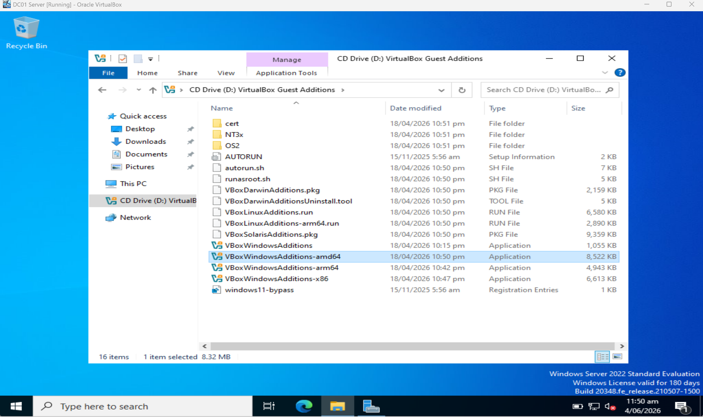
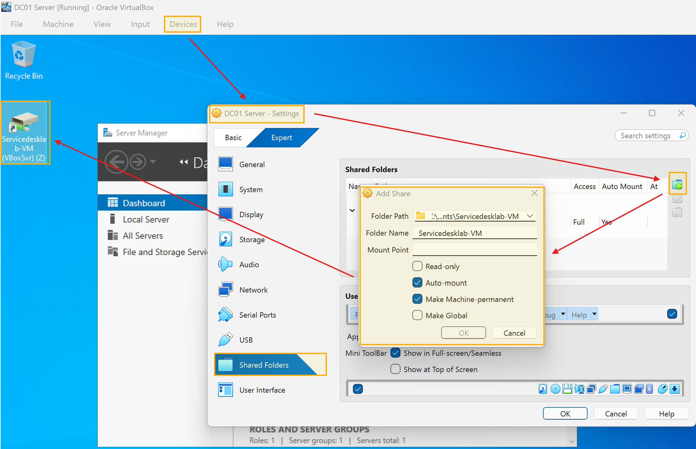
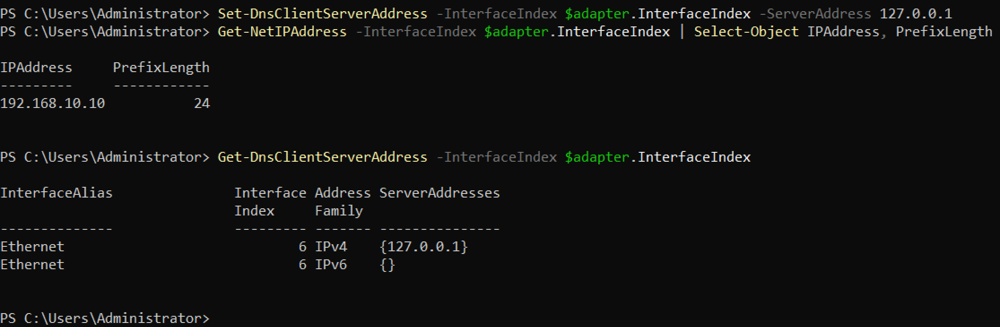
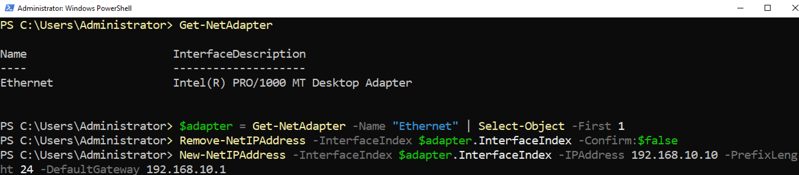
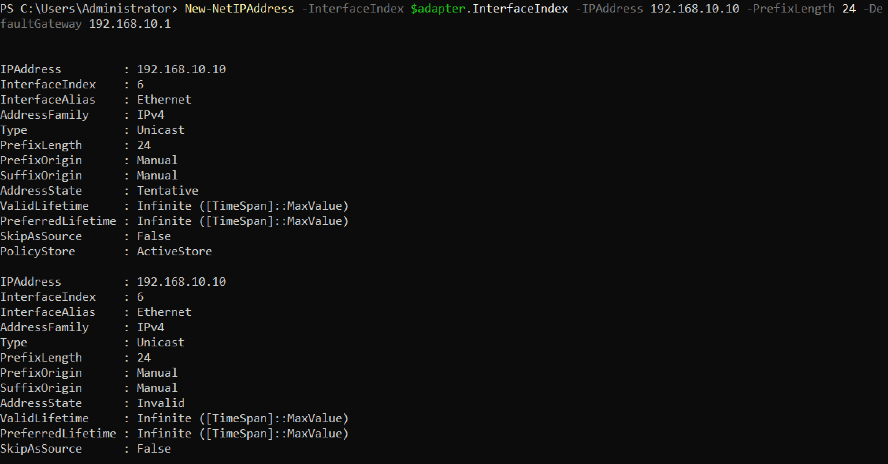

# Initial Server Setup

## Server Details
- **Hostname:** AKL-DC01
- **OS:** Windows Server 2022
- **Role:** Domain Controller
- **Static IP:** 192.168.10.10/24
- **Gateway:** 192.168.10.1
- **DNS:** 127.0.0.1

## Steps Performed

### Guest Additions
- Installed VirtualBox Guest Additions for mouse integration and clipboard sharing.
- Created a shared folder with host machine.




### Network Configuration
- Set static IP: `192.168.10.10`
- Configured DNS to point to localhost (127.0.0.1)
- This ensures the server uses itself for DNS after AD DS installation.





## Commands Used

```powershell
# Set static IP
New-NetIPAddress -InterfaceIndex 4 -IPAddress 192.168.10.10 -PrefixLength 24 -DefaultGateway 192.168.10.1

# Set DNS
Set-DnsClientServerAddress -InterfaceIndex 4 -ServerAddresses 127.0.0.1
