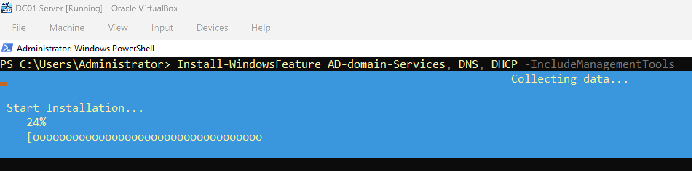
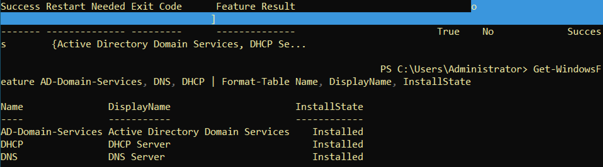
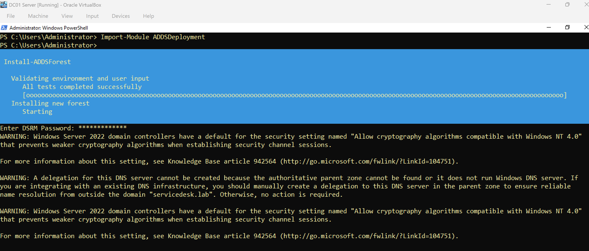
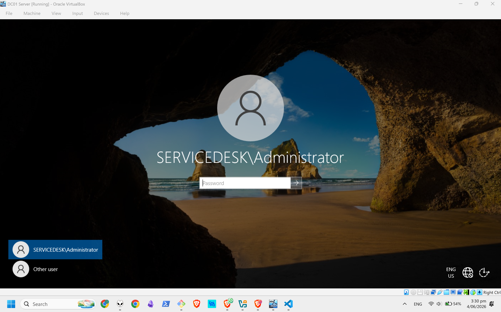
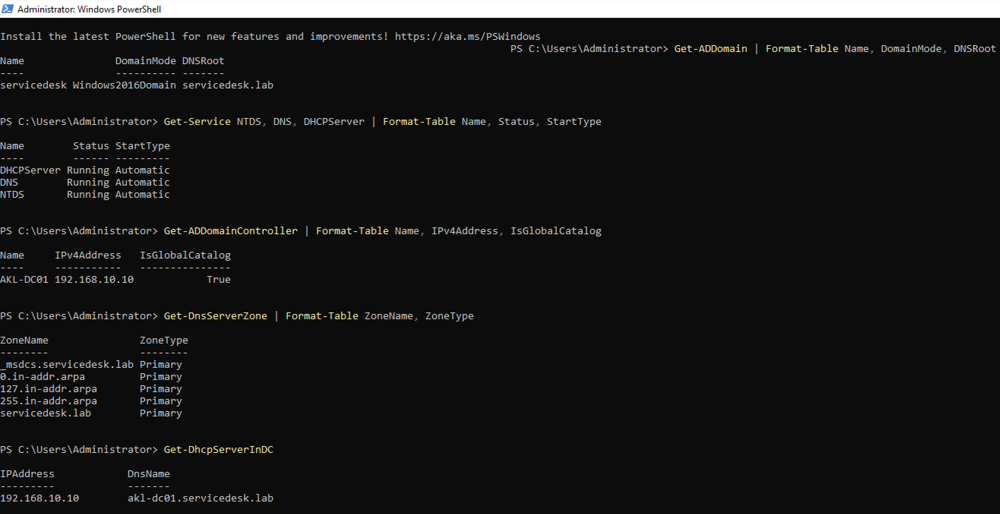

# Active Directory Domain Services Setup

## Domain Information
- **Domain:** servicedesk.lab
- **NetBIOS Name:** SERVICEDESK
- **Domain Controller:** AKL-DC01
- **IP Address:** 192.168.10.10
- **Functional Level:** Windows Server 2016 (WinThreshold)

---

## Step 1: Install Roles

### Command

```powershell
Install-WindowsFeature AD-Domain-Services, DNS, DHCP -IncludeManagementTools
```



### Verification

```powershell
Get-WindowsFeature AD-Domain-Services, DNS, DHCP | Format-Table Name, DisplayName, InstallState

# Expected: All three roles show Installed.
```



---

## Step 2: Promote to Domain Controller

### Command

```powershell
Import-Module ADDSDeployment

Install-ADDSForest `
    -DomainName "servicedesk.lab" `
    -DomainNetbiosName "SERVICEDESK" `
    -ForestMode "WinThreshold" `
    -DomainMode "WinThreshold" `
    -InstallDns:$true `
    -CreateDnsDelegation:$false `
    -SafeModeAdministratorPassword (Read-Host "Enter DSRM Password" -AsSecureString) `
    -Force:$true
```


Server restarts automatically after promotion.

### Post-Reboot Login
- Username: SERVICEDESK\Administrator
- Password: Original Administrator password (not DSRM)



---

## Step 3: Post-Promotion Verification

### Core Services

```powershell
Get-Service NTDS, DNS, DHCPServer | Format-Table Name, Status, StartType

# Expected: All three services show Running.
```
### Domain Information

```powershell
Get-ADDomain | Format-Table Name, DomainMode, Forest, DNSRoot

Expected: Name = servicedesk.lab, DomainMode = Windows2016Domain.
```

### Domain Controller

```powershell
Get-ADDomainController | Format-Table Name, Site, IPv4Address, IsGlobalCatalog

Expected: Name = AKL-DC01, IPv4Address = 192.168.10.10, IsGlobalCatalog = True.
```

### DNS Zones

```powershell
Get-DnsServerZone | Format-Table ZoneName, ZoneType

Expected: servicedesk.lab with ZoneType Primary.
```

### DHCP Server Status

```powershell
Get-DhcpServerInDC
```



## Scripts
- [Install AD DS Roles](../scripts/02-install-ad-ds.ps1)
- [Promote Domain Controller](../scripts/03-promote-dc.ps1)
- [Verify Domain](../scripts/04-verify-domain.ps1)

## Next Steps
Proceed to [DHCP Configuration](03-dhcp-configuration.md)