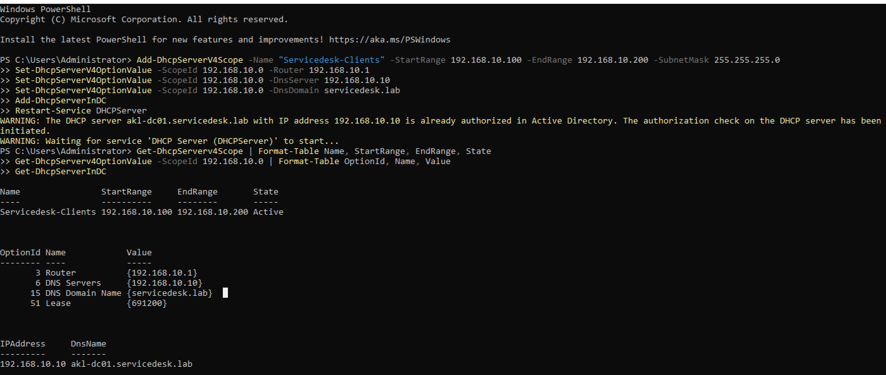

# DHCP Configuration

## Scope Details
You can use your own. These were my personal preferences:

- **Scope Name:** Servicedesk-Clients
- **IP Range:** 192.168.10.100 - 192.168.10.200
- **Subnet Mask:** 255.255.255.0 (/24)
- **Lease Duration:** 8 days
- **Default Gateway:** 192.168.10.1
- **DNS Server:** 192.168.10.10
- **DNS Domain Name:** servicedesk.lab

---

## Configuration Commands

### Create Scope

```powershell
Add-DhcpServerV4Scope `
    -Name "Servicedesk-Clients" `
    -StartRange 192.168.10.100 `
    -EndRange 192.168.10.200 `
    -SubnetMask 255.255.255.0 `
    -LeaseDuration 8.00:00:00
```

### Set Scope Options

```powershell
Set-DhcpServerV4OptionValue -ScopeId 192.168.10.0 -Router 192.168.10.1
Set-DhcpServerV4OptionValue -ScopeId 192.168.10.0 -DnsServer 192.168.10.10
Set-DhcpServerV4OptionValue -ScopeId 192.168.10.0 -DnsDomain servicedesk.lab
```

### Authorize DHCP in Active Directory

```powershell
Add-DhcpServerInDC
Restart-Service DHCPServer
```
---

## Verification

### Check Scope

```powershell
Get-DhcpServerv4Scope | Format-Table Name, StartRange, EndRange, State

# Expected: State = Active
```

### Check Options

```powershell
Get-DhcpServerv4OptionValue -ScopeId 192.168.10.0 | Format-Table OptionId, Name, Value
```

Expected:
- Option 3 (Router) = 192.168.10.1
- Option 6 (DNS Server) = 192.168.10.10
- Option 15 (DNS Domain Name) = servicedesk.lab

### Check Authorization

```powershell
Get-DhcpServerInDC
```

Expected: Server is authorized in Active Directory.



---

## What DHCP Provides to Clients
When a workstation joins the network, it automatically receives:
- IP address from the 192.168.10.100-200 range
- Default gateway (192.168.10.1)
- DNS server pointing to the domain controller
- Domain name (servicedesk.lab) for DNS resolution

## Script
- [Configure DHCP](../scripts/05-configure-dhcp.ps1)

## Next Steps
Proceed to [Organisational Units](04-organisational-units.md)