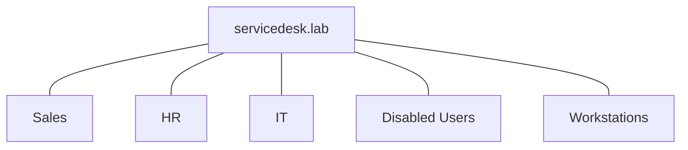
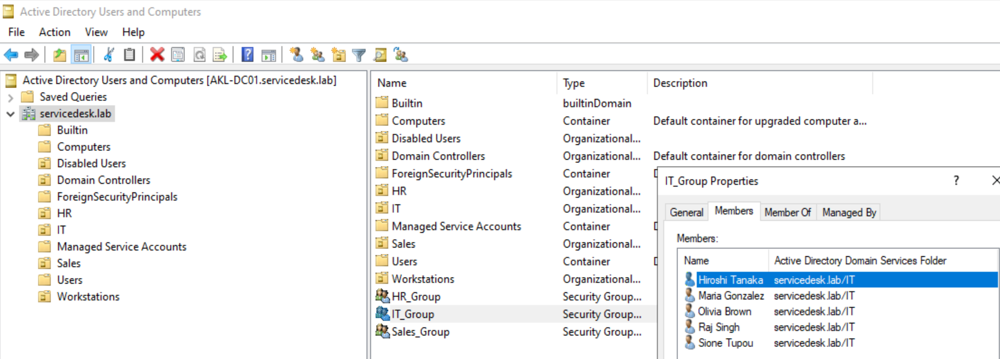
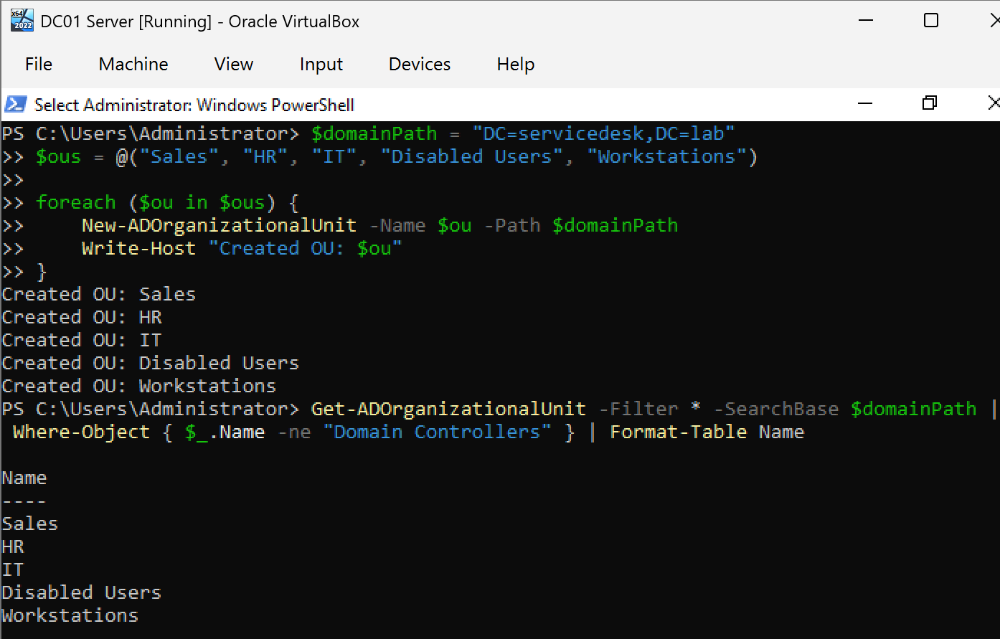

# Organisational Units

## Purpose
Organisational Units (OUs) provide a logical structure for organising users, groups, and computers within Active Directory. They enable:
- Delegated administration by department
- Targeted Group Policy application
- Easier user and computer management

## Structure





---

## Creation Command

```powershell
$ous = @("Sales", "HR", "IT", "Disabled Users", "Workstations")

foreach ($ou in $ous) {
    New-ADOrganizationalUnit -Name $ou -Path "DC=servicedesk,DC=lab"
}
```

---

## Verification

```powershell
Get-ADOrganizationalUnit -Filter * -SearchBase "DC=servicedesk,DC=lab" | Where-Object { $_.Name -ne "Domain Controllers" } | Format-Table Name
```

Expected: Sales, HR, IT, Disabled Users, Workstations listed.



---

## Design Decisions
- **Disabled Users OU:** Separates deactivated accounts from active ones. Users are moved here during offboarding instead of being deleted, preserving audit history.
- **Workstations OU:** Keeps computer objects separate from user objects for cleaner Group Policy management.

---

## Script
- [Create OUs](../scripts/06-create-ous.ps1)

## Next Steps
Proceed to [Groups and Users](05-groups-and-users.md)