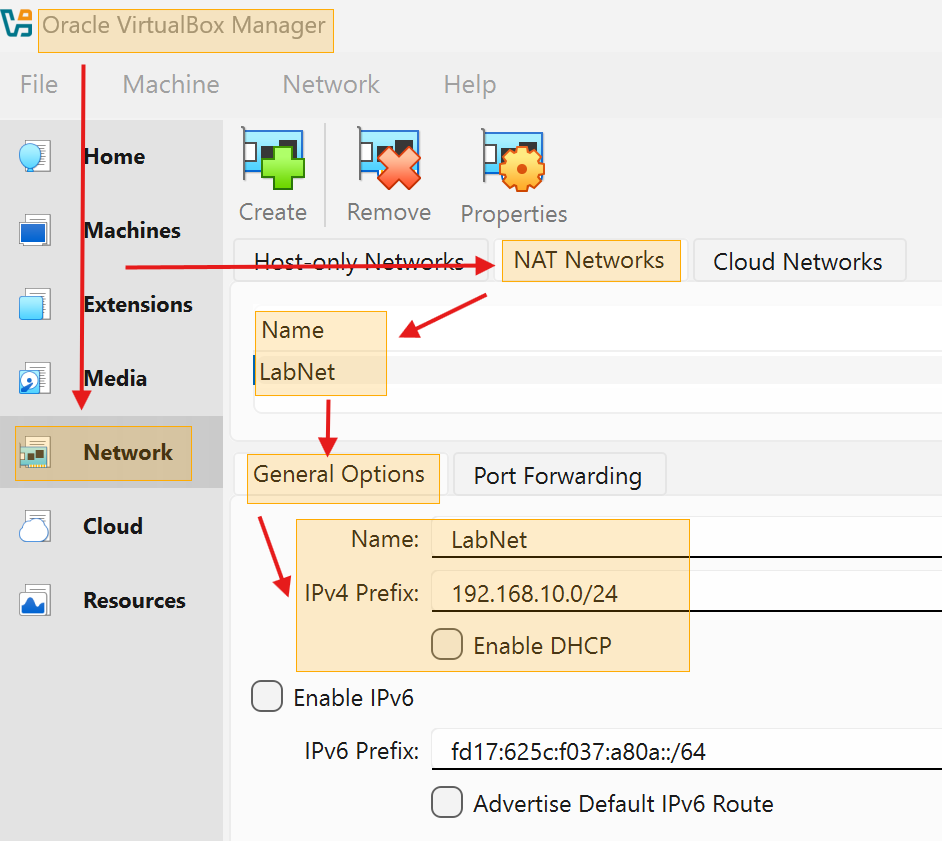
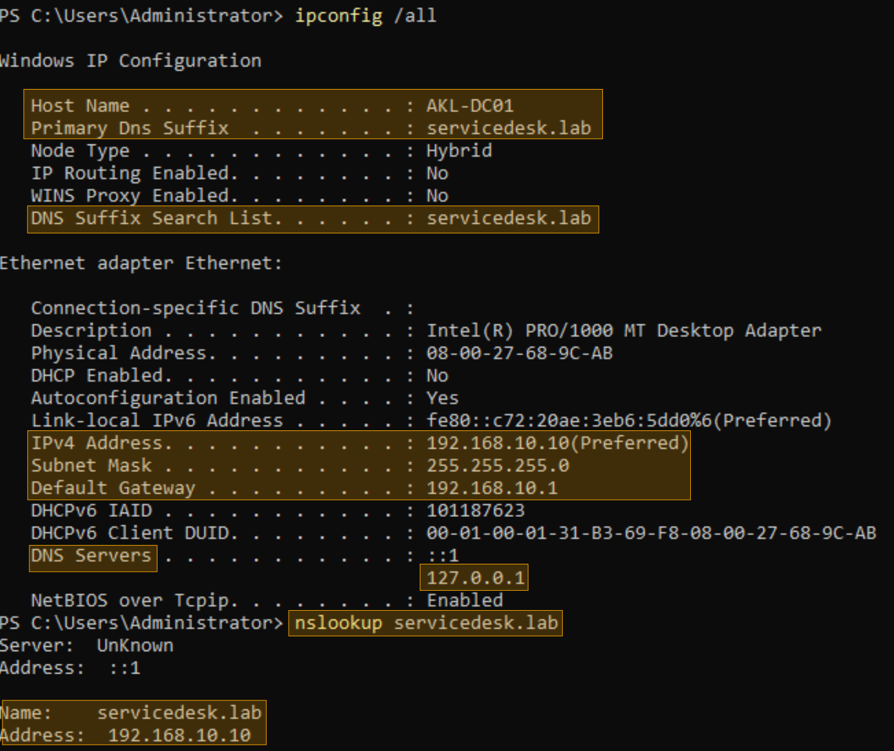
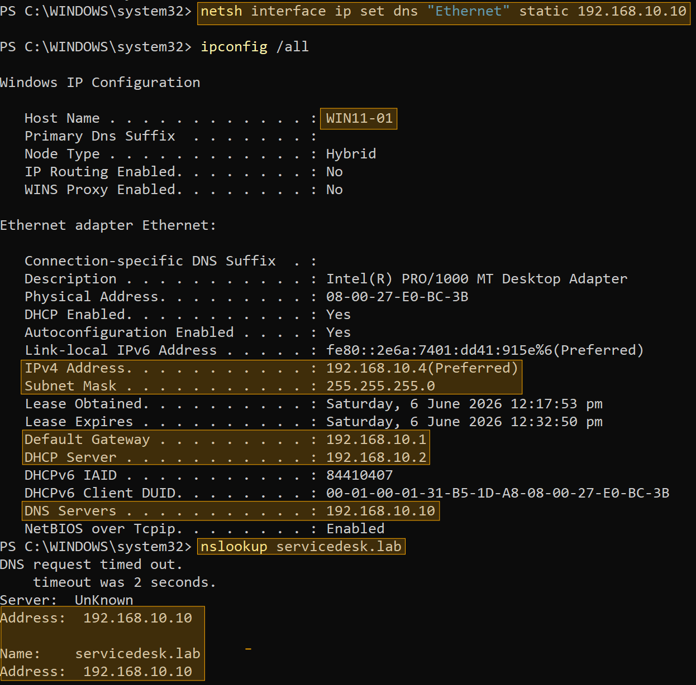
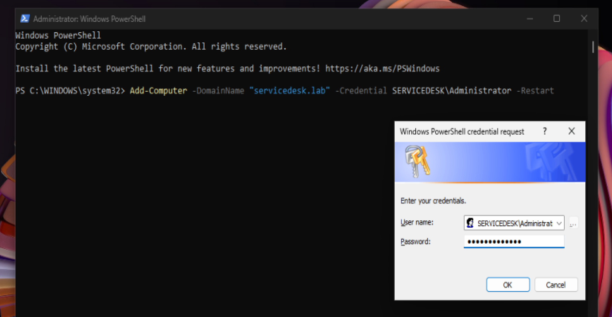
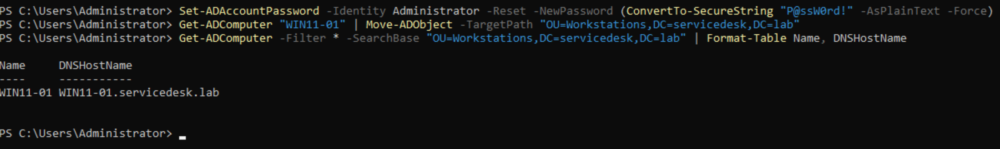
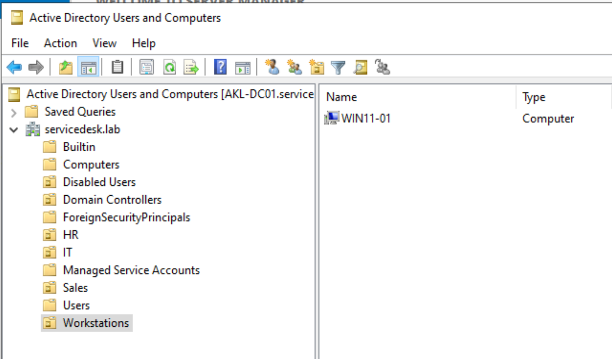

# Domain Join – WIN11-01

This step assumes that you already installed your Windows 11 Enterprise in Virtual Box. To download the Enterprise version for this lab, access this link and look for *Windows 11 Enterprise 24H2 Evaluation ISO*: https://github.com/IPv4v6/linklists/blob/master/windows.md

## Goal
Join the Windows 11 Enterprise client to the `servicedesk.lab` domain so it can authenticate users, receive Group Policy, and access network resources.

## Environment

| Setting | Value |
|---|---|
| Client VM | WIN11-01 |
| Domain Controller | AKL-DC01 (192.168.10.10) |
| Domain | servicedesk.lab |
| Desired Computer OU | Workstations |

---

## Step 1: Verify IP Configuration on WIN11-01

Before joining the domain, the client must use the domain controller as its DNS server. Make sure the DHCP lease isn't pointing DNS to the wrong address.

**Check current configuration:**
```powershell
ipconfig /all
```
If problem persist, change the dns via:

```powershell
netsh interface ip set dns "Ethernet" static 192.168.10.10
```

---

## Disable VirtualBox NAT Network DHCP
On the host machine (VirtualBox):

*File → Preferences → Network → NAT Networks

Select ServicedeskLab → Edit

Untick Enable DHCP

OK*



Finally, confirm via:

```powershell
ipconfig /all | findstr "DNS"
nslookup servicedesk.lab
```

---

## Final IP configuration for both machines




---

## Join the Domain
Enter the domain Administrator password when prompted. The machine restarts automatically.
```powershell
Add-Computer -DomainName "servicedesk.lab" -Credential SERVICEDESK\Administrator -Restart
```


Note: If the password contains special characters that cause login issues, reset it on DC01 first:

```powershell
Set-ADAccountPassword -Identity Administrator -Reset -NewPassword (ConvertTo-SecureString "P@ssW0rd!" -AsPlainText -Force)
```

---

## First Domain Login

After reboot, on the login screen:

Click Other User

Username: SERVICEDESK\Administrator

Password: (domain Administrator password)

By this, you are confirming that the domain join was successful.

---

## Move Computer to Workstations OU
On AKL-DC01, move the new computer object to the correct OU:

```powershell
Get-ADComputer "WIN11-01" | Move-ADObject -TargetPath "OU=Workstations,DC=servicedesk,DC=lab"
```

Then verify it via:
```powershell
Get-ADComputer -Filter * -SearchBase "OU=Workstations,DC=servicedesk,DC=lab" | Format-Table Name, DNSHostName
```




WIN11-01 is now a fully domain‑joined workstation, receiving DNS and DHCP from the domain controller, and ready for Group Policy application and resource access.

---

## Scripts

- [Join Domain (reference)](../scripts/09-join-domain.ps1)
- [Move Computer to OU](../scripts/10-move-computer.ps1)


