# Group Policy Configuration

## Overview

Group Policy is the central way to enforce settings on all domain‑joined computers and users.  
Instead of configuring each PC individually, you define a policy once and Windows applies it automatically.

We created three Group Policy Objects (GPOs) and linked them to the domain or a specific OU.  
We also restricted logon hours for one user, Tane Williams, using the GUI.

---

## GPO 1: Password Policy

This policy forces all domain users to use strong passwords. It stops people from using simple passwords
like `password123` or their own name, and prevents them from reusing the same few passwords forever.

### Settings

| Setting | Value | Reason |
|---|---|---|
| Enforce password history | 5 passwords remembered | Users cannot reuse their last 5 passwords. This makes cycling back to an old favourite impossible. |
| Maximum password age | 90 days | Passwords expire after 90 days. Even if someone steals a password, it only works for a limited time. |
| Minimum password age | 1 day | Users must wait 1 day before changing their password again. This stops them from changing it 5 times in a row to get back to the same old password. |
| Minimum password length | 8 characters | Short passwords are easy to guess. 8 is a good minimum balance between security and usability. |
| Password must meet complexity requirements | Enabled | Passwords must contain characters from three of these four groups: uppercase, lowercase, digits, and symbols. |

### How it's applied (PowerShell)

Password policy lives in the domain's **Security Settings**, not in registry-based
policy. The correct cmdlet edits the same store the GPMC GUI does:

```powershell
Set-ADDefaultDomainPasswordPolicy -Identity servicedesk.lab `
    -PasswordHistoryCount 5 `
    -MaxPasswordAge (New-TimeSpan -Days 90) `
    -MinPasswordAge (New-TimeSpan -Days 1) `
    -MinPasswordLength 8 `
    -ComplexityEnabled $true
```

### GUI alternative (GPMC)

Group Policy Management → right-click **Default Domain Policy** → Edit →
Computer Configuration → Windows Settings → Security Settings →
Account Policies → **Password Policy**.

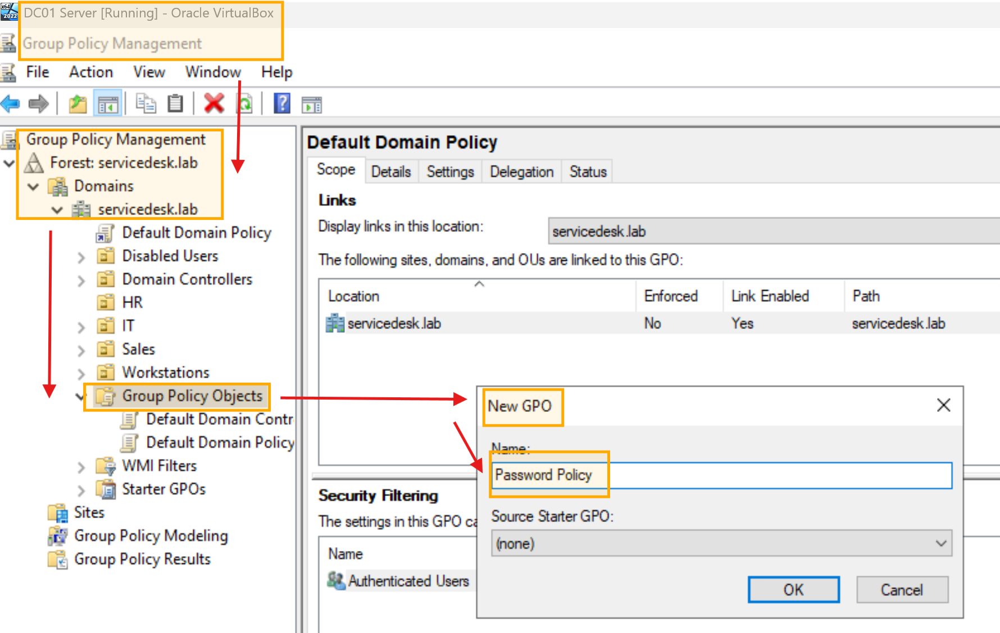
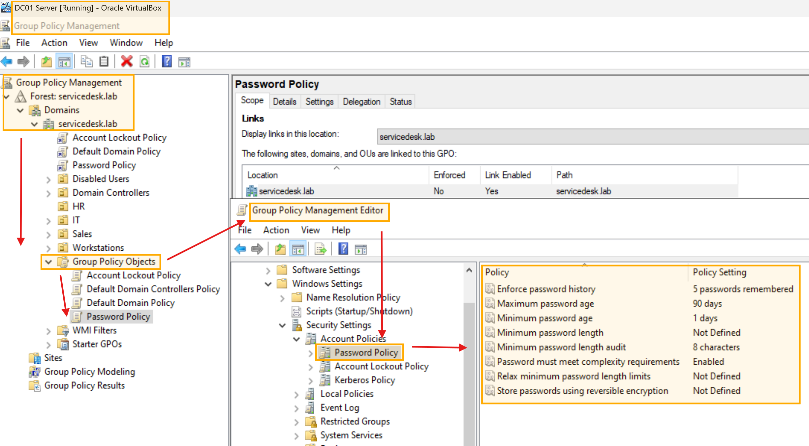
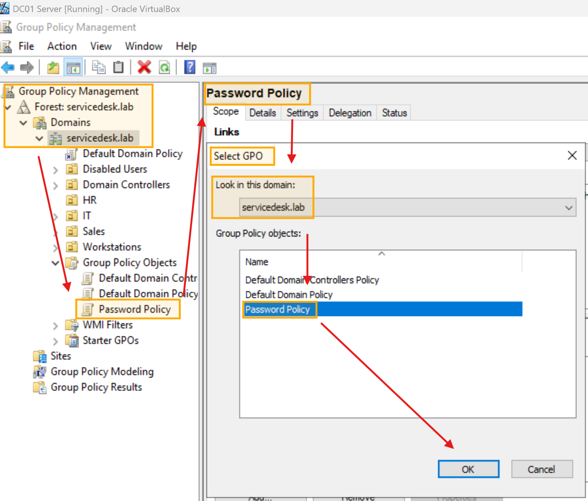


---

## GPO 2: Account Lockout Policy
Locks an account after too many wrong password attempts, stopping brute-force
guessing. After 15 minutes the account unlocks itself, so genuine mistakes
don't always need a service desk call.

### Settings

| Setting | Value | Reason |
|---|---|---|
| Account lockout threshold | 5 invalid attempts | Enough for a forgetful user, too few for an attacker. |
| Account lockout duration | 15 minutes | Self-unlocks — user waits instead of calling. |
| Reset counter after | 15 minutes | Failed-attempt counter returns to zero. |

> **Important default:** Windows ships with `LockoutThreshold = 0`, which means
> lockout is **disabled** — unlimited guesses. Enabling it is a deliberate step.

### How it's applied (PowerShell)

```powershell
Set-ADDefaultDomainPasswordPolicy -Identity servicedesk.lab `
    -LockoutThreshold 5 `
    -LockoutDuration (New-TimeSpan -Minutes 15) `
    -LockoutObservationWindow (New-TimeSpan -Minutes 15)
```

### GUI alternative (GPMC)

Same path as above → Account Policies → **Account Lockout Policy**.

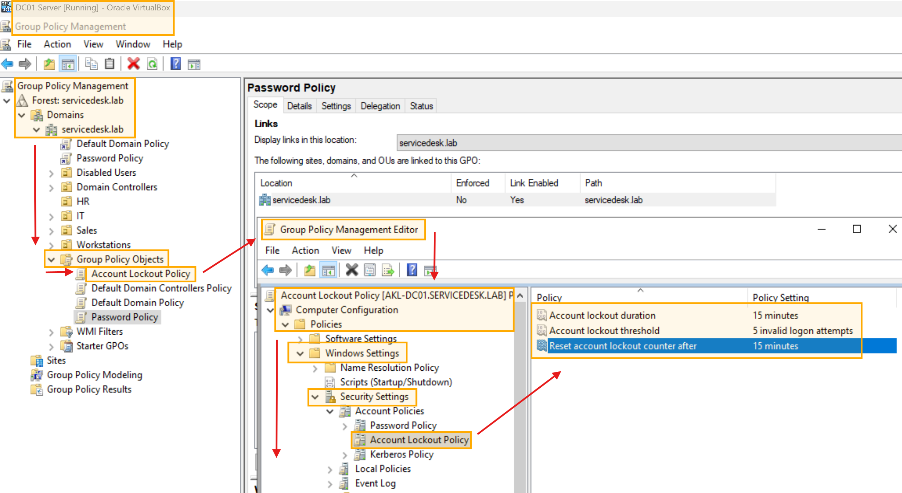
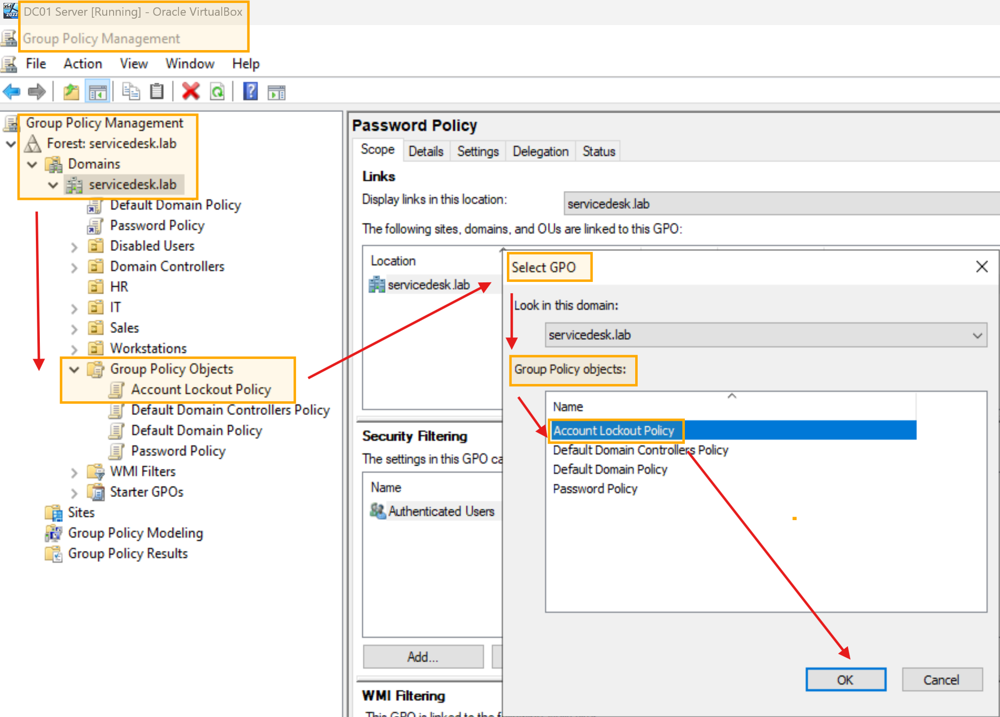

### Verification — the policy is live

```powershell
Get-ADDefaultDomainPasswordPolicy
```

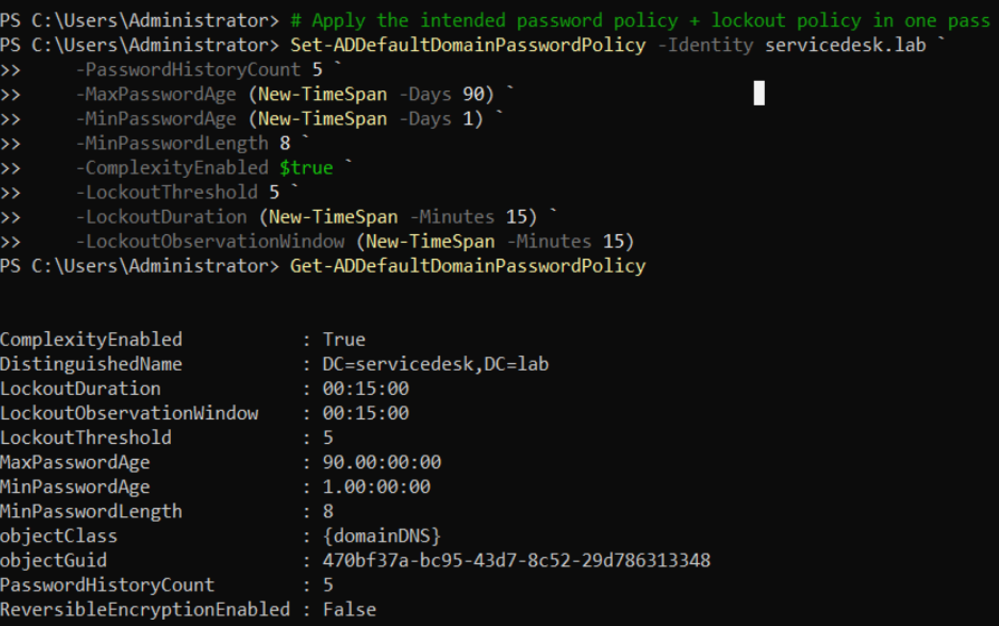
*Both policies applied and verified on AKL-DC01 — lockout threshold 5, min length 8, max age 90 days.*

---

## Lessons Learned — the GPO that "worked" but did nothing

The first version of this lab created two custom GPOs and wrote password/lockout
values with `Set-GPRegistryValue` under `HKLM\...\Policies\System`. The GPOs
created fine, linked fine, and applied fine — and enforced **nothing**.

**Why:** Account policies (password + lockout) are *Security Settings*, processed
from the Default Domain Policy's security database — not from registry policy.
Registry keys with convincing names like `PasswordComplexity` are not read by
anything. The proof was one command:

```powershell
Get-ADDefaultDomainPasswordPolicy
# Showed Windows defaults: MinPasswordLength 7, LockoutThreshold 0 (disabled)
```

**The fix:** `Set-ADDefaultDomainPasswordPolicy`, which edits the real policy
store. The empty GPOs were unlinked and deleted.

**Service desk takeaway:** "the change applied without errors" is not the same as
"the change works." Always verify the *effective* state, not the deployment step.

---

## GPO3: Sales Drive Mapping
This GPO automatically maps the **S:** drive to the `\\AKL-DC01\SalesShare` shared folder for
every user in the **Sales** department. Users don't need to know the network path – the drive just
appears when they log in.

### Real scenario
In a real company, each department usually has a shared folder where they store team files,
reports, and documents. Instead of emailing files back and forth or using USB drives, everyone
saves to the same network location.

By mapping it to a drive letter (S: for Sales), we make it feel like a local folder on their
computer. The user just opens File Explorer, clicks the S: drive, and their team's files are there.

Later in this lab, we will use this same shared folder for **help‑desk ticket simulations**:
- **Ticket 006 – Shared Folder Access:** We will test that Sales users can access the folder,
  but HR and IT users cannot. This proves the permissions are working correctly.
- **NTFS permissions practice:** We will modify permissions on subfolders to grant or deny
  access to specific groups, which is one of the most common requests a service desk analyst
  handles ("I can't open this folder", "Please give the new starter access to the team drive").

Only Sales users need the Sales share. HR and IT users won't see the drive, which keeps the
environment tidy and secure. If an HR user logs in, the S: drive simply doesn't exist for them.

### Prerequisite – Create the shared folder

### Prerequisite – Create the shared folder

```powershell
New-Item -Path "C:\Shares\Sales" -ItemType Directory

# Share permission (controls access OVER THE NETWORK)
New-SmbShare -Name "SalesShare" -Path "C:\Shares\Sales" -FullAccess "SERVICEDESK\Sales_Group"

# NTFS permission (controls access TO THE FILES) — without this, Sales
# users get read-only: effective access = the MORE restrictive of the two.
icacls "C:\Shares\Sales" /grant "SERVICEDESK\Sales_Group:(OI)(CI)M"

# Verify both layers
Get-SmbShare -Name "SalesShare" | Format-Table Name, Path
icacls "C:\Shares\Sales"
```

- **Share vs NTFS — the classic gotcha:** a share grant alone is not enough.
- Effective access is the most restrictive combination of share + NTFS
- permissions. `(OI)(CI)M` = Modify, inherited by all files (OI) and
- subfolders (CI). This two-layer model is the backbone of Ticket 006.

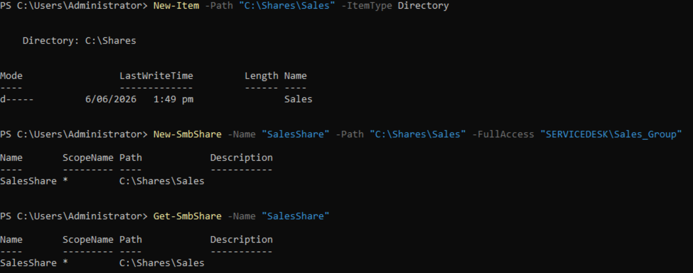
*Creating a shared folder for Sales department: Disk S:/*

---

#### Drive map configuration (GUI guide)

Drive mapping preferences cannot be fully set in PowerShell. We used the GUI:

- Action: Update
- Location: \\AKL-DC01\SalesShare
- Reconnect: Enabled
- Label: Sales Drive
- Drive Letter: S:

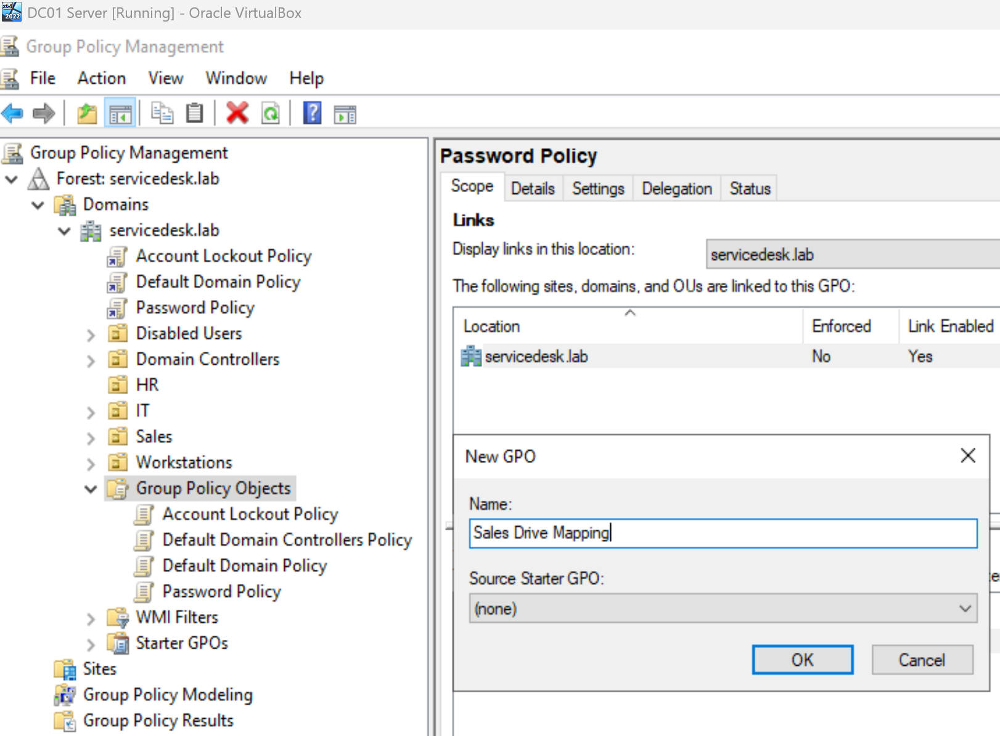
*Creating Sales drive 'S:' mapping for GPO*
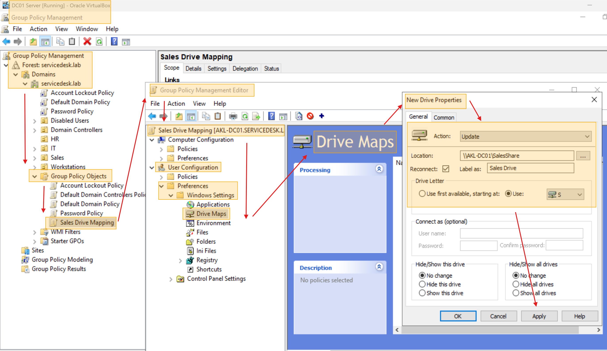
*Setting configurations for Sales drive 'S:' and then mapping into GPO*

After creating the GPO, we linked it to the Sales OU:

```powershell
New-GPO -Name "Sales Drive Mapping"
New-GPLink -Name "Sales Drive Mapping" -Target "OU=Sales,DC=servicedesk,DC=lab"
```

If you get this message, no worries. It means your GUI set up has been successful.

```powershell
PS C:\Users\Administrator> New-GPLink -Name "Sales Drive Mapping" -Target "OU=Sales,DC=servicedesk,DC=lab"
New-GPLink : The GPO named 'Sales Drive Mapping' is already linked to a Scope of Management with Path 'OU=Sales,DC=servicedesk,DC=lab'.
At line:1 char:1
+ New-GPLink -Name "Sales Drive Mapping" -Target "OU=Sales,DC=servicede ...
+ ~~~~~~~~~~~~~~~~~~~~~~~~~~~~~~~~~~~~~~~~~~~~~~~~~~~~~~~~~~~~~~~~~~~~~
    + CategoryInfo          : InvalidArgument: (Microsoft.Group...ewGPLinkCommand:NewGPLinkCommand) [New-GPLink], ArgumentException
    + FullyQualifiedErrorId : UnableToCreateNewLink,Microsoft.GroupPolicy.Commands.NewGPLinkCommand

PS C:\Users\Administrator> New-GPO -Name "Sales Drive Mapping"
New-GPO : The command cannot be completed because a "Sales Drive Mapping" GPO already exists in the servicedesk.lab domain.
Parameter name: Sales Drive Mapping
At line:1 char:1
+ New-GPO -Name "Sales Drive Mapping"
+ ~~~~~~~~~~~~~~~~~~~~~~~~~~~~~~~~~~~
    + CategoryInfo          : InvalidArgument: (Microsoft.Group...s.NewGpoCommand:NewGpoCommand) [New-GPO], ArgumentException
    + FullyQualifiedErrorId : GpoWithNameAlreadyExists,Microsoft.GroupPolicy.Commands.NewGpoCommand
```

## Final Verification Step
After the previous steps. move to WIN11-01 Virtual Machine and log-in using William Tane credentials. The password is going to be the same as the WIN11-01 VM. DUe to Password Policy previously set up, a new password assignation screen will pop up. Assign a new password, log in an Force Group Policy update on a client.


*Loggin WIN11-01 with a Sales user credentials*

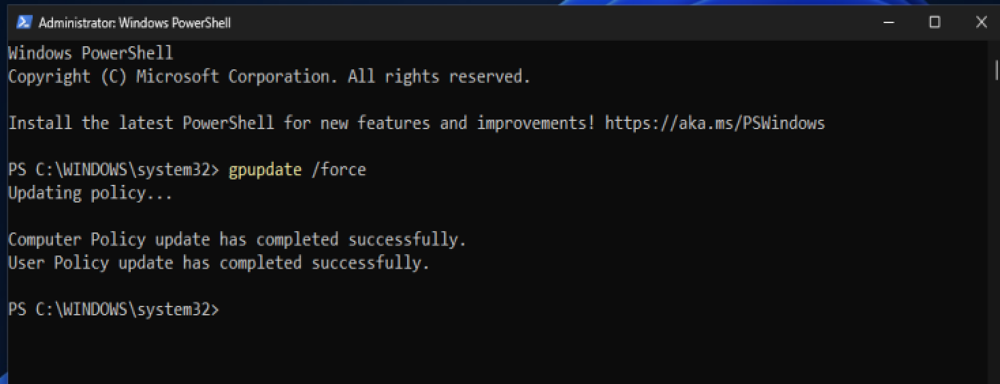
*Forcing group policy update on a client*

After running `gpupdate /force` and restarting WIN11‑01, the S: drive appears for any Sales user (William is one of them).

Have in mind that creating the GPO on the server is only half the job. Group Policy does not
apply instantly because it refreshes on a schedule (every 90 minutes by default, plus a random offset).
In a real service desk environment, you would never ask a user to wait up to two hours for a
change to take effect.

Running `gpupdate /force` tells the client to pull down every GPO immediately. The restart
ensures that settings which only apply at boot or login (like drive mappings) are fully processed.

We then log in as a Sales user to confirm the drive appears, and log in as a non‑Sales user to
confirm it does not. This is the same verification step you would perform before closing a ticket:
*"I've made the change — now let me prove it works before I tell the user it's done."*

Finally, after rebooting, logging with William Tane credentials again and confirm the **'S:/'** drive is visible.

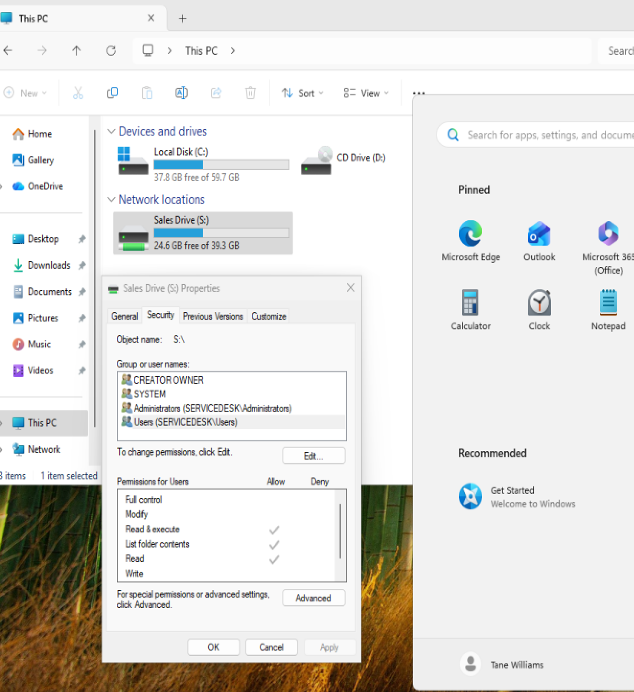
*William Tane confirming 'S:' drive presence*

## All GPO Links

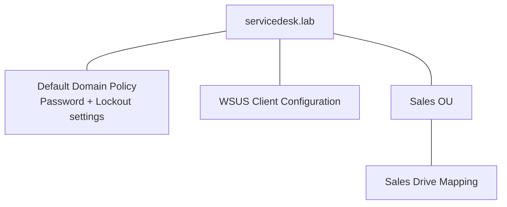