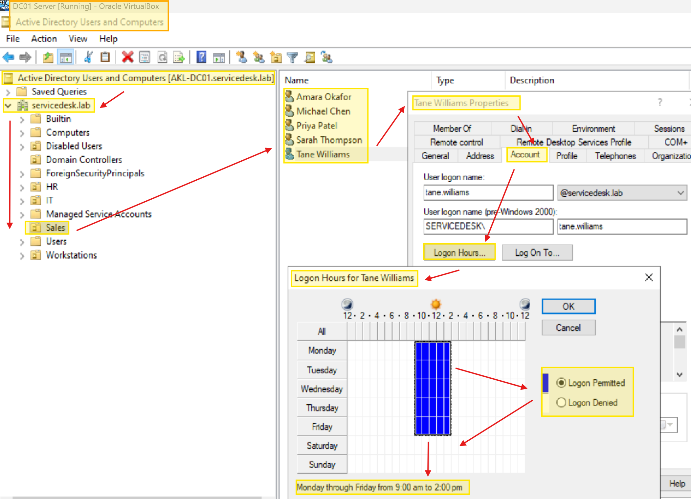

# Logon Hours Restrictions

## Overview

Logon hours control **when** a user account is allowed to sign in to the domain.  
It is a simple but effective security control used for:

- Shift workers who only need access during rostered hours
- Temporary contractors with limited engagement windows
- Service accounts that should only run during maintenance windows
- Compliance requirements (e.g. "no logins outside business hours")

This runbook covers the **basic scenario**: applying logon hours to a single user.  
A bulk department‑wide script is available as a reference for scale operations. 
A Runbook is a compilation of routine procedures and operations that are documented for reference while working on a critical incident. Sometimes, it can also be referred to as a Playbook

---

## Scenario: Single User Restriction

**Request:** Management wants Tane Williams (Sales) restricted to **Monday–Friday, 9:00 AM – 2:00 PM** only. He should not be able to log in outside those hours.

---

## Method 1: GUI

### Steps

1. On **AKL-DC01**, open **Active Directory Users and Computers**
2. Navigate to the **Sales** OU
3. Right‑click **Tane Williams** → **Properties**
4. Go to the **Account** tab
5. Click **Logon Hours**
6. Click and drag to select **Monday through Friday, 9 AM to 2 PM**
7. Click **Logon Permitted**
8. Select all other hours (including Saturday and Sunday) and click **Logon Denied**
9. Click **OK** → **Apply** → **OK**

### Visual Guide


*Single-user Logon hours setting using GUI steps.*
*The grid shows allowed hours in blue and denied hours in white. Tane can only log in Monday–Friday between 9:00 AM and 2:00 PM.*

---

## Method 2: PowerShell

### Single User Command

```powershell
# Mon-Fri 9:00 AM - 2:00 PM, weekends denied.
# 21 bytes total: 3 bytes per day x 7 days, starting Sunday.
$hours = [byte[]](
    0x00,0x00,0x00,  # Sunday    - no access
    0x00,0x3E,0x00,  # Monday    - 9am-2pm
    0x00,0x3E,0x00,  # Tuesday   - 9am-2pm
    0x00,0x3E,0x00,  # Wednesday - 9am-2pm
    0x00,0x3E,0x00,  # Thursday  - 9am-2pm
    0x00,0x3E,0x00,  # Friday    - 9am-2pm
    0x00,0x00,0x00   # Saturday  - no access
)

Set-ADUser -Identity tane.williams -LogonHours $hours
```

### How the Byte Array Works

Logon hours are a **21-byte array**: 3 bytes per day × 7 days, Sunday first.
Each **bit** is one hour of that day, starting at midnight:

| Byte (per day) | Covers |
|---|---|
| Byte 1 | 00:00 – 08:00 (hours 0–7) |
| Byte 2 | 08:00 – 16:00 (hours 8–15) |
| Byte 3 | 16:00 – 00:00 (hours 16–23) |

For 9am–2pm we need hours 9–13 set. Those live in **byte 2**, bits 1–5:

```
hour:  15 14 13 12 11 10  9  8
bit:    7  6  5  4  3  2  1  0
value:  0  0  1  1  1  1  1  0   = 0x3E
```

> **Time zone warning (important in NZ):** AD interprets the bits as **UTC**.
> The ADUC GUI converts your local selection to UTC automatically — raw
> PowerShell writes do not. New Zealand is UTC+12/+13, so the pattern above
> lands ~12 hours offset from local time. For precise local-hour
> restrictions, prefer the GUI method; use the PowerShell method when you
> understand and account for the offset.

### Verification

```powershell
Get-ADUser -Identity tane.williams -Properties LogonHours |
    Select-Object SamAccountName,
        @{Name="LogonHours";Expression={[System.BitConverter]::ToString($_.LogonHours)}}
```

Expected: 21 bytes, with `3E` appearing as the middle byte of Monday–Friday:

```
00-00-00-00-3E-00-00-3E-00-00-3E-00-00-3E-00-00-3E-00-00-00-00
```

---

## What Happens When a User Is Outside Their Allowed Hours

| Situation | Result |
|---|---|
| User tries to log in outside allowed hours | "Your account has time restrictions that prevent you from signing in" |
| User is already logged in when hours end | A warning appears and they are forced off within a few minutes |
| User tries to unlock a locked session | Denied if outside allowed hours |

## Service Desk Troubleshooting

If a user reports "I can't log in" during what should be their working hours:

1. Check the **Logon Hours** grid on their account
2. Verify the **system time** on the client machine — a wrong time zone can cause false denials
3. Confirm with their **manager** what hours they should have
4. Adjust the hours if the request is approved

## Scripts

- [Set Single User Logon Hours](../scripts/15-set-logon-hours.ps1)

## Next Steps

This runbook covers the **single‑user** case. When a management request comes in for all departments (Ticket 007 later in this lab), the bulk script will be used.
- [Bulk Department Logon Hours (reference only)](../scripts/16-set-department-logon-hours.ps1)