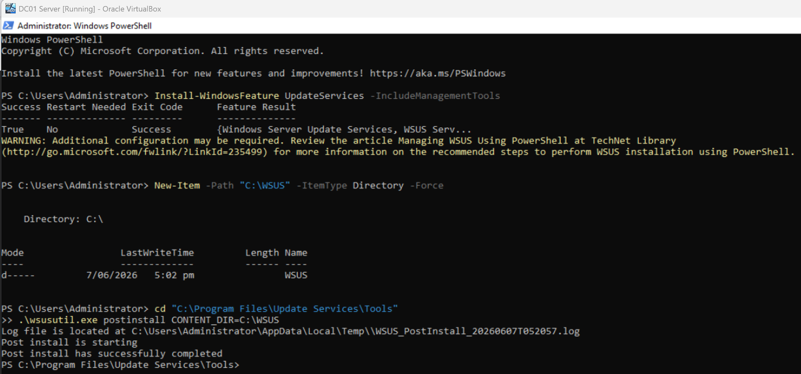
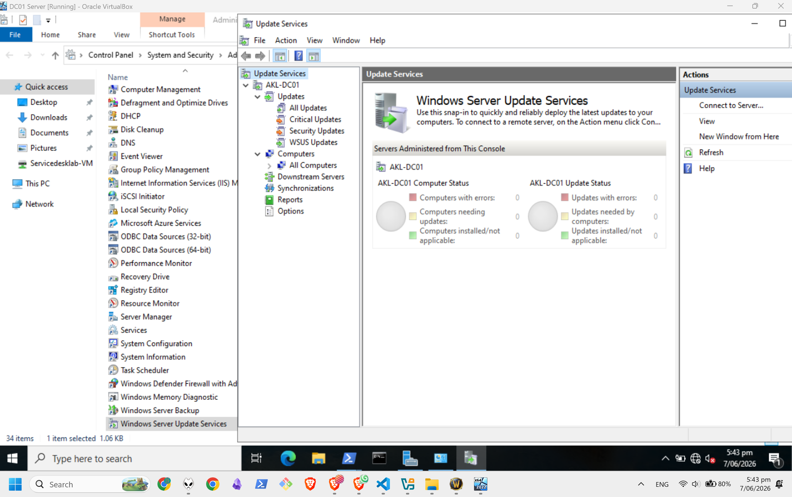
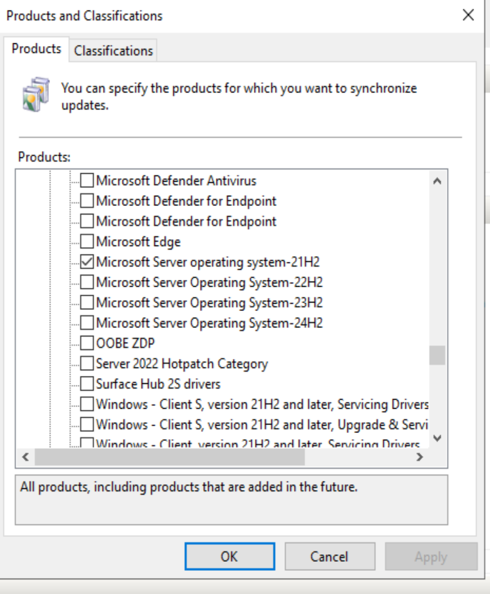
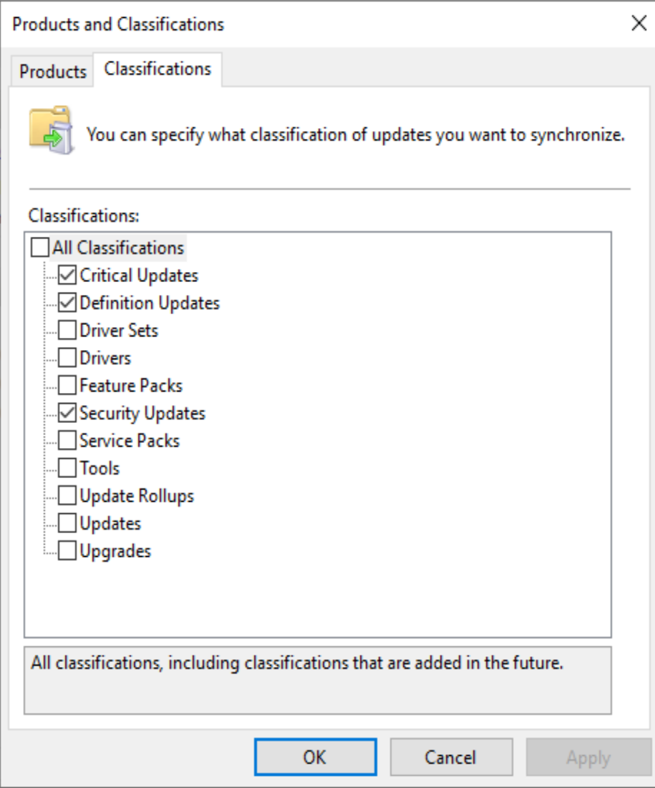
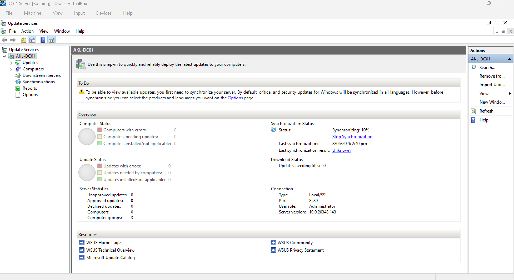
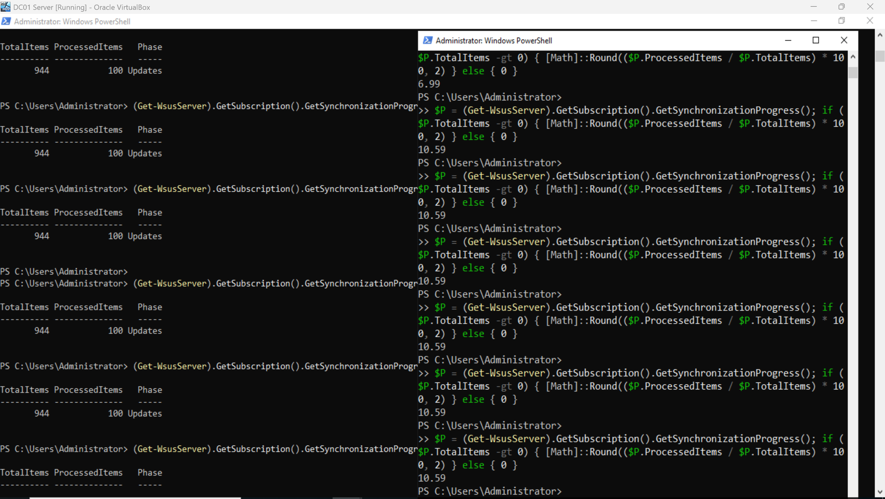
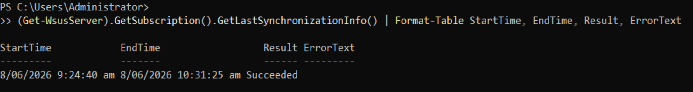
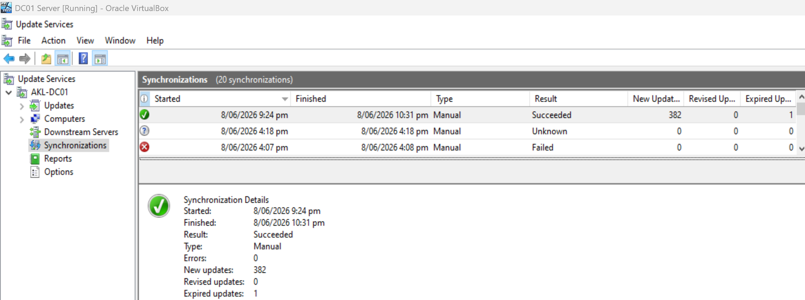
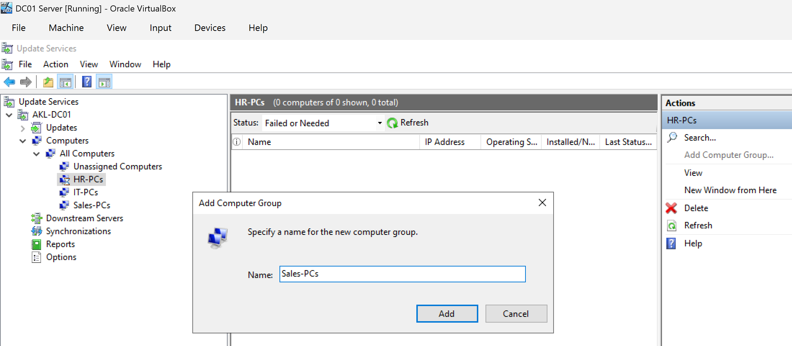
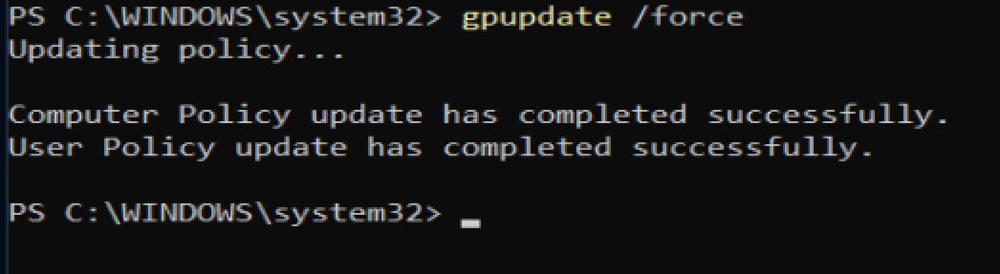

# WSUS Setup – Patch Management

Date: June 2026

## Installing Patch management tool to the lab

Windows Server Update Services (WSUS) is Microsoft's built-in patch management tool. It allows you to download updates once to a central server and deploy them to all domain computers, rather than each PC pulling updates from the internet individually. 

For a service desk or infrastructure role, WSUS is the foundation of patch compliance — ensuring all systems are up-to-date and secure.

---

## Step-by-step

- Installed the WSUS role on AKL-DC01 Virtual Machine
- Configured it to synchronize Critical Updates, Security Updates, and Definition Updates for Windows 11 and Windows Server 2022
- Created computer groups (Sales-PCs, HR-PCs, IT-PCs) to target updates by department
- Deployed a Group Policy Object that points all domain computers to the WSUS server

---

## PowerShell Installation

```powershell
Install-WindowsFeature UpdateServices -IncludeManagementTools
New-Item -Path "C:\WSUS" -ItemType Directory -Force
cd "C:\Program Files\Update Services\Tools"
.\wsusutil.exe postinstall CONTENT_DIR=C:\WSUS
```


*WSUS install completed in AKL-DC01 Virtual Machine*

Access the WSUS Dashboard via Windows Server Update Services > Update Services




---

## WSUS Configuration Before Synchorisation 

**Products Selected** via Update Services > Options > Products and Classifications > Select the products below for Synchronisation:
*- Windows 11*
*- Windows Server operating system-21H2 (This is equivalent to Windows Server 2022)*


*You can specify the products for which you want updates and the types of updates you want*

**Classifications Selected**
*- Critical Updates*
*- Security Updates*
*- Definition Updates*


*You can specify what classification of updates you want to synchronise. Keep these three for now*

---

## Synchronisation Schedule
This was the most time-demanding step in the entire lab. Be patient and ready to troubleshoot — most importantly, don't give up.

Once WSUS is installed, you must synchronise the full Microsoft product catalogue before you can select only the items you need. This initial fetch downloads every product Microsoft has ever released. In my case it took two full days to complete.

While the sync runs, open Options → Products and Classifications periodically. The list will grow as new products appear. Wait until both Windows 11 and Windows Server Operating System-21H2 are visible.

VirtualBox has known limitations at the hypervisor level. The kernel features available to a virtual machine are limited, and WSUS consumes significant resources during synchronisation. This can cause the process to freeze, crash, or stall at 0%. You may need to restart IIS, restart the WSUS service, and re-trigger the sync several times.

If you are sychronising from WSUS dashboard, this is how it would look like:



### Monitoring Commands (PowerShell)

During synchronisation, use these commands to monitor progress instead of relying on the GUI:

```powershell
# Check sync progress with percentage
$P = (Get-WsusServer).GetSubscription().GetSynchronizationProgress()
if ($P.TotalItems -gt 0) {
    [Math]::Round(($P.ProcessedItems / $P.TotalItems) * 100, 2)
} else { 0 }

# Check current sync status
(Get-WsusServer).GetSubscription().GetSynchronizationStatus()

# View last sync result
(Get-WsusServer).GetSubscription().GetLastSynchronizationInfo() |
    Format-Table StartTime, EndTime, Result, ErrorText
```



---

### Recovery Commands (if sync freezes)

```powershell
# Restart WSUS and IIS
Stop-Process -Name w3wp -Force -ErrorAction SilentlyContinue
iisreset /restart
Restart-Service WsusService -Force

# Re-trigger synchronisation
(Get-WsusServer).GetSubscription().StartSynchronization()
```

---

### Why the Sync Kept Failing (and How We Fixed It)

#### The Problem

During the initial synchronisation, WSUS stayed permanently frozen at `0%` or crashed the MMC console with this error:

```makrdown
The WSUS administration console was unable to connect to the WSUS Server via the remote API.
System.Net.WebException -- The operation has timed out
```

#### Root Cause

1. **Database deadlocks** — repeated manual cancellations left corrupted transaction states in the Windows Internal Database. This was my mistake.
2. **Metadata overload** — selecting broad product categories forced the server to download decades of obsolete updates, crashing the IIS application pool. Thas why we only select Windows 11 and Windows Server 2022
3. **VirtualBox network bottlenecks** — the NAT Network router saturated under high HTTP concurrency. So I switched to NAT connection on Adapter 1 just for the purpose of the synchronization. Then restored previous IP configurations and went back to NAT Network.

#### How We Resolved It

I switched to PowerShell commands, which bypass the heavy MMC console entirely from WSUS dashboard. The script below performs the full recovery: flushes DNS, resets IIS, restarts the WSUS service, and triggers a targeted synchronisation.

- [WSUS Sync bottleneck fix](../scripts/19-wsus-sync-bottleneck-fix.ps1)

---

Successful Synchronization with those two products will show as follow:



---

## Computer Groups

Computer groups let you target updates to specific sets of machines rather than deploying everything to everyone at once. In a real environment, you would approve patches for the IT department first, verify nothing breaks, then roll them out to Sales and HR. Groups also make compliance reporting clearer — you can see at a glance which department is fully patched and which still needs updates.

| Group | Target |
|---|---|
| Sales-PCs | Sales department workstations |
| HR-PCs | HR department workstations |
| IT-PCs | IT department workstations |




---

## Group Policy – WSUS Client Configuration
A GPO was created to point all domain computers to the WSUS server.

Registry Values Set
Key	Value
WUServer	http://AKL-DC01:8530
WUStatusServer	http://AKL-DC01:8530
NoAutoUpdate	0
AUOptions	3 (Auto download and notify for install)

## GPO Creation (PowerShell)
```powershell
New-GPO -Name "WSUS Client Configuration"
Set-GPRegistryValue -Name "WSUS Client Configuration" -Key "HKLM\Software\Policies\Microsoft\Windows\WindowsUpdate" -ValueName "WUServer" -Type String -Value "http://AKL-DC01:8530"
Set-GPRegistryValue -Name "WSUS Client Configuration" -Key "HKLM\Software\Policies\Microsoft\Windows\WindowsUpdate" -ValueName "WUStatusServer" -Type String -Value "http://AKL-DC01:8530"
Set-GPRegistryValue -Name "WSUS Client Configuration" -Key "HKLM\Software\Policies\Microsoft\Windows\WindowsUpdate\AU" -ValueName "NoAutoUpdate" -Type DWord -Value 0
Set-GPRegistryValue -Name "WSUS Client Configuration" -Key "HKLM\Software\Policies\Microsoft\Windows\WindowsUpdate\AU" -ValueName "AUOptions" -Type DWord -Value 3
New-GPLink -Name "WSUS Client Configuration" -Target "DC=servicedesk,DC=lab"
```


### Client Verification
On `WIN11-01`, after `gpupdate /force`, the registry confirms the client is pointing to WSUS:

```powershell
Get-ItemProperty "HKLM:\Software\Policies\Microsoft\Windows\WindowsUpdate" | Format-Table WUServer, WUStatusServer`
```

Registry on `WIN11-01` confirming the WSUS GPO applied successfully will show the following output:
```powershell
text
WUServer             WUStatusServer
--------             --------------
http://AKL-DC01:8530 http://AKL-DC01:8530
```

---

## Scripts

- [Install WSUS](../scripts/17-install-wsus.ps1)
- [Create WSUS GPO](../scripts/18-create-wsus-gpo.ps1)
- [Create WSUS GPO (GUI alternative)](../scripts/18-create-wsus-gpo-(alternative).ps1)

## Next Steps

The WSUS server will download and manage updates for all domain clients. Patch compliance reporting and update approval are covered in a later help‑desk ticket simulation.
