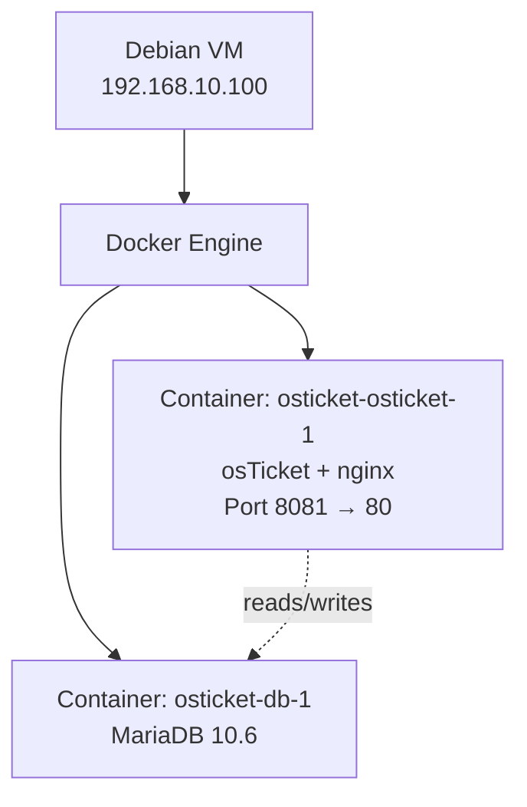

# osTicket Setup – Ticketing System


-green?logo=opensourceinitiative&logoColor=white)


**Date:** June 2026

## Overview

osTicket is an open-source ticketing system used to log, track, and resolve support requests. In this lab it runs on a Debian Linux VM inside Docker containers, completely isolated from the existing SCADA environment on the same machine. A DNS record (`support.servicedesk.lab`) points to the Debian host, so help-desk staff can reach the system with a friendly name.

---

## Architecture



The web interface is published on port **8081** to avoid a conflict with Apache, which already occupies port 80 for another project I have. You can use port 80 without restrictions. Inside Docker, the `osTicket` container connects to the database container using the hostname `db`.

---

## Prerequisites

- Debian VM connected to the `LabNet` NAT Network with IP `192.168.10.100`
- Docker and Docker Compose already installed. More info in https://docs.docker.com/compose/install/
- Firewall configurations to allow port 8081 (in my case, you can just add Port 80): `sudo ufw allow 8081/tcp`
- DNS record `support.servicedesk.lab` → `192.168.10.100` created on AKL-DC01 Server Virtual Machine

---

## Step 1: Debian Network Verification

Before installing anything, confirm the Debian VM is on the correct network and can reach the domain controller.

```bash
ip a show enp0s3       # should show 192.168.10.100
ping 192.168.10.10     # DC01
ping google.com        # internet access
```


*The Debian VM holds the IP 192.168.10.100 on interface enp0s3*

---

## Step 2: Docker Compose File

Create the project directory and the `docker-compose.yml` file.

```bash
mkdir ~/osticket && cd ~/osticket
nano docker-compose.yml
```

Paste the following configuration (uses the `campbellsoftwaresolutions/osticket` image, which proved more reliable than the official image in this lab):

- [Docker Compose File](../docker/docker-compose.yml)

Save with `Ctrl+O`, `Enter`, then `Ctrl+X`.

---

## Step 3: Start the Containers

```bash
sudo docker-compose up -d
```

Wait about 30 seconds, then verify both containers are running:

```bash
sudo docker ps
```

Expected output: two containers (`osticket-osticket-1` and `osticket-db-1`) with status `Up`.


*Both containers are running after a successful `docker-compose up -d`*

---

## Step 4: Access osTicket in the Browser

From any machine on the lab network (e.g., WIN11-01), open:

```
http://192.168.10.100:8081
```

or

```
http://support.servicedesk.lab:8081
```

The osTicket Support Center landing page appears.


*The osTicket front page confirms the web server is responding on port 8081*

---

## Step 5: Staff Login

The Campbell image comes with a pre-configured admin account. Navigate to the staff login page:

```
http://192.168.10.100:8081/scp
```

Login credentials:

- **Username:** `admin`
- **Password:** `Password123!`


*Staff login page at `/scp`*

After login, the admin dashboard appears with a default welcome ticket.


*Admin dashboard after successful login*

---

## Step 6: Verify Admin Panel Access

To confirm you have full administrative privileges, click **Admin Panel** (top right) → **Settings** → **System**. The System Settings page should load without errors.


*Admin Panel → Settings → System confirms full admin access*

---

## Step 7: Create DNS Record on the Domain Controller

On AKL-DC01, run the following PowerShell command so users can reach osTicket by name:

```powershell
Add-DnsServerResourceRecordA -Name "support" -ZoneName "servicedesk.lab" -IPv4Address "192.168.10.100"
```

Verify the record resolves correctly from WIN11-01:

```powershell
nslookup support.servicedesk.lab
```

And test in a browser:

```
http://support.servicedesk.lab:8081/scp
```


*Browser on WIN11-01 reaching osTicket via the friendly DNS name*

---

## Troubleshooting Notes

| Issue | Solution |
|---|---|
| Port 80 already in use (Apache) | Changed host port to `8081` in `docker-compose.yml` |
| Official `osticket/osticket` image PHP error | Switched to `campbellsoftwaresolutions/osticket` |
| Port 8080 also in use (Java SCADA app) | Used `8081` instead |
| Container restarting repeatedly | Check logs: `sudo docker logs osticket-osticket-1` |

---

## Scripts

- [Debian Network Setup (reference)](../scripts/21-debian-network.sh)
- [osTicket Docker Setup (automated)](../scripts/22-osticket-docker-setup.sh)
- [Support DNS Record (PowerShell)](../scripts/23-setup-support-dns.ps1)

---

## Next Steps

With osTicket running, the help-desk ticket simulations can begin. Tickets will be created in osTicket while the underlying Active Directory and WSUS tasks are performed on DC01.
