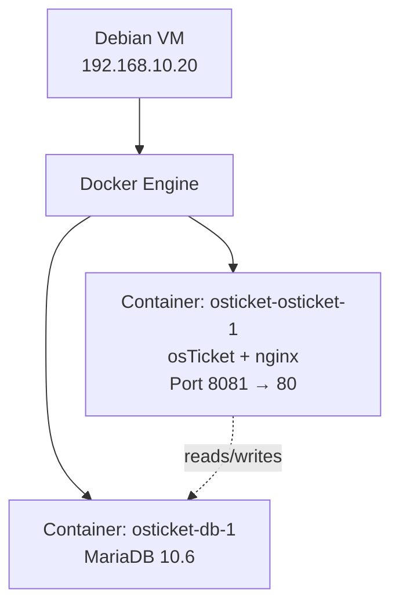
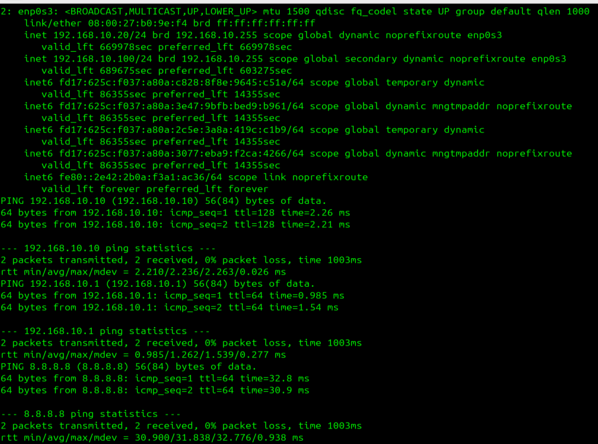
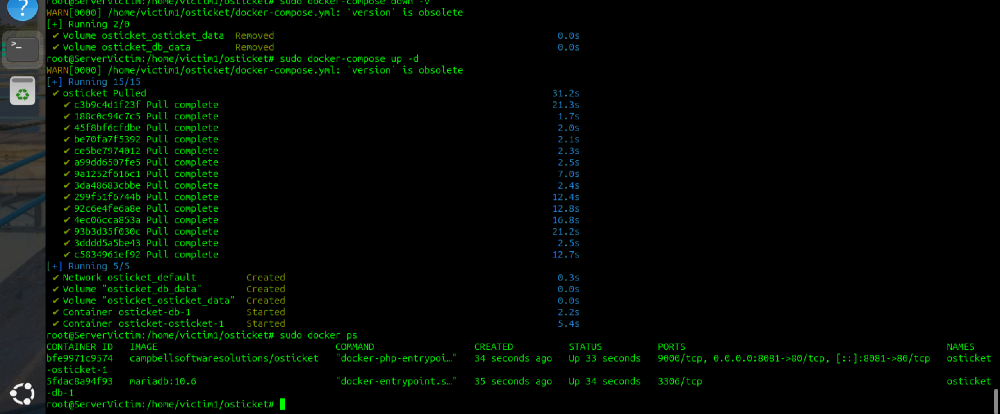
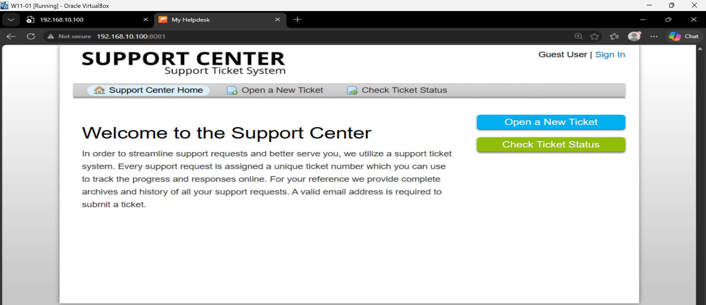
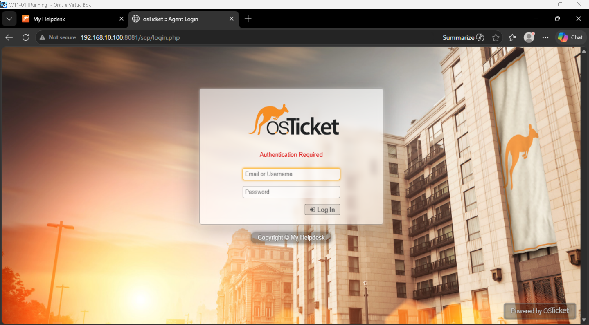
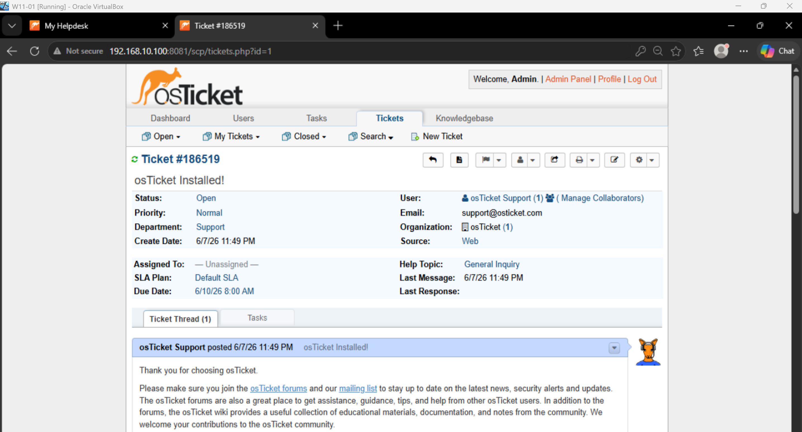
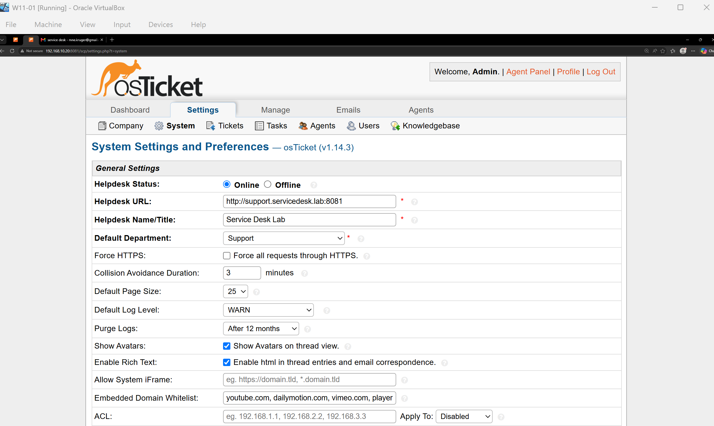
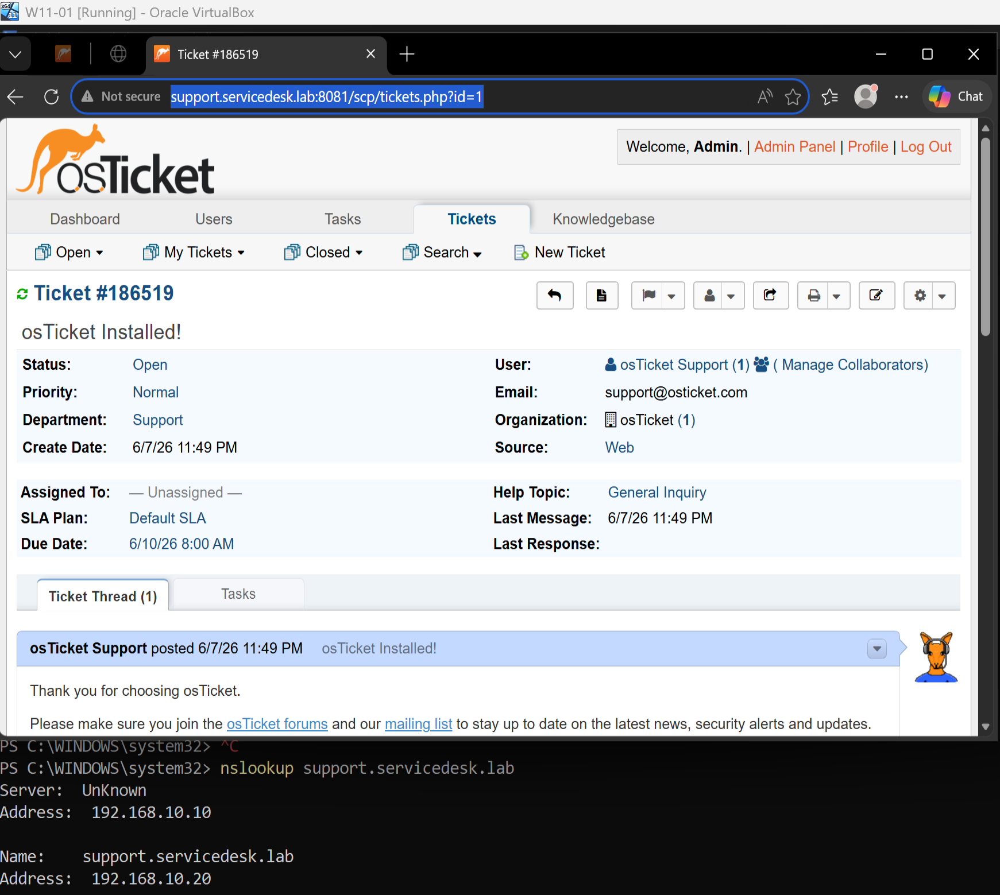

# osTicket Setup – Ticketing System


-green?logo=opensourceinitiative&logoColor=white)


**Date:** June 2026
**Machine:** Debian Virtual Machine

## Overview

osTicket is an open-source ticketing system used to log, track, and resolve support requests. In this lab it runs on a Debian Linux VM inside Docker containers, completely isolated from the existing SCADA environment on the same machine. A DNS record (`support.servicedesk.lab`) points to the Debian host, so help-desk staff can reach the system with a friendly name.

---

## Architecture



The web interface is published on port **8081** to avoid a conflict with Apache, which already occupies port 80 for another project I have. You can use port 80 without restrictions. Inside Docker, the `osTicket` container connects to the database container using the hostname `db`.

> **Why .20 and not a pool address?**
> osTicket is infrastructure, not a client workstation, so it needs a
> permanent address. A DHCP reservation on AKL-DC01 pins the Debian VM's
> MAC to 192.168.10.20 — below the client pool (.100–.200). This mirrors
> standard practice: infrastructure hosts sit on stable low addresses,
> while DHCP clients lease from the upper range.

---

## Prerequisites

- Debian VM connected to the `LabNet` NAT Network, pinned to `192.168.10.20` via a DHCP reservation on AKL-DC01
- Docker and Docker Compose already installed. More info in https://docs.docker.com/compose/install/
- Firewall configurations to allow port 8081 (in my case, you can just add Port 80): `sudo ufw allow 8081/tcp`
- DNS record `support.servicedesk.lab` → `192.168.10.20` created on AKL-DC01 Server Virtual Machine

---

## Step 1: Debian Network Verification

Before installing anything, confirm the Debian VM is on the correct network and can reach the domain controller.

```bash
ip a show enp0s3       # should show 192.168.10.20
ping 192.168.10.10     # DC01
ping google.com        # internet access
```


*The Debian VM holds the IP 192.168.10.20 on interface enp0s3*

---

## Step 2: Docker Compose File

Create the project directory and the `docker-compose.yml` file.

```bash
mkdir ~/osticket && cd ~/osticket
nano docker-compose.yml
```

Paste the following configuration (uses the `campbellsoftwaresolutions/osticket` image, which proved more reliable than the official image in this lab):

- [Docker Compose File](../docker/docker-compose.yml)

---

## Step 3: Start the Containers

```bash
sudo docker-compose up -d
```

Wait about 30 seconds, then verify both containers are running:

```bash
sudo docker ps
```

Expected output: two containers (`osticket-osticket-1` and `osticket-db-1`) with status `Up`.


*Both containers are running after a successful `docker-compose up -d`*

---

## Step 4: Access osTicket in the Browser

From any machine on the lab network, open one of the following:

```
http://support.servicedesk.lab:8081/scp/login.php
# from WIN11-01 and AKL-DC01

http://192.168.10.20:8081/scp/
# on Debian itself
```

The osTicket Support Center landing page appears. Because a DHCP reservation on AKL-DC01 pins this VM to `192.168.10.20`, the address is stable — always reach osTicket via the friendly name `support.servicedesk.lab:8081`.


*The osTicket front page confirms the web server is responding on port 8081*

---

## Step 5: Staff Login

The Campbell image comes with a pre-configured admin account. Navigate to the staff login page:

```
http://support.servicedesk.lab:8081/scp
# or http://192.168.10.20:8081/scp on Debian
```

Login credentials:

- **Username:** `ostadmin`
- **Password:** `Admin1`


*Staff login page at `/scp`*

After login, the admin dashboard appears with a default welcome ticket.


*Admin dashboard after successful login*

---

## Step 6: Verify Admin Panel Access

To confirm you have full administrative privileges, click **Admin Panel** (top right) → **Settings** → **System**. The System Settings page should load without errors.


*Admin Panel → Settings → System confirms full admin access*

Once in there change the following:

| Setting | Current Value | Change To |
|---|---|---|
| Helpdesk URL | `http://localhost:8080/` | `http://support.servicedesk.lab:8081` |
| Helpdesk Name/Title | My Helpdesk | Service Desk Lab |

Scroll down and click **Save Changes**.

---

## Step 7: Create DNS Record on the Domain Controller

On `AKL-DC01`, run the following PowerShell command so users can reach osTicket by name:

```powershell
Add-DnsServerResourceRecordA -Name "support" -ZoneName "servicedesk.lab" -IPv4Address "192.168.10.20"
```

Verify the record resolves correctly from WIN11-01:

```powershell
nslookup support.servicedesk.lab
```

Expect:
```powershell
PS C:\Users\Administrator> nslookup support.servicedesk.lab
Server:  localhost
Address:  127.0.0.1

Name:    support.servicedesk.lab
Address:  192.168.10.20
```

And test in a browser:

```
http://support.servicedesk.lab:8081/scp
```


*Browser on WIN11-01 reaching osTicket via the friendly DNS name*

---

## Step 8: osTicket Health Check

### Domain-Side Health Check: AKL-DC01 Server (Windows Server 2022)
Once everything is configured, this is the routine check run **from AKL-DC01**
when anyone reports the ticketing system unreachable. It verifies the two
things the domain side owns: name resolution and port reachability. If both
pass, the fault is on the Debian/Docker side — check `sudo docker ps` there.

```powershell
.\24-osticket-healthcheck.ps1
```

Expected output on a healthy system:

```
[*] Checking DNS resolution for support.servicedesk.lab...
[+] DNS OK: resolves to 192.168.10.20
[*] Testing TCP port 8081 on support.servicedesk.lab...
[+] PORT OK: 192.168.10.20:8081 is answering
[+] Health check PASSED — osTicket reachable at http://support.servicedesk.lab:8081
```

> **Triage logic:** DNS fails → check the `support` A record and the DHCP
> reservation on DC01. DNS OK but port fails → the problem is on the Debian
> host (containers down, firewall). Both OK but the browser still fails →
> client-side issue on the user's machine.

---

### Debian-Side Check

If the domain-side check fails at the port or HTTP layer — or you're already
on the Debian host — run the local counterpart:

```bash
sudo bash 25-osticket-healthcheck.sh
```

Expected output on a healthy system:

```
[+] App container (osticket-osticket-1) is running
[+] DB container (osticket-db-1) is running
[+] Database engine is answering
[+] HTTP OK: application responded 200
[+] No recent errors in the application log
[+] Health check PASSED — osTicket stack is healthy on this host.
```

Together, scripts 24 and 25 split the triage cleanly: **24 = can the domain
reach it**, **25 = is the stack itself healthy**.

---

## Scripts

- [Debian Network Setup (Debian network setup reference)](../scripts/21-debian-network.sh)
- [osTicket Docker Setup (Automated osTicket Docker deployment)](../scripts/22-osticket-docker-setup.sh)
- [Support DNS Record (PowerShell)- Create the support DNS record on DC01](../scripts/23-setup-support-dns.ps1)
- [osTicket Health Check (PowerShell) - Domain-side DNS + port verification](../scripts/24-osticket-healthcheck-DC01Server.ps1)

---

## Next Steps

With osTicket running, the help-desk ticket simulations can begin. Tickets will be created in osTicket while the underlying Active Directory and WSUS tasks are performed on DC01.