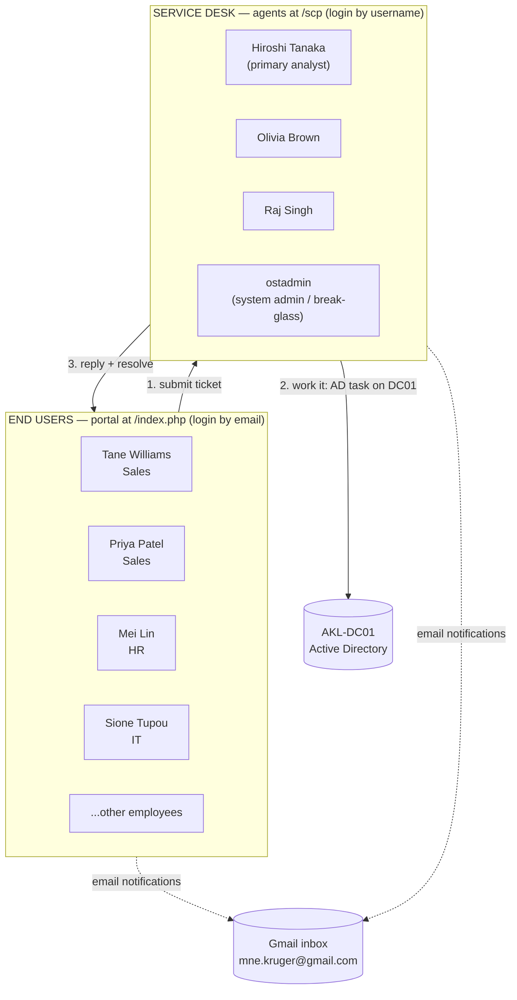

# osTicket Configuration – Agents, Users, Help Topics, SLAs & Email

**Date:** June 2026
**Prerequisite:** [osTicket installed and reachable](10-osticket-setup.md)

---

## Overview

With osTicket installed (see `10-osticket-setup.md`), this document covers turning a bare install into an **organised, working service desk**: the people who use it, how they're grouped, what they can submit, the response targets (SLAs), and outbound email notifications.

The goal mirrors a small managed services provider: a handful of **agents** (the service desk) supporting a population of **end users** (employees), with everything tracked and notified by email.

---

## Access URLs

Always reach osTicket by its **friendly DNS name**, never the raw IP — the address is pinned by a DHCP reservation but the name is the resilient choice.

| Who | Purpose | URL |
|---|---|---|
| **Agents / Admin** | Work tickets, configure the system | `http://support.servicedesk.lab:8081/scp/login.php` |
| **End Users** | Submit and track tickets | `http://support.servicedesk.lab:8081/index.php` |

---

## The Two-Sided Model

The single most important concept in osTicket: **Agents and Users are different populations, using different logins, at different URLs.**

- **Agents** work tickets at `/scp`. They log in with a **username** (e.g. `hiroshi.tanaka`).
- **Users** submit tickets at the client portal. They log in (or stay guests) with their **email address**.

**The workflow for every ticket:**

1. An end user submits a request (portal, or the desk logs it on their behalf).
2. The ticket lands in a department queue with an SLA clock running.
3. The assigned agent (the analyst) does the actual work — usually an Active Directory task on AKL-DC01.
4. The agent replies and resolves; the user is notified by email.

> **Agents see everything; users see only their own tickets.** In the agent panel, the **"Open"** tab shows all tickets system-wide, while **"My Tickets"** shows only those assigned to the logged-in agent.

---

## Departments

Departments are kept aligned to the AD organisational structure. They act as **routing targets** (which team works the ticket), not as buckets for where requesters sit.

| Department | Role | Default? |
|---|---|---|
| **Support** | Catch-all / front door | ✅ Default |
| **IT** | Where the service desk agents live | |
| **HR** | Routing target | |
| **Sales** | Routing target | |

<!-- SCREENSHOT: Admin Panel → Agents → Agents (the agent roster) -->

*The agent roster: ostadmin (Support) plus the three IT-department agents.*

---

## Agents (the Service Desk)

Agents work tickets. **Three agents plus the admin** is deliberately lean — enough to demonstrate assignment and escalation between people without noise.

| Name | Username | Department | Email | Role |
|---|---|---|---|---|
| Admin User | `ostadmin` | Support | `mne.kruger@gmail.com` | System Admin (break-glass) |
| **Hiroshi Tanaka** | `hiroshi.tanaka` | IT | `mne.kruger+hiroshi@gmail.com` | **Primary analyst (the lab persona)** |
| Olivia Brown | `olivia.brown` | IT | `mne.kruger+olivia@gmail.com` | Agent |
| Raj Singh | `raj.singh` | IT | `mne.kruger+raj@gmail.com` | Agent |

> **`ostadmin` vs. an agent account:** `ostadmin` is the *system administrator* — used to **configure** osTicket (create agents, SLAs, email). It is not used for day-to-day ticket work. The analyst persona for this lab is **Hiroshi Tanaka**, who logs in as `hiroshi.tanaka` and works/closes every ticket.

> **Why agents share one inbox:** Gmail **plus-addressing** (`mne.kruger+hiroshi@gmail.com`, `+olivia`, `+raj`) gives each agent a unique address that osTicket accepts, while every message still lands in the single `mne.kruger@gmail.com` inbox — ideal for a one-person lab.

---

## End Users & Organizations

End users are the employees who receive support. They are grouped into **Organizations** that mirror the AD OUs (Sales / HR / IT).

### Organizations

<!-- SCREENSHOT: Agent Panel → Users → Organizations → Sales (members listed) -->

*The Sales organization with its members.*

<!-- SCREENSHOT: Agent Panel → Users → Organizations → HR (members listed) -->

*The HR organization.*

<!-- SCREENSHOT: Agent Panel → Users → Organizations → IT (members listed) -->

*The IT organization.*

### User Directory

| Name | Organization | Email (portal login) |
|---|---|---|
| Tane Williams | Sales | `mne.kruger+tane@gmail.com` |
| Priya Patel | Sales | `mne.kruger+priya@gmail.com` |
| Emma Wilson | Sales | `mne.kruger+emma@gmail.com` |
| Mei Lin | HR | `mne.kruger+mei@gmail.com` |
| Sione Tupou | IT | `mne.kruger+sione@gmail.com` |

> **Tane Williams** is the recurring "customer" across the ticket simulations — the user who forgets passwords, locks his account, and requests access. The analyst (Hiroshi) resolves these.

> **User logins are optional.** A user can stay a **guest** — tickets can be opened on their behalf and they still receive all email updates. Portal login is only needed if you want users to self-serve. For the simulations, guest + email is sufficient and realistic.

---

## Help Topics

Help Topics are the request categories an end user picks when opening a ticket. Each maps to the ticket simulations and drives the department + SLA.

| Help Topic | Priority | Department | SLA Plan | Maps to |
|---|---|---|---|---|
| **Access Issue** | High | Support | **Urgent – 4h** | Password reset, account unlock, shared-folder access |
| New Starter / Leaver | Normal | Support | Standard – 24h | Onboarding, offboarding |
| Department Transfer | Normal | Support | Standard – 24h | Department transfer |
| Shared Folder Access | Normal | Support | Standard – 24h | NTFS / share permissions |
| General Inquiry | Normal | Support | Standard – 24h | Catch-all |

*(The default `Feedback` and `Billing` topics were disabled as irrelevant to an IT service desk.)*

<!-- SCREENSHOT: Admin Panel → Manage → Help Topics (the topic list) -->

*Active help topics, each routed to Support with an attached SLA.*

<!-- SCREENSHOT: Admin Panel → Manage → Help Topics → (any topic) → New ticket options tab, showing the SLA Plan dropdown -->

*Each help topic's "New ticket options" tab sets its department and SLA plan.*

---

## SLA Plans

Service Level Agreements set the response target. osTicket has SLAs **built in** — no external system needed. Two tiers cover the lab:

| SLA Plan | Grace Period | Applied To | Rationale |
|---|---|---|---|
| **Urgent – 4h** | 4 hours | Access Issue | A user who can't log in is blocked from working |
| **Standard – 24h** | 24 hours | Everything else | Routine requests |

Tickets are flagged **overdue** when the grace period is exceeded, and overdue alerts are left **enabled** to demonstrate SLA breach behaviour.

<!-- SCREENSHOT: Admin Panel → Manage → SLA (the SLA plan list) -->

*The two custom SLA plans alongside the default.*

---

## Email Notifications (Gmail SMTP)

Outbound email runs through **Gmail SMTP**, so agents and users receive real notifications.

### Gmail prerequisites (one-time)

1. Enable **2-Step Verification** on the Google account.
2. Generate a **16-character App Password** (named `osticket-lab`).
3. Use that App Password in osTicket's SMTP config — **never the real Gmail password, and never commit it to GitHub** (documented as `<gmail-app-password>`).

### SMTP settings (Admin Panel → Emails → Emails → `mne.kruger@gmail.com`)

| Field | Value |
|---|---|
| Email Address | `mne.kruger@gmail.com` |
| Email Name | `Service Desk` |
| Department | Support |
| IMAP/POP Fetching | **Disabled** (outbound only) |
| SMTP Status | **Enabled** |
| SMTP Hostname | `smtp.gmail.com` |
| SMTP Port | `587` |
| Authentication | Required |
| SMTP Username | `mne.kruger@gmail.com` |
| SMTP Password | `<gmail-app-password>` |

### Make it the system default

**Admin Panel → Settings → Emails** → set **Default System Email** and **Default Alert Email** to `Service Desk <mne.kruger@gmail.com>`. This is essential — otherwise osTicket sends from the dead default `helpdesk@example.com` and mail fails.

### Verification — the notifications work

When a ticket is created and assigned, both parties are emailed automatically:

<!-- SCREENSHOT: Gmail inbox showing the "Ticket Assigned to you" email (to Hiroshi) -->

*The agent (Hiroshi) receives a "Ticket Assigned to you" notification.*

<!-- SCREENSHOT: Gmail inbox showing the ticket-created email (to Tane) -->

*The end user (Tane) receives confirmation that a ticket was opened on their behalf.*

> **Plus-addressing in action:** the agent alert goes to `mne.kruger+hiroshi@gmail.com` and the user notice to `mne.kruger+tane@gmail.com` — both arrive in the same inbox, proving the unique-address routing works end to end.

---

## Pending / Known Items

- **Agent emails:** if Olivia (`olivia.brown@servicedesk.lab`) and Raj (`raj.singh@servicedesk.lab`) still show `@servicedesk.lab` addresses, update them to plus-addressed Gmail so escalation notifications reach a real inbox.
- **Admin email:** ensure the Admin User account and the system Admin Email are not left on `admin@example.com` (it bounces — there is no mail server for that domain).
- **Helpdesk name:** set **Admin Panel → Settings → System → Helpdesk Name** to `Service Desk Lab` so email templates stop reading "My Helpdesk".

---

## Verification Checklist

| Check | Pass criteria |
|---|---|
| Agents log in at `/scp` | Each agent's own username + password works |
| Users access portal | Email-based login (or guest) works |
| Organizations populated | Sales / HR / IT each list their members |
| Help topics active | 5 topics, each routed to Support with an SLA |
| SLA auto-applies | New "Access Issue" ticket shows **Urgent – 4h** + due date ~4h out |
| Email sends | Diagnostic test + real ticket alerts arrive in Gmail |

---

## Next Steps

The ticketing system is fully operational. The help-desk ticket simulations (Tickets 002+) now run against this system: users submit, the analyst (Hiroshi) works the Active Directory task on AKL-DC01, replies, and resolves — with the full email trail as evidence.
