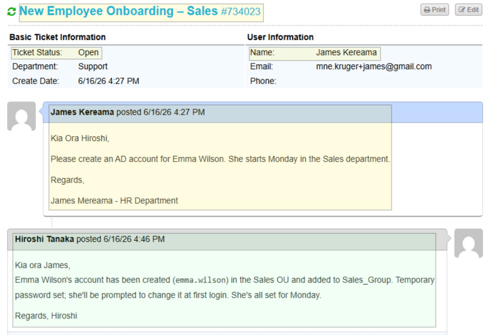
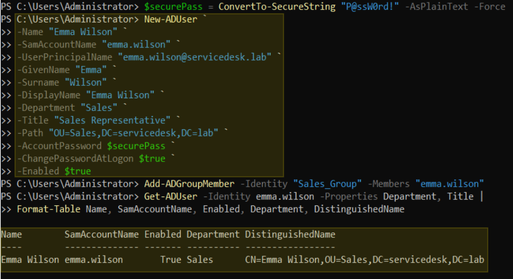

# Ticket 001 – New Employee Onboarding


**Ticket ID:** #734023 (osTicket)
**Date:** June 2026
**Requester:** James Kereama (HR)
**Assigned To:** Hiroshi Tanaka (Service Desk)
**Help Topic:** New Starter / Leaver
**SLA:** Standard – 24h

---

## Request

HR submitted a request via the Support Center to provision an Active Directory account for a new Sales hire starting Monday.
Onboarding is one of the most frequent ticket types. Getting it wrong has real consequences:

- **Wrong OU** → department GPOs don't apply (e.g. the Sales S: drive mapping won't work).
- **Missing group** → no access to department shared resources on day one.
- **No forced password change** → the service desk retains a working credential, a security gap.

`*"Kia Ora Hiroshi, Please create an AD account for Emma Wilson. She starts Monday in the Sales department. Regards, James Kereama - HR Department"*`

| Field | Detail |
|---|---|
| Full Name | Emma Wilson |
| Department | Sales |
| Job Title | Sales Representative |
| Logon Name | `emma.wilson` |
| UPN | `emma.wilson@servicedesk.lab` |

<!-- SCREENSHOT: osTicket ticket #734023 as submitted by James Kereama (client portal view) -->

*The onboarding request as logged in osTicket by HR.*

---

## Resolution — PowerShell (AKL-DC01)

### Step 1: Create the account

```powershell
$securePass = ConvertTo-SecureString "<TempPassword>" -AsPlainText -Force

New-ADUser `
    -Name "Emma Wilson" `
    -SamAccountName "emma.wilson" `
    -UserPrincipalName "emma.wilson@servicedesk.lab" `
    -GivenName "Emma" `
    -Surname "Wilson" `
    -DisplayName "Emma Wilson" `
    -Department "Sales" `
    -Title "Sales Representative" `
    -Path "OU=Sales,DC=servicedesk,DC=lab" `
    -AccountPassword $securePass `
    -ChangePasswordAtLogon $true `
    -Enabled $true
```

> `-Path` places Emma in the Sales OU so the Sales GPOs (including the S: drive mapping) apply automatically.
> `-ChangePasswordAtLogon $true` forces her to set her own password at first logon, invalidating the temporary one the service desk used.

### Step 2: Add to the Sales security group

```powershell
Add-ADGroupMember -Identity "Sales_Group" -Members "emma.wilson"
```

OU placement controls GPOs; group membership controls resource access (shared folders, applications). Both are required — one does not imply the other.

---

### Step 3: Verify

```powershell
# Confirm account is enabled and in the correct OU
Get-ADUser -Identity emma.wilson -Properties Department, Title |
    Format-Table Name, SamAccountName, Enabled, Department, DistinguishedName

# Confirm group membership from the user side
Get-ADPrincipalGroupMembership -Identity emma.wilson | Select-Object Name
```

<!-- SCREENSHOT: PowerShell showing New-ADUser, Add-ADGroupMember, and verification output -->

*Account created and verified on AKL-DC01 — enabled, correct OU, Sales_Group membership.*

---

## Resolution — GUI Alternative (ADUC)

The same result can be achieved through the GUI, useful for cross-checking or when PowerShell is unavailable:

1. **Server Manager → Tools → Active Directory Users and Computers**
2. Expand `servicedesk.lab` → click the **Sales** OU
3. Right-click blank space → **New → User**
4. First name: `Emma` / Last name: `Wilson` / User logon name: `emma.wilson` → **Next**
5. Set the temporary password → tick **"User must change password at next logon"** → **Next → Finish**
6. Double-click Emma → **General** tab → set Department: `Sales`, Title: `Sales Representative`
7. **Member Of** tab → **Add** → type `Sales_Group` → **Check Names → OK → Apply**

---

## Ticket Closure

Working the ticket as Hiroshi (Service Desk), the resolution note was posted to the requester and the ticket marked Resolved:

`Kia ora James, Emma Wilson's account has been created (`emma.wilson`) in the Sales OU and added to Sales_Group. Temporary password set; she'll be prompted to change it at first login. She's all set for Monday. Regards, Hiroshi`

---

## Timeline

| Time | Event |
|---|---|
| 4:27 PM | HR (James Kereama) submits onboarding request #734023 |
| — | Ticket claimed and assigned to Hiroshi Tanaka |
| — | Duplicate pre-check run — clear |
| — | Account created, added to Sales_Group, verified |
| 4:46 PM | Resolution note posted to HR, ticket marked Resolved |

---

## Related

- [User Onboarding Runbook](../runbooks/user-onboarding.md)
  