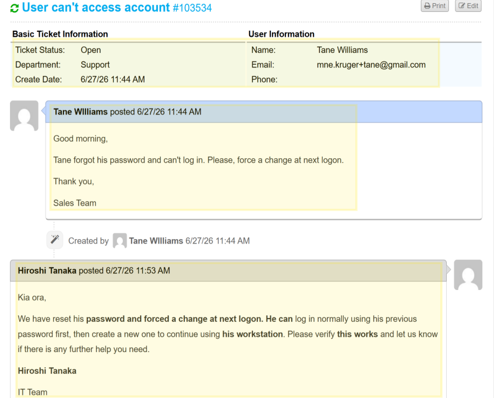

# Ticket 002 – Password Reset


**Ticket ID:** #931872 (osTicket)
**Date:** June 2026
**Requester:** Tane Williams (Sales)
**Assigned To:** Hiroshi Tanaka (Service Desk)
**Help Topic:** Access Issue
**SLA:** Urgent – 4h

---

## Request

A Sales user reported he is unable to log in — he has forgotten his password and needs it reset.

| Field | Detail |
|---|---|
| User | Tane Williams |
| Username | `tane.williams` |
| Department | Sales |
| Issue | Forgotten password — cannot log in |

<!-- SCREENSHOT: osTicket #931872 as submitted (client portal view) -->

*The access request as logged in osTicket.*

---

## Why This Matters at an MSP

Password resets are the single highest-volume ticket at any service desk. Two things make a reset correct rather than just functional:

- **Forced change at next logon** — the temporary password is known to the analyst, so the user must replace it immediately. Skipping this leaves a credential the service desk knows.
- **Identity verification** — in production, the user's identity is verified (and the temp password delivered) through a separate channel before the reset, preventing social-engineering attacks.

---

## Resolution — PowerShell (AKL-DC01)

### Step 1: Confirm account state

```powershell
Get-ADUser -Identity tane.williams -Properties LockedOut, Enabled, PasswordLastSet |
    Format-Table Name, Enabled, LockedOut, PasswordLastSet
```

Confirmed `Enabled = True`, `LockedOut = False` — a forgotten password, not a lockout.

### Step 2: Reset the password

```powershell
$newPass = ConvertTo-SecureString "<TempPassword>" -AsPlainText -Force
Set-ADAccountPassword -Identity tane.williams -Reset -NewPassword $newPass
```

> `-Reset` sets a new password without requiring the old one — the correct flag for a service desk reset.

### Step 3: Force a password change at next logon

```powershell
Set-ADUser -Identity tane.williams -ChangePasswordAtLogon $true
```

> Ensures the user sets their own private password at first login, invalidating the temporary one.

### Step 4: Verify

```powershell
Get-ADUser -Identity tane.williams -Properties PasswordLastSet, PasswordExpired, ChangePasswordAtLogon |
    Format-Table Name, PasswordLastSet, PasswordExpired, ChangePasswordAtLogon
```

`PasswordLastSet` updated to the current time and the account flagged to change at next logon.

<!-- SCREENSHOT: PowerShell showing reset, force-change, and verification -->

*Password reset and forced-change applied and verified on AKL-DC01.*

---

## Resolution — GUI Alternative (ADUC)

1. **Server Manager → Tools → Active Directory Users and Computers**
2. Navigate to the **Sales** OU → right-click **Tane Williams** → **Reset Password**
3. Enter the new temporary password
4. Tick **"User must change password at next logon"** → **OK**

---

## End-to-End Test (WIN11-01)

Logged into WIN11-01 as `tane.williams` with the temporary password. Windows immediately prompted for a new password, confirming both the reset and the forced change.

<!-- SCREENSHOT: WIN11-01 forced password-change prompt at login -->

*Windows prompts Tane to set a new password at first login.*

---

## Ticket Closure

Resolution note posted to the user and the ticket marked Resolved:

> Kia ora Tane, your password has been reset. Please log in with the temporary password provided separately — you'll be prompted to set a new password of your own at first login. Regards, Hiroshi

<!-- SCREENSHOT: osTicket #931872 resolved with the agent reply (agent panel view) -->

*Ticket #931872 resolved in osTicket.*

---

## Timeline

| Time | Event |
|---|---|
| T+0 | Tane reports he cannot log in (#931872) |
| T+0 | Ticket claimed by Hiroshi; account state confirmed (not locked) |
| T+0 | Password reset, forced change at next logon applied |
| T+0 | Verified; end-to-end login test on WIN11-01 |
| T+0 | Resolution note posted, ticket resolved |

---

## Lessons Learned

- Use `Set-ADAccountPassword -Reset` for a forgotten password — it doesn't require the old password.
- **Always** pair a reset with `-ChangePasswordAtLogon $true`; otherwise the service desk retains a working credential.
- Confirm the account isn't *locked* first — a lockout (Ticket 003) is a different fix, and a reset alone won't clear it.
- In production, verify the user's identity and deliver the temp password through a separate channel before resetting.

---

## Related

- [Password Reset Runbook](../runbooks/password-reset.md)