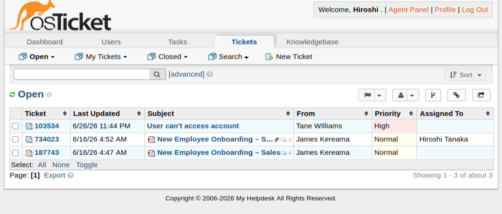

# Ticket 002 – Password Reset


**Ticket ID:** #103534 (osTicket)
**Date:** June 2026
**Requester:** Tane Williams (Sales)
**Assigned To:** Hiroshi Tanaka (Service Desk)
**Help Topic:** Access Issue
**SLA:** Urgent – 4h

---

## Scenario

It's the start of the shift. A new ticket lands in the Support queue, flagged **High** priority against the *Access Issue* topic, so the 4-hour SLA clock is already running. The Sales team has logged it on Tane's behalf:

> **#103534 — User can't access account**
> *"Good morning, Tane forgot his password and can't log in. Please force a change at next logon. Thank you, Sales Team."*

The ticket is **unassigned**, sitting in the shared queue. As the analyst on shift (Hiroshi), I claim it, confirm what's actually wrong, and resolve it.

<!-- SCREENSHOT: osTicket Open queue showing #103534, High priority, unassigned -->

*The ticket arrives in the Open queue — High priority (Access Issue → Urgent–4h SLA), waiting to be claimed.*

<!-- SCREENSHOT: osTicket #103534 thread — request and resolution -->

*The full request as logged by the Sales team.*

| Field | Detail |
|---|---|
| User | Tane Williams |
| Username | `tane.williams` |
| Department | Sales |
| Issue | Forgotten password — cannot log in |

---

## Why This Matters at an MSP

Password resets are the single highest-volume ticket at any service desk. Two things make a reset *correct* rather than just functional:

- **Forced change at next logon** — the temporary password is known to the analyst, so the user must replace it immediately. Skipping this leaves a working credential the service desk knows.
- **Identity verification** — in production, the user's identity is verified (and the temp password delivered) through a separate channel before the reset, preventing social-engineering attacks.

---

## Resolution — PowerShell (AKL-DC01)

### Step 1: Confirm the account state

First, rule out a lockout — a forgotten password and a locked-out account are different problems with different fixes.

```powershell
Get-ADUser -Identity tane.williams -Properties LockedOut, Enabled, PasswordLastSet |
    Format-Table Name, Enabled, LockedOut, PasswordLastSet
```

Confirmed `Enabled = True`, `LockedOut = False` — a genuine forgotten password, not a lockout.

<!-- SCREENSHOT: PowerShell pre-check + reset + force-change commands -->

*Account state confirmed, password reset, and forced change applied on AKL-DC01.*

### Step 2: Reset the password

```powershell
$newPass = ConvertTo-SecureString "<TempPassword>" -AsPlainText -Force
Set-ADAccountPassword -Identity tane.williams -Reset -NewPassword $newPass
```

> `-Reset` sets a new password without requiring the old one — the correct flag for a service desk reset, since the user has forgotten it.

### Step 3: Force a password change at next logon

```powershell
Set-ADUser -Identity tane.williams -ChangePasswordAtLogon $true
```

> Ensures the user sets their own private password at first login, invalidating the temporary one the desk used.

### Step 4: Verify

`ChangePasswordAtLogon` is a *write-only* parameter — it can't be read back with `Get-ADUser`. The actual stored attribute is `pwdLastSet`, which is set to **0** when "must change at next logon" is active:

```powershell
Get-ADUser -Identity tane.williams -Properties PasswordLastSet, PasswordExpired, pwdLastSet |
    Select-Object Name, PasswordLastSet, PasswordExpired,
        @{Name='MustChangeAtLogon';Expression={$_.pwdLastSet -eq 0}}
```

**Result:** `pwdLastSet = 0` (so `MustChangeAtLogon = True`), `PasswordExpired = True`, and `PasswordLastSet` is blank — all three are the correct signature of an armed forced-change. There is no "last set" timestamp until the user sets their own password.

<!-- SCREENSHOT: PowerShell verification — pwdLastSet = 0 -->

*Verification confirms the forced change is armed (pwdLastSet = 0).*

---

## Resolution — GUI Alternative (ADUC)

The same result through the GUI:

1. **Server Manager → Tools → Active Directory Users and Computers**
2. Navigate to the **Sales** OU → right-click **Tane Williams** → **Reset Password**
3. Enter the new temporary password
4. Tick **"User must change password at next logon"** → **OK**

---

## End-to-End Test (WIN11-01)

The real proof is at the login screen. Logged into WIN11-01 as `tane.williams` with the temporary password — Windows immediately blocked sign-in and required a new password, confirming both the reset and the forced change worked.

<!-- SCREENSHOT: WIN11-01 login as tane.williams with temp password -->

*Signing in to WIN11-01 with the temporary password.*

<!-- SCREENSHOT: WIN11-01 "password must be changed before signing in" prompt -->

*Windows enforces the password change before allowing sign-in — the forced-change confirmed end to end.*

---

## Ticket Closure

A resolution note was posted to the requester and the ticket marked Resolved:

> Kia ora, we have reset Tane's password and forced a change at next logon. He can log in using the temporary password first, then create a new one of his own to continue using his workstation. Please verify this works and let us know if there's anything further you need. — Hiroshi Tanaka, IT Team

<!-- SCREENSHOT: osTicket #103534 marked Resolved with the agent reply -->

*Ticket #103534 resolved in osTicket within the 4-hour SLA.*

---

## Timeline

| Time | Event |
|---|---|
| 11:44 AM | Sales team logs ticket #103534 (High priority, Access Issue) |
| — | Hiroshi claims the unassigned ticket from the queue |
| — | Account state confirmed — not locked, just a forgotten password |
| — | Password reset, forced change at next logon applied and verified |
| — | End-to-end login test on WIN11-01 — forced change confirmed |
| 11:53 AM | Resolution note posted, ticket resolved (well within the 4h SLA) |

---

## Lessons Learned

- Use `Set-ADAccountPassword -Reset` for a forgotten password — it doesn't require the old password.
- **Always** pair a reset with `-ChangePasswordAtLogon $true`; otherwise the service desk retains a working credential.
- `ChangePasswordAtLogon` is write-only — verify the result by reading `pwdLastSet` (0 = must change at next logon), not by trying to read the parameter back.
- Confirm the account isn't *locked* first — a lockout (Ticket 003) is a different fix, and a reset alone won't clear it.
- In production, verify the user's identity and deliver the temporary password through a separate, out-of-band channel before resetting.

---

## Related

- [Password Reset Runbook](../runbooks/password-reset.md)