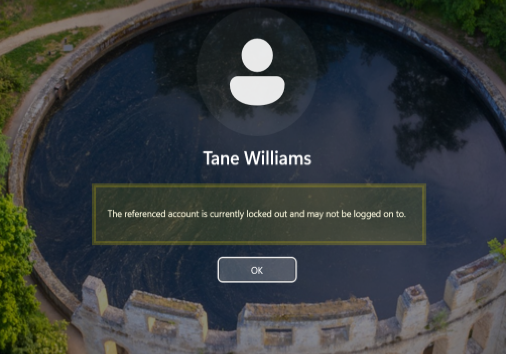
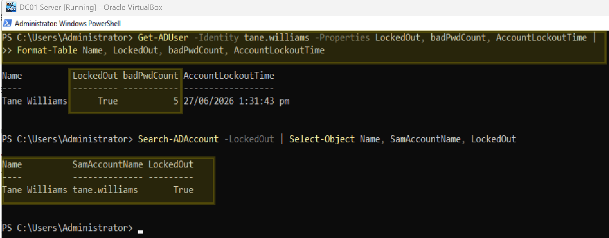
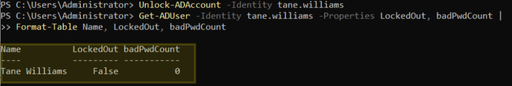
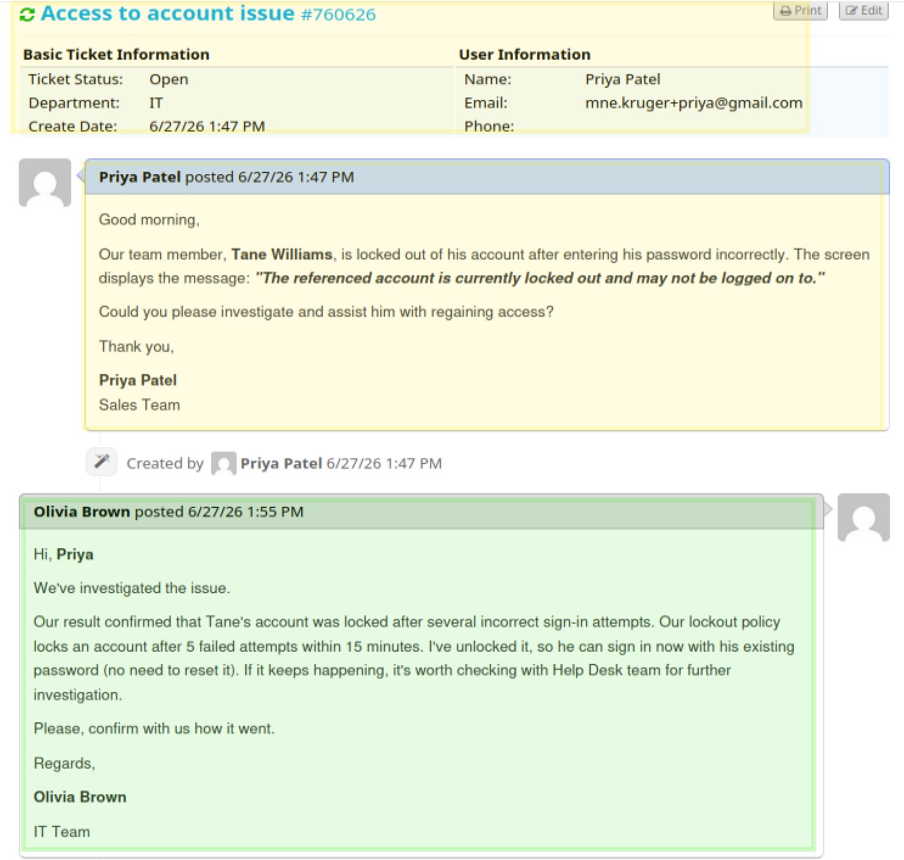
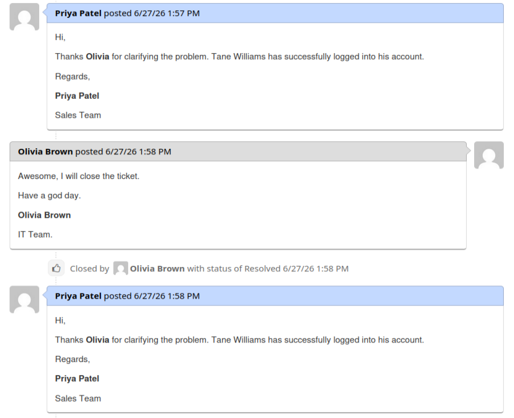

# Ticket 003 – Account Unlock


**Ticket ID:** #760626 (osTicket)
**Date:** June 2026
**Requester:** Tane Williams (Sales)
**Assigned To:** Hiroshi Tanaka (Service Desk)
**Help Topic:** Access Issue
**SLA:** Urgent – 4h

---

## Scenario

A High-priority ticket lands in the Support queue against the *Access Issue* topic — the 4-hour SLA clock is running. Tane can't get into his workstation:

**User can't access account**
`Our team member, Tane Williams, is locked out of his account after entering his password incorrectly. The screen displays the message: "The referenced account is currently locked out and may not be logged on to.`
`Could you please investigate and assist him with regaining access?`

`Thank you,`

`Priya` `Patel`
`Sales Team`


This is a lockout, not a forgotten password which is a different problem with a different fix. As the analyst on shift (Olivia Brown), I claim the ticket, confirmed the lock, unlocked the account, and verified it.

<!-- SCREENSHOT: osTicket request as submitted -->

*The lockout reported in osTicket.*

| Field | Detail |
|---|---|
| User | Tane Williams |
| Username | `tane.williams` |
| Department | Sales |
| Issue | Account locked after repeated failed sign-in attempts |

---

## Why This Matters at an ?

Account lockouts are one of the most frequent service-desk incidents. Handling them well means understanding two things:

- **An unlock is not a reset.** The password is still valid but the account is just temporarily frozen by the lockout policy. Unlock it; don't change the password (unless the user has *also* forgotten it).
- **Investigate repeat lockouts.** A one-off is usually user error (caps lock, wrong password). Repeated lockouts are often a **stale cached credential** — an old password saved on a phone, mapped drive, or scheduled task silently retrying against AD. Unlocking repeatedly without finding the source just delays the next lockout.

---

## The Lockout Policy Being Tested

This ticket exercises the domain lockout policy configured earlier in the lab:

| Setting | Value |
|---|---|
| Account lockout threshold | 5 failed attempts |
| Reset counter after | 15 minutes |
| Lockout duration | 15 minutes |

After 5 bad attempts within the window, the account locks. It auto-unlocks after 15 minutes — but the service desk unlocks it **immediately** so the user isn't left waiting.

---

## Resolution — PowerShell (AKL-DC01)

### Step 1: Confirm the account is locked

```powershell
Get-ADUser -Identity tane.williams -Properties LockedOut, badPwdCount, AccountLockoutTime |
    Format-Table Name, LockedOut, badPwdCount, AccountLockoutTime
```

Confirmed `LockedOut = True` with a recent `AccountLockoutTime` — the lockout policy fired as expected.

> To list every locked account in the domain at once:
> ```powershell
> Search-ADAccount -LockedOut | Select-Object Name, SamAccountName, LockedOut
> ```

<!-- SCREENSHOT: WIN11-01 showing the lockout message after 5 failed attempts -->

*The lockout policy firing on WIN11-01 after five failed sign-in attempts. Pre-check confirms the account is locked.*

### Step 2: Unlock the account

```powershell
Unlock-ADAccount -Identity tane.williams
```

> This clears the lockout flag only. The existing password remains valid — no reset is performed.

### Step 3: Verify

```powershell
Get-ADUser -Identity tane.williams -Properties LockedOut, badPwdCount |
    Format-Table Name, LockedOut, badPwdCount
```

**Result:** `LockedOut = False`. The account is usable again. (`badPwdCount` resets to 0 on the next successful logon or after the observation window — `LockedOut = False` is the confirmation that matters.)

<!-- SCREENSHOT: PowerShell unlock + verification showing LockedOut = False -->

*Account unlocked and verified on AKL-DC01.*

---

## Resolution — GUI Alternative (ADUC)

1. **Server Manager → Tools → Active Directory Users and Computers**
2. Navigate to the **Sales** OU → right-click **Tane Williams** → **Properties**
3. **Account** tab → tick **"Unlock account. This account is currently locked out..."**
4. **Apply → OK**

---

## End-to-End Test (WIN11-01)

Tane signed back into WIN11-01 with his existing password — successful, confirming the unlock and that no password change was needed.

<!-- SCREENSHOT: WIN11-01 successful login after unlock -->

*Tane signs in successfully after the unlock.*

---

## Ticket Closure

A resolution note was posted to the user and the ticket marked Resolved:

<!-- SCREENSHOT: osTicket resolved with the agent reply -->

*Ticket resolved in osTicket within the 4-hour SLA.*

---

## Timeline

| Time | Event |
|---|---|
| T+0 | Tane locks himself out after 5 failed attempts (policy fires) |
| T+0 | Ticket logged (High priority, Access Issue) |
| — | Hiroshi claims the ticket; confirms `LockedOut = True` |
| — | Account unlocked with `Unlock-ADAccount`; verified `LockedOut = False` |
| — | Login confirmed on WIN11-01 |
| — | Resolution note posted, ticket resolved (within 4h SLA) |

---

## Related

- [Account Unlock Runbook](../runbooks/account-unlock.md)
