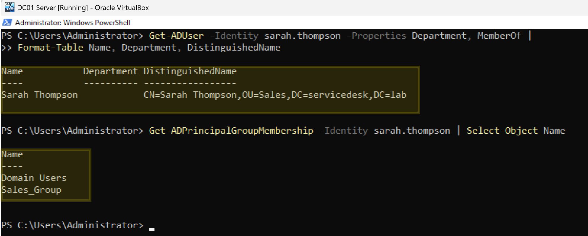
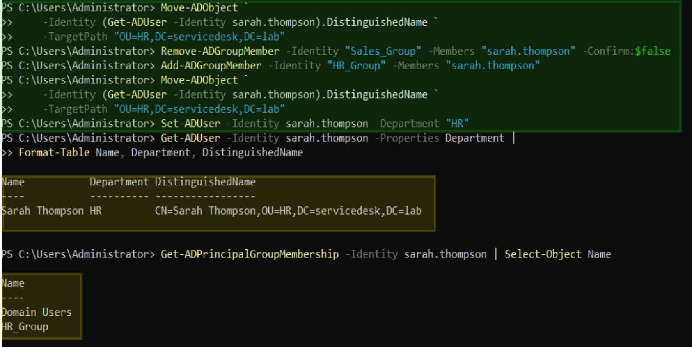
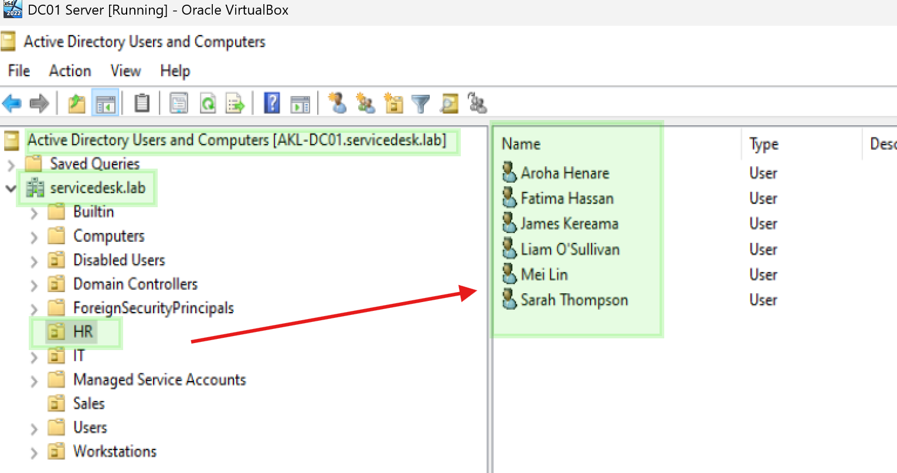
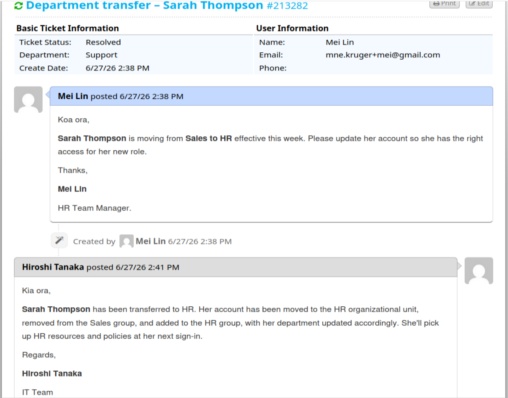

# Ticket 004 – Department Transfer


**Ticket ID:** #213282 (osTicket)
**Date:** June 2026
**Requester:** Mei Lin - HR Department
**Assigned To:** Hiroshi Tanaka (Service Desk)
**Help Topic:** Department Transfer
**SLA:** Standard – 24h

---

## Scenario

A routine ticket lands in the queue against the *Department Transfer* topic. An employee is changing teams:

**Department transfer – Sarah Thompson**
`Hi, Sarah Thompson is moving from Sales to HR effective this week. Please update her account so she has the right access for her new role. Thanks, HR.`

Straightforward on the surface, but it has two halves that must both be done — group membership (resource access) and OU placement (Group Policy). As the analyst on shift (Hiroshi), I update both and verify.

<!-- SCREENSHOT: osTicket request as submitted -->

*The transfer request as logged in osTicket.*

| Field | Detail |
|---|---|
| User | Sarah Thompson |
| Username | `sarah.thompson` |
| From | Sales |
| To | HR |

---

## Why This Matters at an MSP?

A department transfer is two operations, not one:

- **Group membership** controls access to shared resources (folders, apps). Wrong group = no access, or lingering access she shouldn't keep.
- **OU placement** controls which Group Policies apply (drive mappings, restrictions). Wrong OU = old department's policies still apply.

Doing only one half is the classic transfer mistake — e.g. she's in the HR group but still in the Sales OU, so she maps the Sales drive instead of HR's. Both must change together.

---

## Resolution — PowerShell (AKL-DC01)

### Step 1: Confirm current state

```powershell
Get-ADUser -Identity sarah.thompson -Properties Department, MemberOf |
    Format-Table Name, Department, DistinguishedName

Get-ADPrincipalGroupMembership -Identity sarah.thompson | Select-Object Name
```

Confirmed: `OU=Sales`, member of `Sales_Group`.

### Step 2: Swap group membership

```powershell
Remove-ADGroupMember -Identity "Sales_Group" -Members "sarah.thompson" -Confirm:$false
Add-ADGroupMember -Identity "HR_Group" -Members "sarah.thompson"
```

> Removing the old group is as important as adding the new one — leaving stale membership is privilege creep.

### Step 3: Move to the new OU

```powershell
Move-ADObject `
    -Identity (Get-ADUser -Identity sarah.thompson).DistinguishedName `
    -TargetPath "OU=HR,DC=servicedesk,DC=lab"
```

> `Move-ADObject` requires the full distinguished name; wrapping `Get-ADUser` resolves it from the username.

### Step 4: Update the department attribute

```powershell
Set-ADUser -Identity sarah.thompson -Department "HR"
```

> Moving OUs does not update the `Department` attribute — it's a separate label, set explicitly for accurate reporting.

### Step 5: Verify

```powershell
Get-ADUser -Identity sarah.thompson -Properties Department |
    Format-Table Name, Department, DistinguishedName

Get-ADPrincipalGroupMembership -Identity sarah.thompson | Select-Object Name
```

**Result:** `OU=HR`, Department = `HR`, member of `HR_Group` and no longer in `Sales_Group`.

<!-- SCREENSHOT: PowerShell verification — HR OU, HR_Group, Department HR -->

*After: moved to the HR OU, in HR_Group, department updated.*

<!-- SCREENSHOT: GUI verification — HR OU, HR_Group, Department HR -->

*Confirming via GUI.*

---

## Resolution — GUI Alternative (ADUC)

1. **Server Manager → Tools → Active Directory Users and Computers**
2. **Sales** OU → right-click **Sarah Thompson** → **Properties → Member Of** → select `Sales_Group` → **Remove**; **Add** → `HR_Group` → **OK**
3. Right-click Sarah → **Move…** → select the **HR** OU → **OK**
4. **Properties → Organization** tab → set Department to `HR` → **Apply**

---

## Ticket Closure

`Kia ora, Sarah Thompson has been transferred to HR — moved to the HR organizational unit, removed from the Sales group, added to the HR group, and her department updated. She'll pick up HR resources and policies at her next sign-in. Regards, Hiroshi`

<!-- SCREENSHOT: osTicket resolved with the agent reply -->

*Ticket resolved in osTicket.*

---

## Timeline

| Time | Event |
|---|---|
| T+0 | Mei Lin manager at HR submits transfer request for Sarah Thompson |
| — | Hiroshi claims the ticket; captures before state |
| — | Group membership swapped, OU moved, department updated |
| — | Verified: HR OU, HR_Group, Department = HR |
| — | Resolution note posted, ticket resolved |

---

## Related

- [Department Transfer Runbook](../runbooks/department-transfer.md)