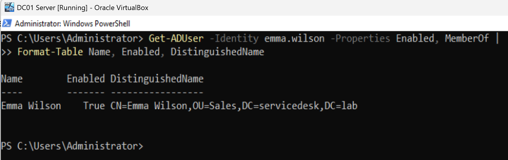
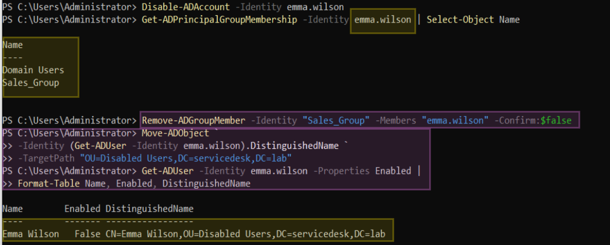
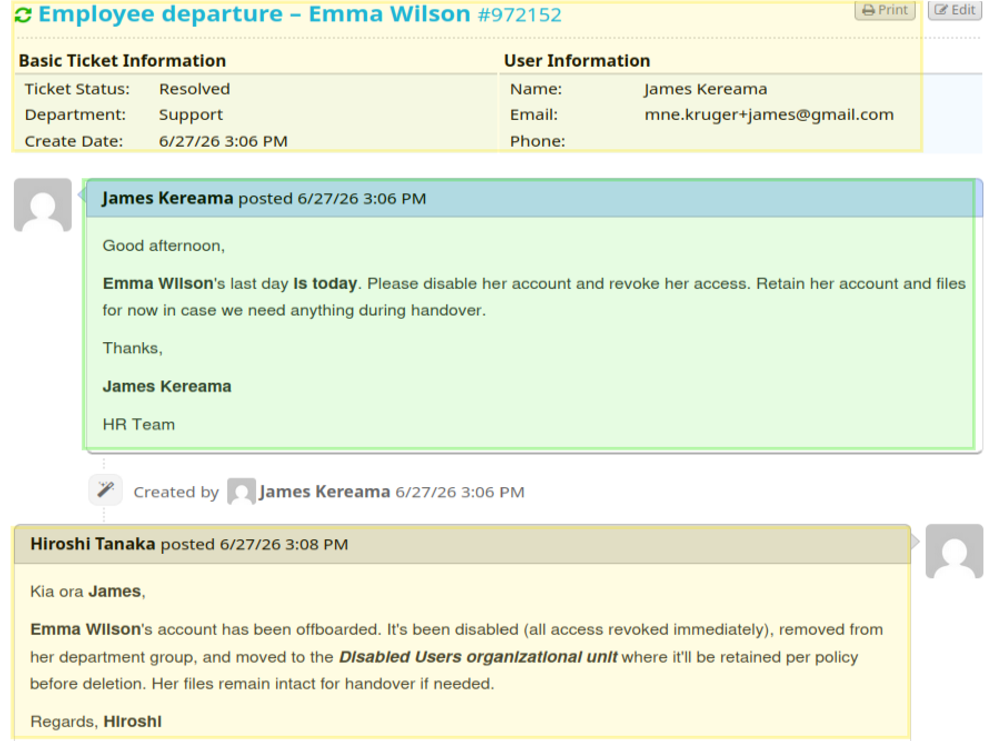

# Ticket 005 – Employee Offboarding


**Ticket ID:** #972152 (osTicket)
**Date:** June 2026
**Requester:** James Mereama from HR Department
**Assigned To:** Hiroshi Tanaka (Service Desk)
**Help Topic:** New Starter / Leaver
**SLA:** Urgent – 4h

---

## Scenario

A ticket arrives from HR — an employee is leaving and their access needs to be revoked:

**Employee departure – Emma Wilson**
`Hi, Emma Wilson's last day is today. Please disable her account and revoke her access. Retain her account and files for now in case we need anything during handover. Thanks, HR.`

Offboarding is security-sensitive and time-critical — revoking access promptly is the priority. As the analyst on shift (Hiroshi), I disabled the account, strip access to it, and quarantined it for retention (in case HR messages in the future saying that employee is returning to her previous position).

| Field | Detail |
|---|---|
| User | Emma Wilson |
| Username | `emma.wilson` |
| Department | Sales |
| Action | Disable, revoke access, retain for handover |

---

## Why This Matters at an MSP

Offboarding is one of the most security-critical tickets a service desk handles — and the sequence matters:

- **Disable, don't delete.** Disabling blocks access immediately but preserves the account's SID, so file and mailbox permissions stay intact for handover, and the account can be restored if the departure reverses. Immediate deletion orphans permissions and is unrecoverable.
- **Speed matters on involuntary departures** — access should be revoked the moment HR gives the word, sometimes before the person has left the building.
- **Retention then deletion** — the disabled account is held in a quarantine OU for a retention period (commonly 30–90 days), then deleted.

---

## Resolution — PowerShell (AKL-DC01)

### Step 1: Confirm the account

```powershell
Get-ADUser -Identity emma.wilson -Properties Enabled, MemberOf |
    Format-Table Name, Enabled, DistinguishedName
```

Confirmed `Enabled = True`, in the Sales OU.

<!-- SCREENSHOT: PowerShell pre-check — enabled, Sales OU -->

*Before: account active in the Sales OU.*

### Step 2: Disable the account

```powershell
Disable-ADAccount -Identity emma.wilson
```

> Revokes all access immediately — the first and most important step. Reversible, unlike deletion.

### Step 3: Document, then remove group access

```powershell
# Record group membership before removing (audit trail)
Get-ADPrincipalGroupMembership -Identity emma.wilson | Select-Object Name

Remove-ADGroupMember -Identity "Sales_Group" -Members "emma.wilson" -Confirm:$false
```

> Capture the groups before stripping them — part of the audit record and useful for provisioning a replacement.

### Step 4: Move to the Disabled Users OU

```powershell
Move-ADObject `
    -Identity (Get-ADUser -Identity emma.wilson).DistinguishedName `
    -TargetPath "OU=Disabled Users,DC=servicedesk,DC=lab"
```

> Quarantines the account out of the active Sales OU, clearly marking it as former staff and halting Sales policy inheritance.

### Step 5: Verify

```powershell
Get-ADUser -Identity emma.wilson -Properties Enabled |
    Format-Table Name, Enabled, DistinguishedName
```

**Result:** `Enabled = False`, now in `OU=Disabled Users`.

<!-- SCREENSHOT: PowerShell verification — disabled, in Disabled Users OU -->

*After: account disabled and moved to the Disabled Users OU.*

---

## Resolution — GUI Alternative (ADUC)

1. **Server Manager → Tools → Active Directory Users and Computers**
2. **Sales** OU → right-click **Emma Wilson** → **Disable Account**
3. **Properties → Member Of** → note groups, then remove `Sales_Group`
4. Right-click Emma → **Move…** → select **Disabled Users** OU → **OK**

---

## Ticket Closure

> Kia ora, Emma Wilson's account has been offboarded — disabled (all access revoked immediately), removed from her department group, and moved to the Disabled Users organizational unit for retention before deletion. Her account and files remain intact for handover. Regards, Hiroshi

<!-- SCREENSHOT: osTicket resolved with the agent reply -->

*Ticket resolved in osTicket.*

---

## Timeline

| Time | Event |
|---|---|
| T+0 | James Mereama from HR submits departure request for the employee Emma Wilson |
| — | Hiroshi claims the ticket; confirms account active |
| — | Account disabled (access revoked); groups recorded then removed |
| — | Moved to Disabled Users OU for retention |
| — | Verified disabled + relocated; resolution posted, ticket resolved |

---

## Related

- [Offboarding Runbook](../runbooks/offboarding.md)