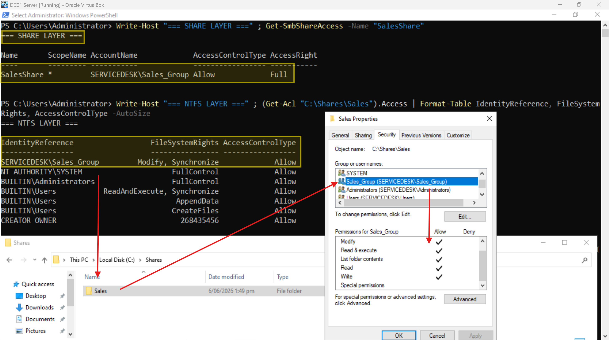
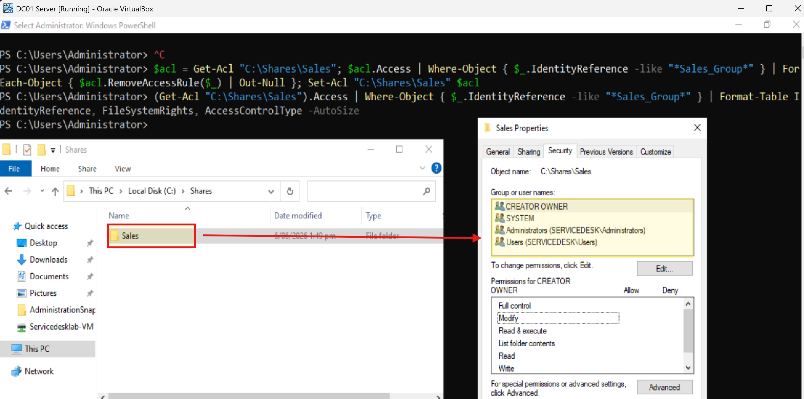
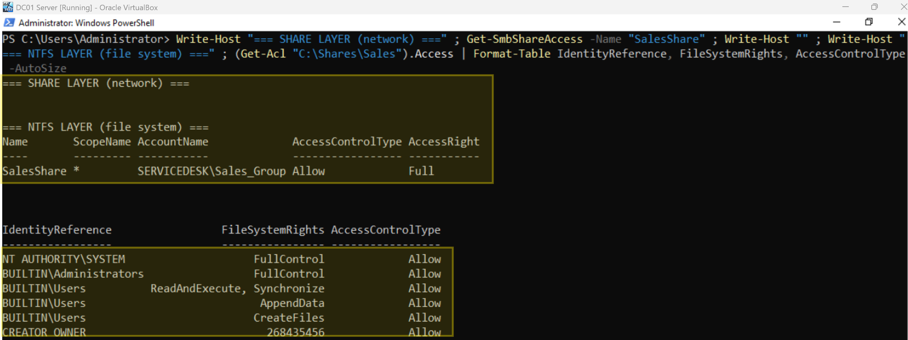
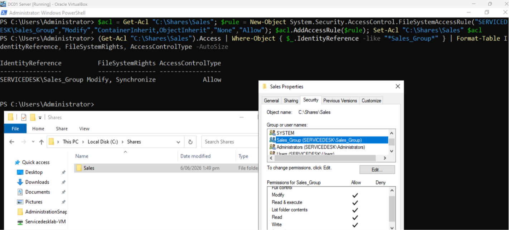
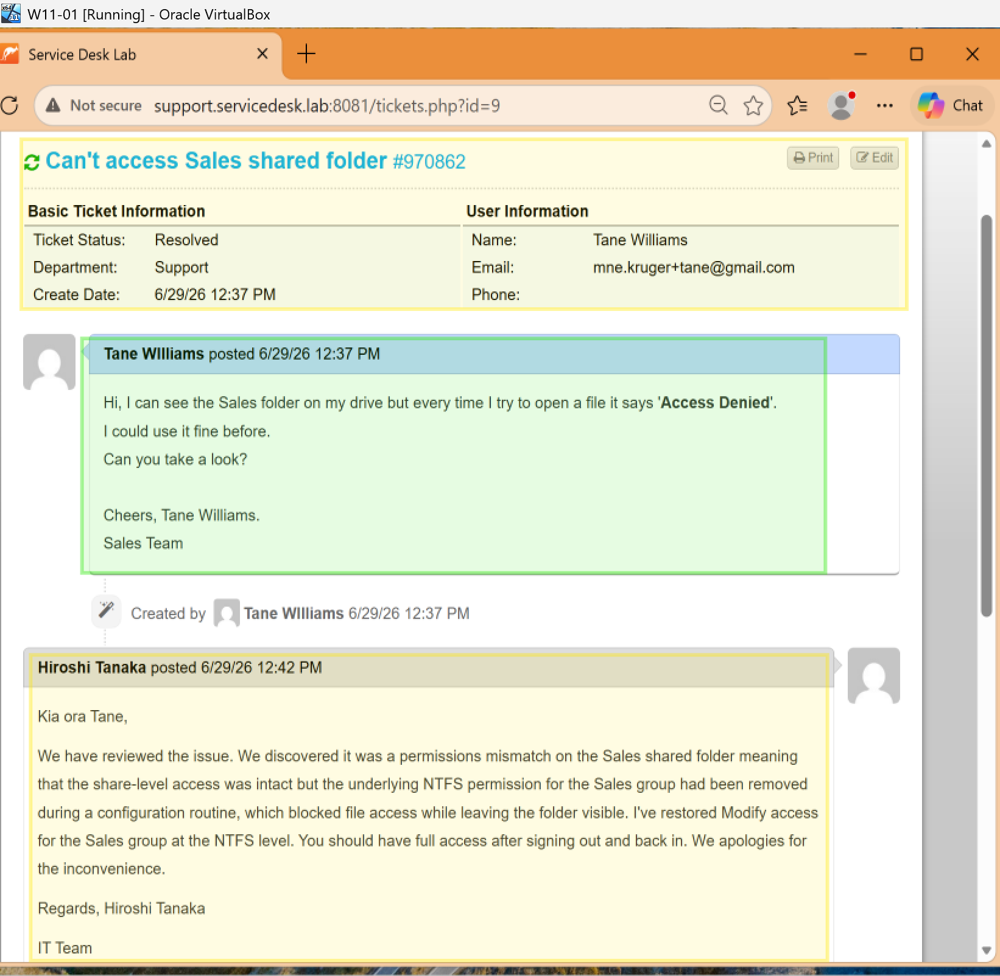

# Ticket 006 – Shared Folder Access


**Ticket ID:** #970862 (osTicket)
**Date:** June 2026
**Requester:** Tane Williams (Sales)
**Assigned To:** Hiroshi Tanaka (Service Desk)
**Help Topic:** Shared Folder Access
**SLA:** Standard – 24h

---

## Scenario

A ticket arrives with the *Shared Folder Access* topic. A Sales user can see the department folder but can't open anything inside it:

**Can't access Sales shared folder**
`Hi, I can see the Sales folder on my drive but every time I try to open a file it says 'Access Denied'. I could use it fine before. Can you take a look? Cheers, Tane.`

The "visible but not openable" symptom points straight at a permissions-layer mismatch. As the analyst on shift (Hiroshi), I diagnose both permission layers, find the gap, and fix it.

| Field | Detail |
|---|---|
| User | Tane Williams |
| Department | Sales |
| Resource | `\\AKL-DC01\SalesShare` → `C:\Shares\Sales` (S: drive) |
| Symptom | Folder visible, files return Access Denied |

---

## Why This Matters at an MSP?

Shared-folder access issues are a service-desk task, and they tells you the following:

- **Two permission layers must both allow access** — Share permissions (network level) and NTFS permissions (file-system level).
- **The effective permission is the most restrictive of the two.** Full Control on the share means nothing if NTFS denies access.
- **The classic symptom** — "I can see the folder but can't open files" — almost always means share access is fine but NTFS is blocking. Knowing to check *both* layers is what separates a quick fix from an hour of guessing.

---

## Resolution — PowerShell (AKL-DC01)

### Step 1: Confirm the healthy baseline

Before the incident, Sales_Group has Modify access at the NTFS layer:

```powershell
(Get-Acl "C:\Shares\Sales").Access |
    Where-Object { $_.IdentityReference -like "*Sales_Group*" } |
    Format-Table IdentityReference, FileSystemRights, AccessControlType -AutoSize
```

Shows `SERVICEDESK\Sales_Group  Modify, Synchronize  Allow`.

<!-- SCREENSHOT: NTFS showing Sales_Group with Modify (healthy state) -->

*Baseline: Sales_Group has Modify access on the Sales folder.*

### Step 2: Diagnose — check both permission layers

When the issue is reported, check the share layer and the NTFS layer together:

<!-- SCREENSHOT: NTFS showing Sales_Group with Modify (healthy state) -->

*Baseline: Sales_Group has lost permissions, this is the reason why Tane submitted a ticket. Compare with the previous picture to confirm.*

```powershell
# Share-level permissions
Get-SmbShareAccess -Name "SalesShare"

# NTFS-level permissions
(Get-Acl "C:\Shares\Sales").Access |
    Format-Table IdentityReference, FileSystemRights, AccessControlType -AutoSize
```

**Finding:** the share grants `SERVICEDESK\Sales_Group → Full`, but the NTFS ACL no longer lists Sales_Group at all. The two layers are out of sync, and NTFS (the more restrictive) wins — producing Access Denied despite the folder being visible.

<!-- SCREENSHOT: both layers — share OK, NTFS missing Sales_Group -->

*Share access is intact but the NTFS permission for Sales_Group is missing. This is the root cause.*

### Step 3: Fix — restore the NTFS permission

```powershell
$acl = Get-Acl "C:\Shares\Sales"
$rule = New-Object System.Security.AccessControl.FileSystemAccessRule(
    "SERVICEDESK\Sales_Group",
    "Modify",
    "ContainerInherit,ObjectInherit",
    "None",
    "Allow"
)
$acl.AddAccessRule($rule)
Set-Acl "C:\Shares\Sales" $acl
```

> `ContainerInherit,ObjectInherit` propagates the permission to all subfolders and files, not just the top-level folder — essential so existing contents become accessible.

### Step 4: Verify

```powershell
(Get-Acl "C:\Shares\Sales").Access |
    Where-Object { $_.IdentityReference -like "*Sales_Group*" } |
    Format-Table IdentityReference, FileSystemRights, AccessControlType -AutoSize
```

**Result:** Sales_Group is restored with `Modify` / `Allow` at the NTFS level.

<!-- SCREENSHOT: NTFS now shows Sales_Group with Modify -->

*NTFS permission for Sales_Group restored — both layers now grant access and you can confirmed via C:\Shares\Sales + Right Click on Folder>Security> It will display current permissions.*

---

## Resolution — GUI Alternative

1. Right-click `C:\Shares\Sales` → **Properties → Security** tab
2. **Edit → Add** → type `Sales_Group` → **Check Names → OK**
3. Tick **Modify** under Allow → **Apply → OK**
4. Cross-check the **Sharing** tab → **Advanced Sharing → Permissions** to confirm the share layer is also correct

---

## Ticket Closure

A resolution note was posted to the requester and the ticket marked Resolved:

`Kia ora, the issue was a permissions mismatch on the Sales shared folder — the share-level access was intact but the underlying NTFS permission for the Sales group had been removed, which blocked file access while leaving the folder visible. I've restored Modify access for the Sales group at the NTFS level. You should have full access after signing out and back in. Regards, Hiroshi`

<!-- SCREENSHOT: osTicket resolved with the agent reply -->

*Ticket resolved and access issue reported in osTicket.*

---

## Timeline

| Time | Event |
|---|---|
| T+0 | Tane reports the Sales folder is visible but files return Access Denied |
| — | Hiroshi claims the ticket; checks both share and NTFS layers |
| — | Root cause found: NTFS missing Sales_Group while the share grants Full |
| — | NTFS Modify permission restored with inheritance |
| — | Verified; ticket resolved within the 24h SLA |

---

## Related

- [Shared Folder Access Runbook](../runbooks/shared-folder-access.md)