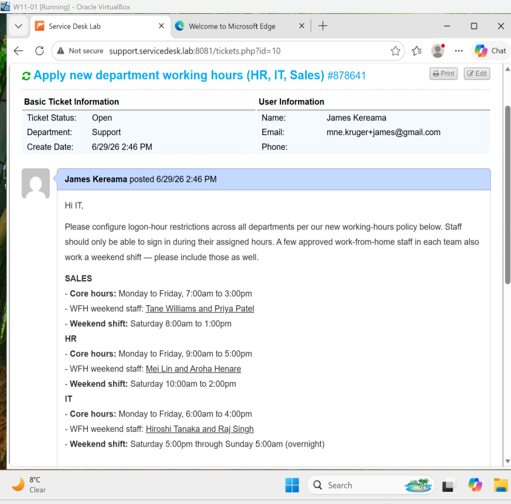
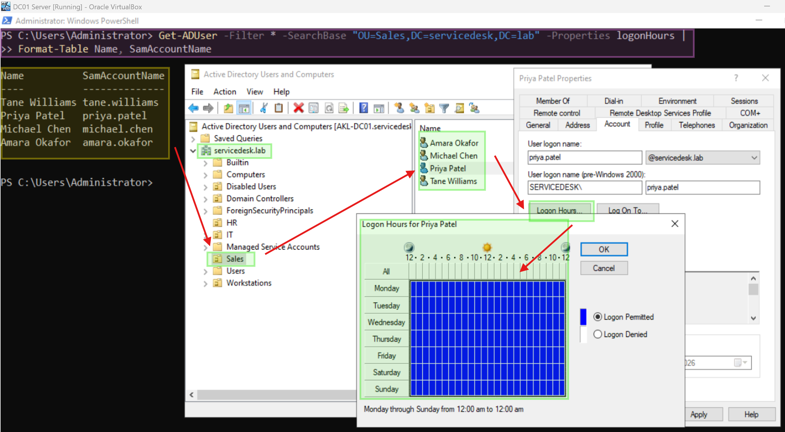
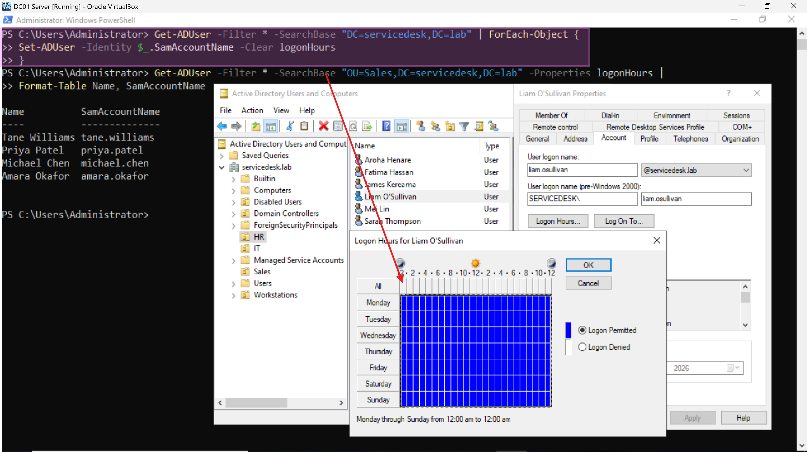
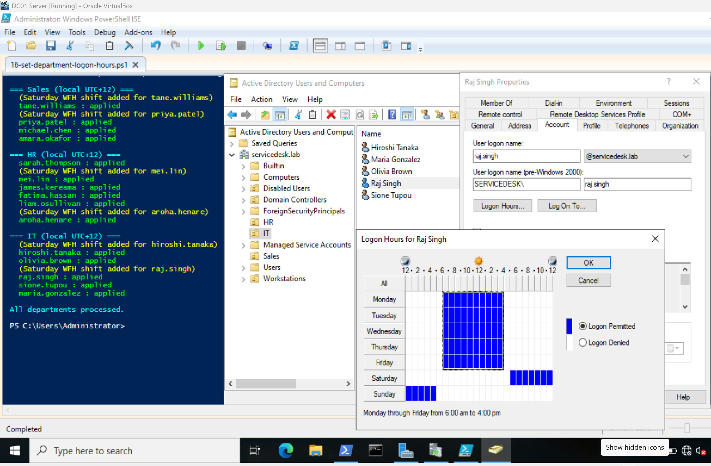
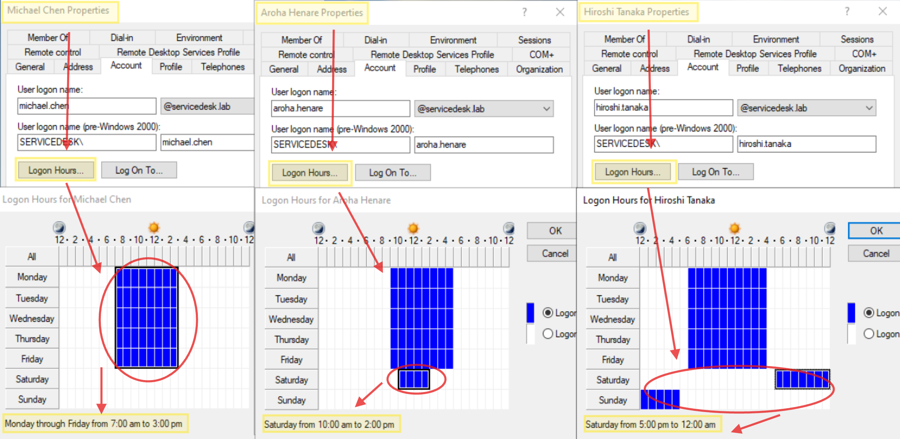
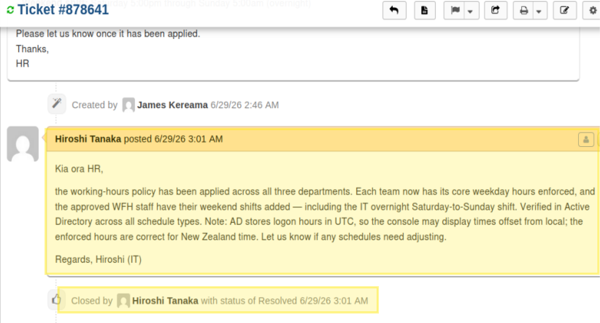

# Ticket 007 – Bulk Logon Hours (Department Schedules + Weekend WFH)


**Ticket ID:** #878641 (osTicket)
**Date:** June 2026
**Requester:** HR Department
**Assigned To:** Hiroshi Tanaka (IT / Service Desk)
**Help Topic:** General Inquiry
**SLA:** Standard – 24h

---

## Scenario

HR has finalised the organisation's working-hours policy for the new financial year (2026) and raised a task with the IT team to enforce it in `Active Directory`. Rather than a single blanket rule, each department has its own core hours, and a small number of staff in each team have an approved work-from-home arrangement that includes a weekend shift for the IT Team (one senior member plus a entry level agent member).

The full requirement HR submitted:

**Task – Apply department working hours (HR → IT)**
Hi IT, please configure logon-hour restrictions across all departments per our new policy below. Staff should only be able to sign in during their assigned hours. A few approved WFH staff in each team also work a weekend shift — please include those. Let us know once it's applied. Thanks, HR."*

| Department | Core hours (Mon–Fri) | WFH weekend staff | Weekend shift |
|---|---|---|---|
| **Sales** | 7:00am – 3:00pm | Tane Williams, Priya Patel | Saturday 8:00am – 1:00pm |
| **HR** | 9:00am – 5:00pm | Mei Lin, Aroha Henare | Saturday 10:00am – 2:00pm |
| **IT** | 6:00am – 4:00pm | Hiroshi Tanaka, Raj Singh | Saturday 5:00pm – Sunday 5:00am (overnight) |

Applying this by hand across 15 users — each with a department base schedule, and 6 of them with an additional weekend block — would be slow and error-prone. As the IT analyst handling the task (Hiroshi), I script it so every account in scope receives exactly the right schedule consistently.

<!-- SCREENSHOT: osTicket task as submitted by HR -->

*The working-hours task as logged by HR for the IT team.*

---
## NOTE:
For this task we are going to use script 16
- [Bulk Department Logon Hours](../scripts/16-set-department-logon-hours.ps1)
Import the script into your DC01 Server VM and run it via PowerShell ISE as Administrator Mode.

---

## Why This Matters at an MSP?

This task is about **automation at scale with real-world complexity** — exactly the kind of work that separates a button-clicker from an analyst:

- **Bulk operations beat per-user clicking.** One OU-scoped script applies the correct schedule to every user in a department identically. Manual entry across 15 users invites missed accounts and inconsistent settings (no imagine how it is for a company with 1000s of workers).
- **Conditional logic per user.** Not everyone gets the same rule — the script applies a department base to all, then *adds* a weekend block only to the named Work From Home staff. This mirrors how real policies actually work.
- **Edge cases must be handled.** The IT weekend shift crosses both midnight *and* the week boundary (Saturday night into Sunday morning). The schedule math has to handle the wrap correctly. This is a good example to put in practice.
- **Consistency is a security property.** A policy applied to "most" of a department leaves gaps. Scripting guarantees full, accurate coverage.

---

## Key to know before running the script: logonHours Is Stored in UTC

Active Directory stores the `logonHours` attribute in **UTC**, not local time. If local hours are written directly, the ADUC grid displays them shifted by the local UTC offset — on a New Zealand domain (UTC+12 in winter) the schedule appears ~12 hours out and wraps across day boundaries (an 8am–6pm rule shows as an overnight, wrong-day block).

This script **converts the specified local hours to UTC before writing**, using a `$UtcOffset` parameter, so the ADUC grid reflects the intended *local* times. New Zealand was in winter (NZST, UTC+12) at the time of application, so `-UtcOffset 12` was used.

> **Reusing this lab from another country:** set `$UtcOffset` to your own offset — e.g. UK `0`, US Eastern `-5`, Sydney `+10`, NZ summer (NZDT) `+13`. The script handles the conversion; you only supply the number.

---

## Start the task — PowerShell (from AKL-DC01)

### Step 1: Allow the script to run (session-scoped)

```powershell
Set-ExecutionPolicy -Scope Process -ExecutionPolicy Bypass
```

> `-Scope Process` applies only to this PowerShell window and reverts on close — it doesn't weaken the server's standing policy.

---

### Step 2: Clear any existing logon hours (clean slate)

```powershell
Get-ADUser -Filter * -SearchBase "DC=servicedesk,DC=lab" | ForEach-Object {
    Set-ADUser -Identity $_.SamAccountName -Clear logonHours
}
```

Confirmed across departments that all users returned to "always permitted" before applying the new policy.


<!-- SCREENSHOT: clear command run; an HR user showing all-permitted baseline -->

*Clean slate: logon hours will look blue for all departments before applying the new schedules.*

---

### Step 3: Apply the full schedule across all departments

**Note:** You can run the command below or execute the .ps1 script via PowerShell ISE as an Administrator.

```powershell
.\16-set-department-logon-hours.ps1 -UtcOffset 12
```

The script applies each department's weekday base to all its users, then adds the weekend block to the named WFH staff. Output confirms all three departments processed, with the Saturday shift flagged for the six WFH users.


<!-- SCREENSHOT: script output for all departments + an IT night-shift grid -->

*All departments processed. The IT night-shift user shows the Saturday-evening block wrapping into Sunday morning.*

---

### Step 4: Verify across all three schedule types

Confirmed in ADUC (each user → **Properties → Account → Logon Hours…**):

| User | Schedule type | Grid summary |
|---|---|---|
| Michael Chen (Sales) | Weekday only | Mon–Fri 7:00am–3:00pm |
| Aroha Henare (HR) | Weekday + Saturday | Mon–Fri 9–5 **and** Sat 10:00am–2:00pm |
| Hiroshi Tanaka (IT) | Weekday + overnight | Mon–Fri 6–4 **and** Sat 5:00pm–Sun 5:00am |

<!-- SCREENSHOT: three ADUC grids side by side proving the three schedule types -->

*Verification of all three schedule types: weekday-only, weekday + Saturday, and the overnight weekend shift.*

---

## How the Script Works

The script uses a per-department definition table and a helper that converts local day/hour blocks into UTC bit positions in the 21-byte `logonHours` array:

- **Weekday base** (Mon–Fri) is applied to every enabled user in the OU.
- **Weekend block** is added only if the user's username is in that department's WFH list.
- **Overnight handling** (IT): the Saturday 17:00–24:00 and Sunday 00:00–05:00 blocks are written as two segments, so the shift correctly spans the week boundary.
- **UTC conversion**: each local slot (`day×24 + hour`) has the offset subtracted and is wrapped into the 0–167 weekly range, so negative results roll back into the previous UTC day.
- **Error handling**: each write is wrapped in try/catch with `-ErrorAction Stop`, so a genuine failure shows red rather than printing a false success.

See [16-set-department-logon-hours.ps1](../scripts/16-set-department-logon-hours.ps1) for the full script.

---

## Ticket Closure

`Kia ora HR, the working-hours policy has been applied across all three departments. Each team now has its core weekday hours enforced, and the approved WFH staff have their weekend shifts added — including the IT overnight Saturday-to-Sunday shift. Verified in Active Directory across all schedule types. Note: AD stores logon hours in UTC, so the console may display times offset from local; the enforced hours are correct for New Zealand time. Let us know if any schedules need adjusting. Regards, Hiroshi (IT)`

<!-- SCREENSHOT: osTicket resolved with the agent reply -->

*Task resolved in osTicket.*

---

## Timeline

| Time | Event |
|---|---|
| T+0 | HR submits the working-hours policy task to IT |
| — | Hiroshi sets session execution policy; clears existing logon hours |
| — | Bulk script applied across all 3 departments with NZ UTC offset |
| — | Verified all three schedule types in ADUC (weekday, weekend, overnight) |
| — | Resolution note posted to HR, task resolved |

---

## Related

- [Bulk Logon Hours Runbook](../runbooks/bulk-logon-hours.md)
- Script: [16-set-department-logon-hours.ps1](../scripts/16-set-department-logon-hours.ps1)
