# Ticket 008 – WSUS Patch Compliance (Client Registration + Update Deployment)


**Ticket ID:** #XXXXXX (osTicket)
**Date:** June 2026
**Requester:** IT Management (Priya – IT Support Manager)
**Assigned To:** Hiroshi Tanaka (IT / Service Desk)
**Help Topic:** General Inquiry
**SLA:** Standard – 24h

---

## Scenario

As part of the quarter's security baseline, IT department raised a patch management task with the service desk to update all the Windows 11 fleet under WSUS patch control. The lab had WSUS installed and synchronised on AKL-DC01 (432 security updates staged, three computer groups created), but **no client had ever reported in** — the WSUS console showed zero managed computers. This walkthrough walks you on every issue I found during the lab deployment and how it was fixed. Please, have in mind that your scenario might differ. Consider this path only as an alternative.

The task: get WIN11-01 reporting to WSUS, approve and deploy a security update through the proper department-targeted workflow, verify the patch installed, and document a repeatable procedure for the team.

> **Task – Establish WSUS patch compliance (IT Management → Service Desk)**
> *"WSUS is synced but the console shows no computers reporting. Please get WIN11-01 registered, deploy a security update to it through the IT group as a test ring, and confirm it installs. Document the procedure so we can repeat it for the other departments. — Priya, IT Support Manager"*

This ticket was the most involved in the lab. The "client not reporting" problem masked a genuine configuration defect, and the deployment phase surfaced a real-world disk-capacity incident — both documented below exactly as they happened.

<!-- SCREENSHOT: osTicket task as submitted by IT management -->

*Patch-compliance task as logged for the service desk.*

---

## Why This Matters at an MSP

Patch compliance is one of the most important duties of a managed-services desk. WSUS is a **local distribution middleman**: updates download from Microsoft to the server **once**, then clients pull from the server over the LAN, saving bandwidth and giving the admin central control over *what* installs and *when*.

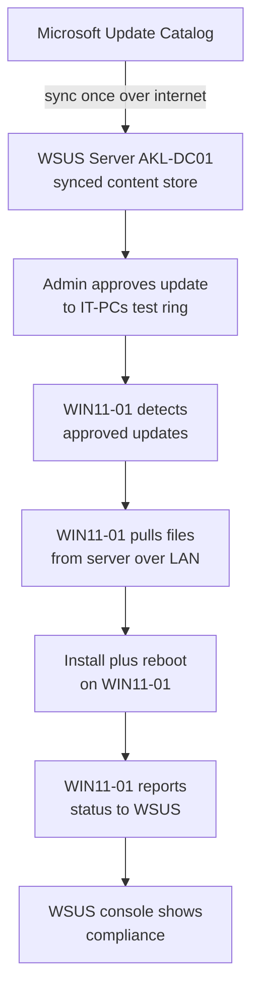

Key principles this ticket exercises:

- **Approval is governance.** Clients can only install what's approved to their group. Approving to **IT-PCs first** (a test ring) before wider rollout mirrors real patch-ring practice.
- **Compliance is provable.** The server reports which machines are patched and which aren't — the difference between "we think we're patched" and "we can show we're patched."
- **Capacity planning is part of the job.** WSUS content can be very large; the system volume must be sized for it.

---

## Part 1 – Root Cause: Client Not Reporting to WSUS

### Symptom

WSUS was healthy server-side — synced, 432 updates staged, last sync **Succeeded** — but the console reported *"no computers are registered to receive updates"* and **Computers: 0**. WIN11-01 never appeared despite the WSUS client GPO being linked at domain level.

### Diagnosis

The WSUS client GPO (`WSUS Client Configuration`) was confirmed applying to WIN11-01: `gpresult` showed it in the applied list, and the client registry held a correct `WUServer = http://AKL-DC01:8530`. Connectivity was fine (`Test-NetConnection ... :8530` → `TcpTestSucceeded: True`) and the Windows Update service was running. Every obvious cause checked out — yet the client still wouldn't report.

The `WindowsUpdate.log` on WIN11-01 exposed the contradiction:

```
Agent  WSUS server: (null)
Agent  Target group: (Unassigned Computers)
```

Despite a correct `WUServer` address, the agent reported the WSUS server as **null** — it wasn't actually *using* WSUS. Checking the client's AU policy key revealed why:

```
NoAutoUpdate : 0
AUOptions    : 3
UseWUServer  : (missing)
```

`UseWUServer` is the value that tells the client to use the intranet WSUS server instead of Microsoft. Without it, the agent ignores `WUServer` entirely and reports null, which is exactly the log symptom.

### Root Cause

The GPO creation script in `09-wsus-setup.md` (and script `18-create-wsus-gpo.ps1`) used `Set-GPRegistryValue` to write **four** registry values — `WUServer`, `WUStatusServer`, `NoAutoUpdate`, `AUOptions` — but **never set `UseWUServer`**. `Set-GPRegistryValue` writes only exactly what it's told; the fifth required value was simply never added. The client faithfully received four values and was missing the one that activates WSUS.

> This is the **same class of silent-omission bug** seen earlier in the lab with the password-policy script — `Set-GPRegistryValue` does precisely what's listed and nothing more, so any omitted value fails silently.

### The Fix (permanent, via GPO)

Added the missing value to the GPO so it applies to every client and survives policy refreshes. On **AKL-DC01**:

```powershell
Set-GPRegistryValue -Name "WSUS Client Configuration" -Key "HKLM\Software\Policies\Microsoft\Windows\WindowsUpdate\AU" -ValueName "UseWUServer" -Type DWord -Value 1

# Verify the GPO now holds all five values
Get-GPRegistryValue -Name "WSUS Client Configuration" -Key "HKLM\Software\Policies\Microsoft\Windows\WindowsUpdate\AU"
```

On **WIN11-01**:

```powershell
gpupdate /force
Get-ItemProperty -Path "HKLM:\SOFTWARE\Policies\Microsoft\Windows\WindowsUpdate\AU" | Select-Object UseWUServer, AUOptions, NoAutoUpdate
# UseWUServer now reads 1

Restart-Service wuauserv -Force
wuauclt /resetauthorization /detectnow
(New-Object -ComObject Microsoft.Update.AutoUpdate).DetectNow()
wuauclt /reportnow
```

`UseWUServer` flipped from blank to `1`, the client re-registered, and WIN11-01 appeared in the WSUS console.

<!-- SCREENSHOT: client AU key showing UseWUServer blank then = 1 after gpupdate -->
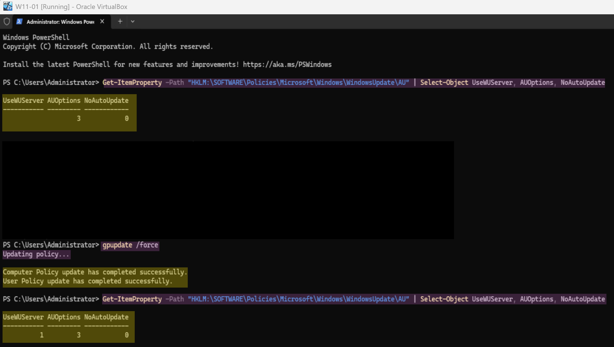
*Root cause and fix in one view: `UseWUServer` blank, then `1` after the corrected GPO applied.*

<!-- SCREENSHOT: GPO now holding all five values incl UseWUServer:1 -->
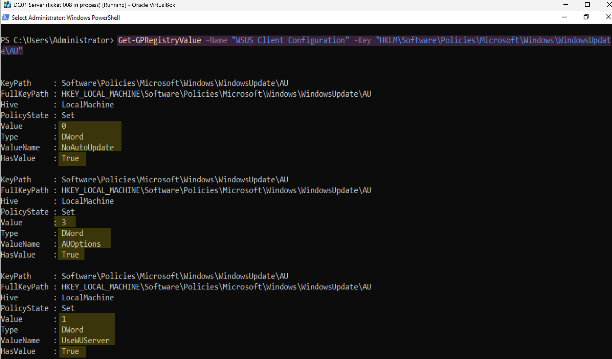
*The permanent fix — `UseWUServer = 1` written into the GPO, not just the client registry.*

<!-- SCREENSHOT: WIN11-01 finally appearing in the WSUS console -->
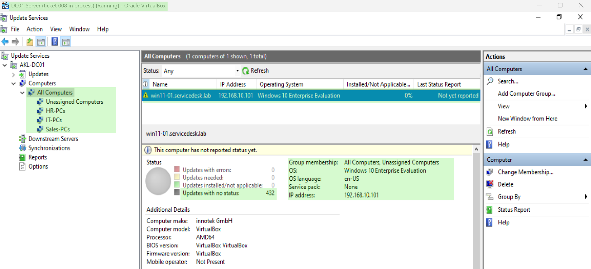
*WIN11-01 registered and reporting to WSUS for the first time.*

---

## Part 2 – Update Approval and Deployment

### Step 1: Baseline, before the implementation

On **WIN11-01**, captured installed patches before deployment:

```powershell
Get-HotFix | Sort-Object InstalledOn -Descending | Select-Object -First 15 HotFixID, Description, InstalledOn
```

<!-- SCREENSHOT: pre-patch hotfix baseline -->
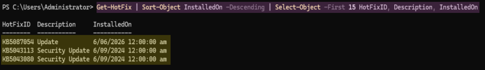
*Installed-update baseline before deployment — the "before" for comparison.*

### Step 2: Move WIN11-01 into the IT-PCs test ring

New clients land in **Unassigned Computers**. WSUS approvals target **groups**, so WIN11-01 was moved into **IT-PCs** (the test ring) via **Change Membership** in the console.

<!-- SCREENSHOT: WIN11-01 moved into IT-PCs group -->
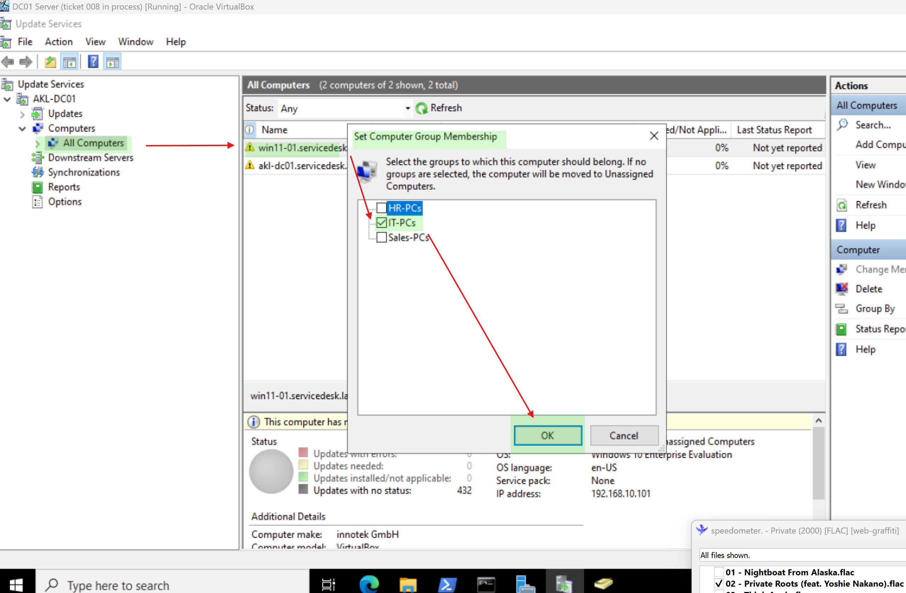
*WIN11-01 placed in the IT-PCs group — the first patch ring.*

### Step 3: Approve a security update to IT-PCs

The 432 staged updates were all **unapproved** — a client only evaluates *approved* updates, so "0 needed" was expected until something was approved.

<!-- SCREENSHOT: unapproved security updates list -->
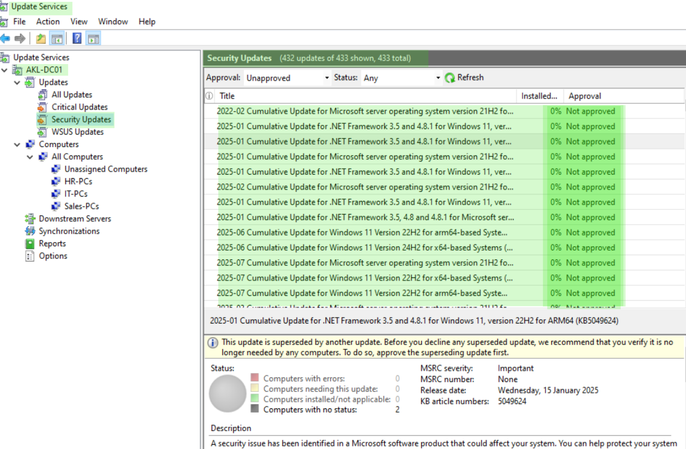
*432 security updates staged but unapproved — nothing for clients to act on yet.*

Filtered to **Windows 11 Version 24H2 for x64-based Systems** (WIN11-01's exact product) and approved a 24H2 x64 cumulative to **IT-PCs → Approved for Install**.

<!-- SCREENSHOT: approve dialog, IT-PCs set to Install -->
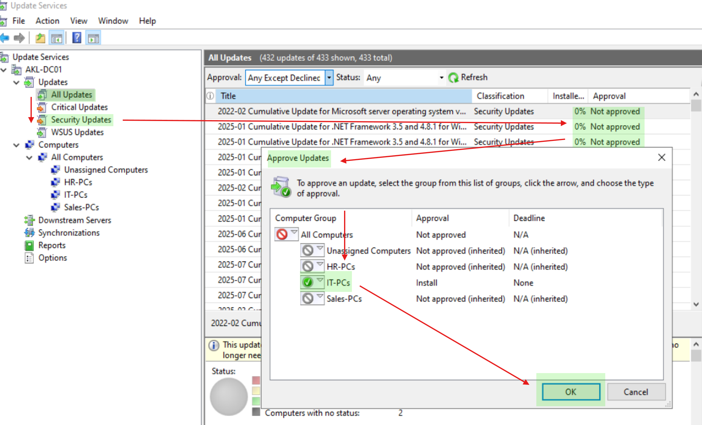
*Update approved for install to IT-PCs only — every other group left inherited / not-approved.*

<!-- SCREENSHOT: 24H2 x64 update showing approved -->
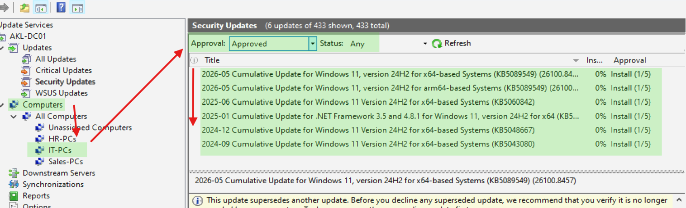
*Approved 24H2 x64 update, queued to download into the server content store.*

### Step 4: Server downloads the content

WSUS must download an approved update's files from Microsoft before clients can pull them. Progress was monitored headlessly with a PowerShell loop — see runbook and script 21:

<!-- SCREENSHOT: content download progress loop -->
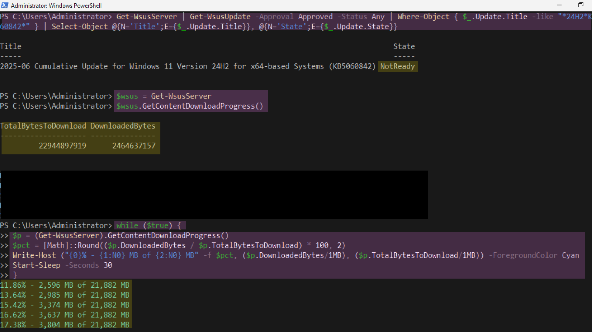
*Server-side content download monitored via PowerShell loop, including a live free-space check.*

### Step 5: Client detects, downloads, and installs

Once content was on the server, WIN11-01 detected the approved update. 

<!-- SCREENSHOT: WIN11-01 installing updates via Windows Update -->
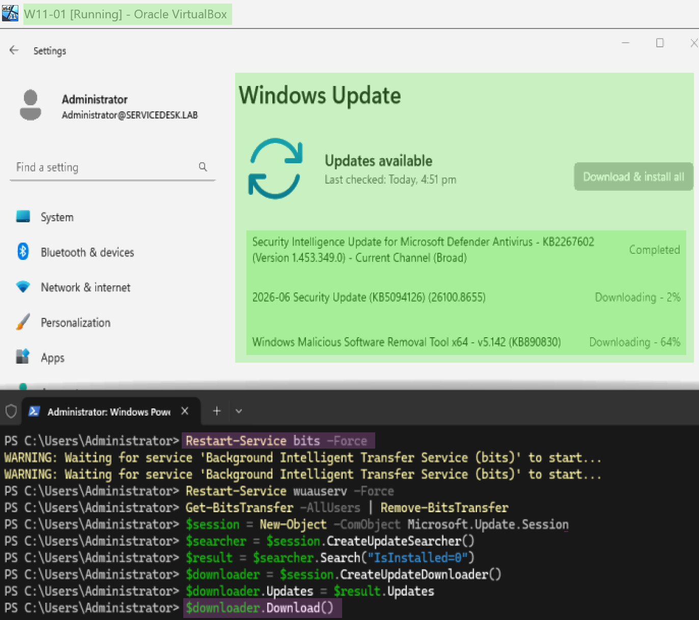
*Approved updates downloading from AKL-DC01 over the LAN and installing on WIN11-01.*

### Step 6: Verify

The client installed the current security rollups, rebooted, and reported back. The WSUS console showed per-update install status populating (no longer 0% / no-status across the board). Post-patch `Get-HotFix` on WIN11-01 showed new security updates (KB5094126, KB5094135) dated the deployment day, on top of the baseline — confirming the install.

<!-- SCREENSHOT: WSUS console showing compliance status populating -->
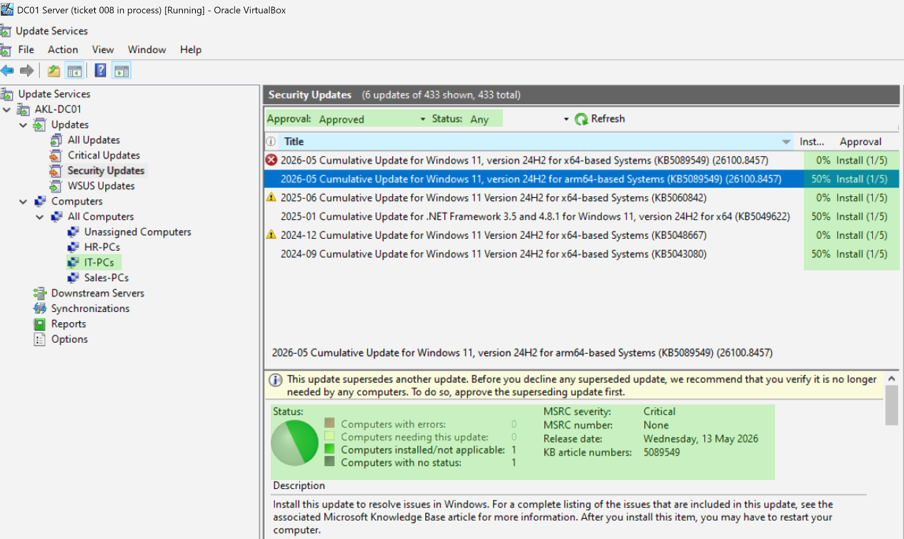
*WSUS receiving real per-update status from WIN11-01 — reporting pipeline confirmed.*

> **Preview / optional update excluded.** A non-security **Preview** update (next month's pre-release cumulative) appeared as optional during deployment. Per patch policy, preview/optional updates are **not** part of standard compliance — only Critical/Security rollups are deployed. It was left uninstalled. Knowing the difference between "an update exists" and "an update should be deployed" is patch governance.

---

## Sub-Incident: WSUS Content Filled the System Volume

During the content download, approving multiple large cumulative updates (~22 GB) **filled the C: drive** (40 GB partition) on AKL-DC01. Every WSUS operation then failed in a cascade — the symptoms looked unrelated until the disk was checked:

| Symptom | Real cause |
|---|---|
| Download stalled at ~68% | No disk space left to write |
| `Get-WsusServer` → HTTP 401, then 503 | WsusPool app pool crashed / stopped (couldn't write) |
| `appcmd set` → *"not enough space on the disk"* | C: at **0 bytes free** |

### Recovery

```powershell
# Confirm the disk is full
Get-PSDrive C | Select-Object Free, Used

# Identify the consumer (C:\WSUS = 24.6 GB, all in WsusContent)
Get-ChildItem "C:\WSUS\WsusContent" -Recurse -File | Measure-Object -Property Length -Sum

# EMERGENCY reclaim (clears downloaded content; WSUS re-downloads only what's approved)
Remove-Item "C:\WSUS\WsusContent\*" -Recurse -Force

# Restart the app pool now that disk is free (Start-IISAppPool may be unavailable; appcmd always works)
C:\Windows\System32\inetsrv\appcmd.exe start apppool "WsusPool"
(Get-WsusServer).GetStatus()
```

### Hardening (prevents the pool crashing under download load)

```powershell
C:\Windows\System32\inetsrv\appcmd.exe set apppool "WsusPool" /processModel.idleTimeout:00:00:00 /recycling.periodicRestart.privateMemory:0
C:\Windows\System32\inetsrv\appcmd.exe recycle apppool "WsusPool"
```

### Proper cleanup (the right way to reclaim space)

```powershell
Invoke-WsusServerCleanup -CleanupObsoleteComputers -CleanupUnneededContentFiles -DeclineSupersededUpdates -DeclineExpiredUpdates -CompressUpdates
```

> Manual content deletion is the **emergency** move, not routine maintenance. The correct long-term reclaim is decline-then-cleanup with `Invoke-WsusServerCleanup`.

---

## Ticket Closure

`Kia ora Priya, WSUS patch compliance is now working end to end. Root cause of the no-reporting issue was the client GPO missing the `UseWUServer` registry value — it had the WSUS address but was never told to use it. Corrected the GPO, WIN11-01 registered, and I deployed a security update through the IT-PCs test ring and confirmed it installed (new KBs verified on the client). I also hit and resolved a disk-capacity issue on the WSUS content volume — documented, with a cleanup routine added to prevent recurrence. The procedure is written up as a runbook for repeating on the other departments. Regards, Hiroshi (IT)`

<!-- SCREENSHOT: osTicket resolved with the agent reply -->

*Task resolved in osTicket.*

---

## Timeline

| Time | Event |
|---|---|
| T+0 | IT management raises WSUS patch-compliance task |
| — | Diagnosed no-reporting: GPO applied but `UseWUServer` missing; client logged "WSUS server: null" |
| — | Added `UseWUServer = 1` to GPO; client registered |
| — | Moved WIN11-01 to IT-PCs; approved 24H2 x64 security update |
| — | Disk-full incident during content download; recovered and hardened WsusPool |
| — | Client installed security rollups via Windows Update; verified with Get-HotFix |
| — | WSUS cleanup; resolution posted |

---

## Lessons Learned

- **`Set-GPRegistryValue` writes only what's listed.** The WSUS GPO set four AU values but omitted `UseWUServer`, so clients had the WSUS address but never used it. Audit registry-writing scripts for *completeness*, not just correctness.
- **"WSUS server: (null)" in WindowsUpdate.log = client isn't using WSUS** despite a correct `WUServer` — check `UseWUServer` first.
- **A client only evaluates *approved* updates.** "0 needed" with nothing approved is normal, not a fault.
- **Approve by group / test ring** (IT-PCs first) — this is patch governance, not just a click.
- **WSUS content is large; size the system volume for it.** Over-approving filled a 40 GB disk and cascaded into app-pool crashes and API failures that *looked* unrelated.
- **Reclaim space the supported way** — `Invoke-WsusServerCleanup`, not manual folder deletion except in emergencies.
- **The Windows Update agent (Settings UI) is more robust than the scripted COM downloader** for pulling approved updates.
- **Exclude preview / optional updates** from compliance — deploy Critical/Security rollups only.

---

## Related

- [WSUS Patch Approval Runbook](../runbooks/wsus-patch-approval.md)
- [WSUS Setup](../docs/09-wsus-setup.md) *(corrected — see UseWUServer note)*
- Script: [21-monitor-wsus-download.ps1](../scripts/21-monitor-wsus-download.ps1)