# Ticket 009 – Software Deployment via GPO (7-Zip)


**Ticket ID:** #741355 (osTicket)
**Date:** July 2026
**Requester:** IT Management (Priya – IT Support Manager)
**Assigned To:** Hiroshi Tanaka (IT / Service Desk)
**Help Topic:** General Inquiry
**SLA:** Standard – 24h

---

## Scenario

IT management wants the **7-Zip** archive utility installed across the IT team's workstations, so staff don't install it manually — which leads to inconsistent versions and unmanaged software. The request comes to the service desk: deploy 7-Zip to the managed workstations automatically, so it is present for all users without anyone touching each machine by hand.

<!-- SCREENSHOT: osTicket task as submitted by IT management -->
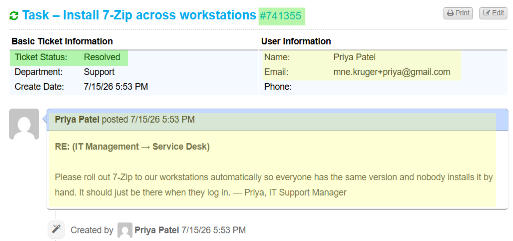
*Software standardisation task as logged for the service desk.*

The key technical point this ticket demonstrates is the **distinction between patching and software distribution**:

- **WSUS** (Ticket 008) patches *Microsoft* products. It **cannot** deploy third-party software.
- **GPO Software Installation** deploys third-party `.msi` packages to domain machines automatically.

Two different tools for two different jobs, a distinction people often gets mistaken.

---

## How Computer-Assigned MSI Deployment Works

GPO Software Installation is a **built-in Active Directory feature** — nothing to install. Assigning an MSI to *computers* makes it install automatically at startup, for all users, before anyone logs in.

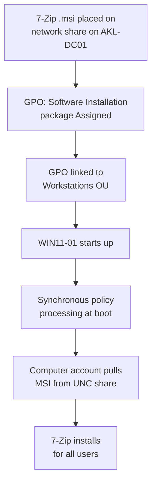

Two things are non-obvious and caused the troubleshooting during this ticket:

1. The MSI must be referenced by a **UNC network path** (`\\AKL-DC01\Software\...`), because the *computer account* pulls it at startup in a local path (`C:\...`), which makes the client look on its own drive and fail.
2. Computer-assigned software installs during **synchronous foreground policy processing** at boot. Windows 11's default asynchronous ("Fast Logon") processing skips it.

---

## Part 1 – Build the Deployment

### Phase 1: Create the software share

GPO Software Installation needs the MSI on a **network share the computer accounts can read** (they pull it at startup, before any user logs in). A local path won't work — it must be a UNC path.

Downloaded the 64-bit 7-Zip `.msi` onto AKL-DC01.

<!-- SCREENSHOT: downloading the 7-Zip MSI on DC01 -->
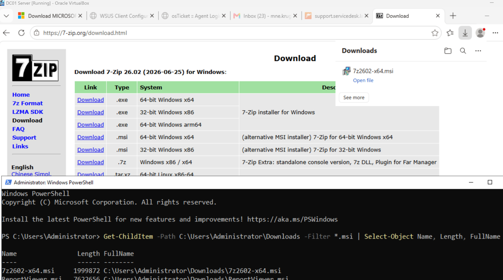
*Obtaining the 64-bit 7-Zip .msi — GPO Software Installation only accepts .msi packages, not .exe.*

Created the folder that will host and share the package.

<!-- SCREENSHOT: creating the C:\Software directory to be shared -->
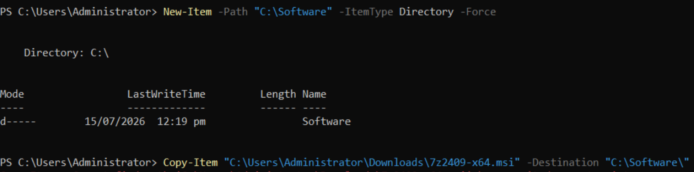
*Creating `C:\Software`, the folder to be shared for package distribution.*

Created the SMB share and granted **Domain Computers** read access — critical, because the computer account (not the user) installs the software at startup.

```powershell
New-SmbShare -Name "Software" -Path "C:\Software" -ReadAccess "Domain Computers","Domain Users"
Get-SmbShareAccess -Name "Software"
Test-Path "\\AKL-DC01\Software\7z2602-x64.msi"   # expect True
```

<!-- SCREENSHOT: share created, Domain Computers read access, UNC path resolves True -->
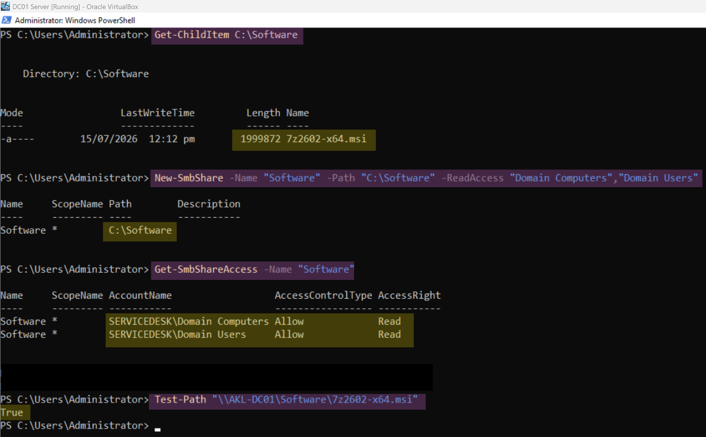
*Share created as `\\AKL-DC01\Software` with Domain Computers read access; UNC path to the MSI resolves True.*

### Phase 2: Create the Software Installation GPO

Created an empty GPO named **Deploy 7-Zip**.

<!-- SCREENSHOT: creating the Deploy 7-Zip GPO with the MSI -->
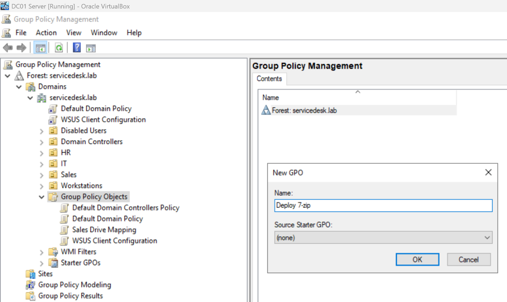
*New GPO created for the 7-Zip software deployment.*

Edited the GPO → **Computer Configuration → Policies → Software Settings → Software installation → New → Package**, and selected the MSI.

<!-- SCREENSHOT: selecting the MSI file in the package dialog -->
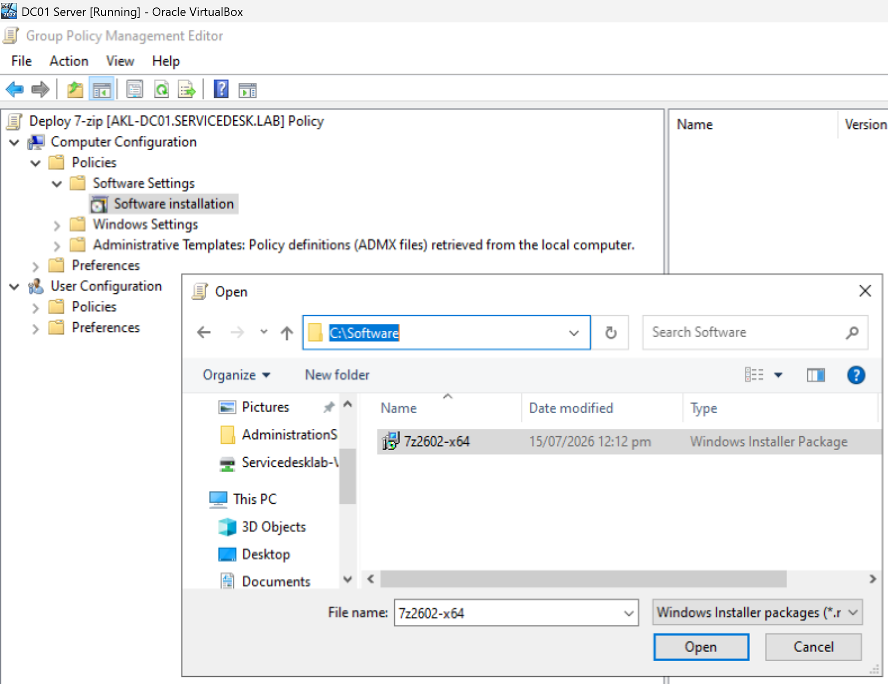
*Adding the 7-Zip MSI as a new Software Installation package.*

Chose **Assigned** deployment — computer-assigned software installs automatically at startup for all users.

<!-- SCREENSHOT: MSI assigned confirmation -->
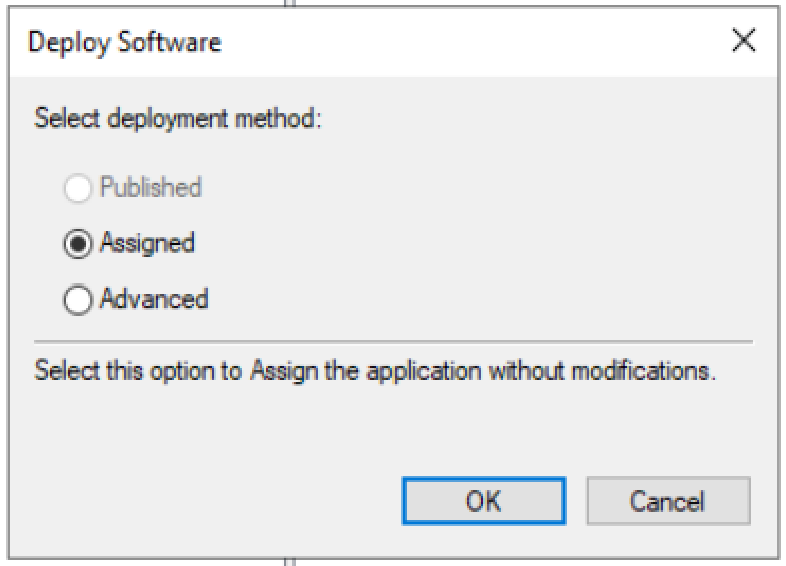
*Package set to Assigned — the deployment type that auto-installs at startup.*

The package now appears in the Software installation pane.

<!-- SCREENSHOT: package listed as assigned in the editor -->
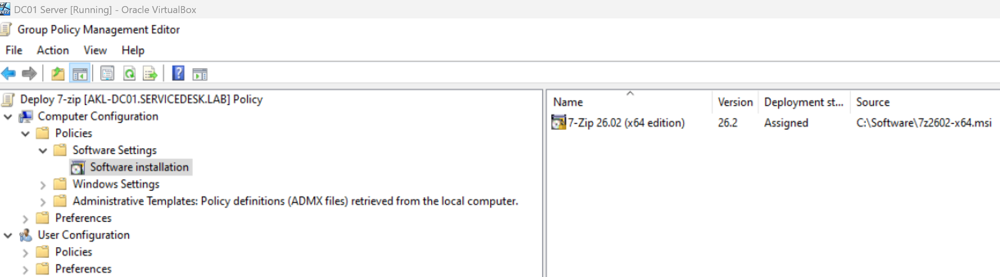
*7-Zip 26.02 (x64) assigned in the GPO's Software installation node.*

### Phase 3: Link the GPO to the correct OU

A computer-assigned GPO applies based on where the **computer object** lives — not the user's department. Checking WIN11-01's location was essential:

```powershell
Get-ADComputer WIN11-01 | Select-Object Name, DistinguishedName
# CN=WIN11-01,OU=Workstations,DC=servicedesk,DC=lab
```

WIN11-01's computer object is in the **Workstations** OU (not IT — the user accounts are in IT/HR/Sales, but the computer objects live in Workstations). So the GPO was linked to **Workstations**.

<!-- SCREENSHOT: GPO linked to the Workstations OU -->
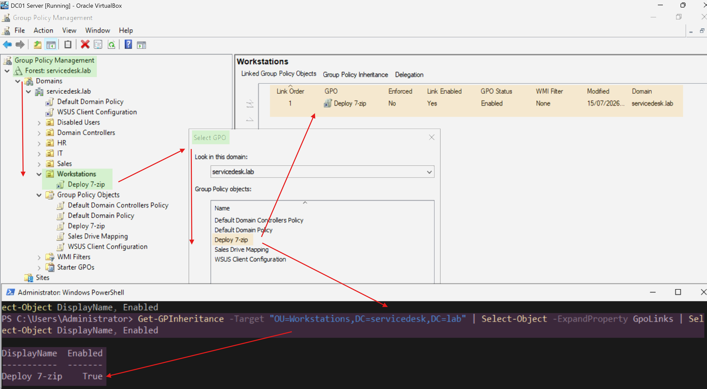
*Deploy 7-Zip linked to the Workstations OU, where WIN11-01's computer object resides.*

---

## Part 2 – Troubleshooting: The Install That Wouldn't Run

The build was correct, but the first deployment attempts failed silently. This section documents the full diagnostic path — three distinct issues, each found and fixed methodically.

### Issue 1: Nothing installs after reboot

Ran `gpupdate /force` on WIN11-01. It reported that software installation changes must be processed before startup and prompted to restart — the expected behaviour, since computer-assigned software installs at boot.

<!-- SCREENSHOT: gpupdate /force showing the pre-startup processing warning + restart prompt -->
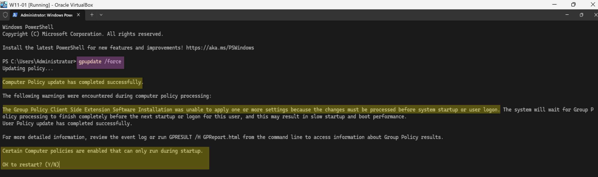
*gpupdate flags that software installation must process before startup, prompting a restart.*

After rebooting, 7-Zip still didn't install. Verified the fundamentals — all of which checked out:

- The client **could reach** the MSI: `Test-Path "\\AKL-DC01\Software\7z2602-x64.msi"` → **True**
- The GPO **was applying**: `gpresult /scope computer /r` listed **Deploy 7-zip** under Applied Group Policy Objects.

<!-- SCREENSHOT: Test-Path True + gpresult showing Deploy 7-zip applied -->
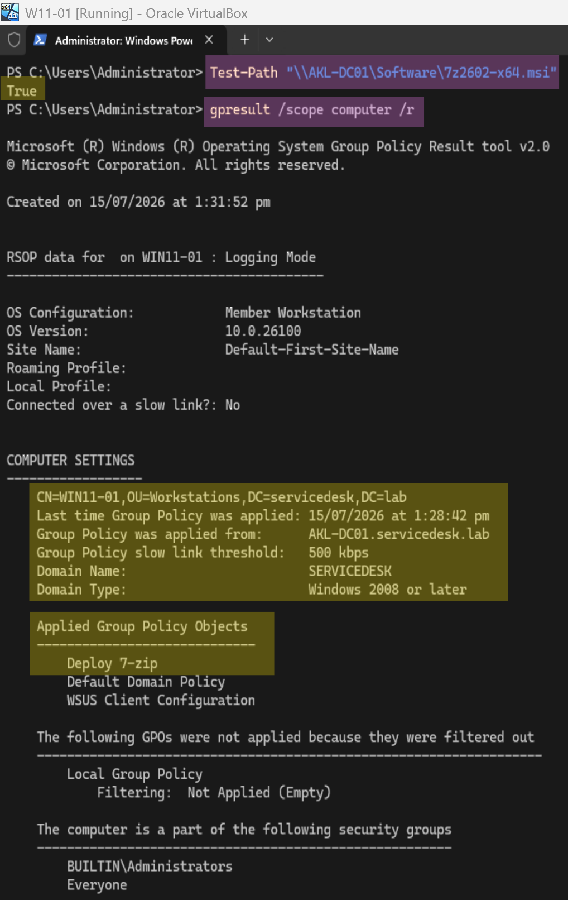
*The contradiction: the GPO applies and the client can reach the MSI — yet nothing installs.*

But the program was absent, and the MSI event log showed only a one-second begin/end transaction during gpupdate (package advertisement) — no actual boot-time install.

<!-- SCREENSHOT: 7zFM.exe False, empty uninstall hive, MSI advertise-only events -->
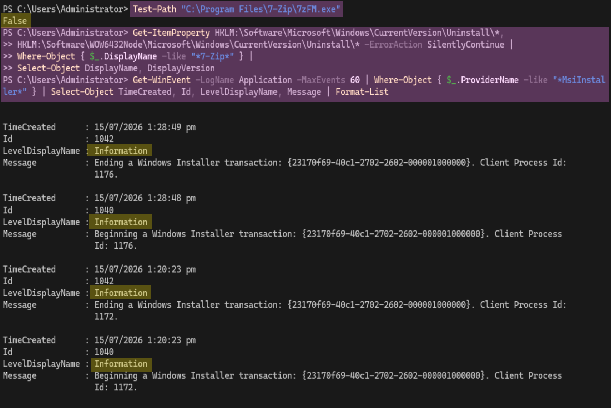
*7-Zip absent from disk and registry; MSI events show only package advertisement, not a boot-time install.*

### Issue 2: Fast Logon Optimization skipping the boot-time install

Windows 11 defaults to **asynchronous** Group Policy processing at boot (Fast Logon Optimization) — it doesn't wait for the network before showing the login screen. But GPO Software Installation **requires synchronous foreground processing**: the machine must wait at boot, contact the DC, and install before login.

Fix: enable **"Always wait for the network at computer startup and logon"** (`SyncForegroundPolicy = 1`) in the GPO.

```powershell
Set-GPRegistryValue -Name "Deploy 7-Zip" -Key "HKLM\SOFTWARE\Policies\Microsoft\Windows NT\CurrentVersion\Winlogon" -ValueName "SyncForegroundPolicy" -Type DWord -Value 1
Get-GPRegistryValue -Name "Deploy 7-Zip" -Key "HKLM\SOFTWARE\Policies\Microsoft\Windows NT\CurrentVersion\Winlogon"
```

<!-- SCREENSHOT: SyncForegroundPolicy = 1 set in the GPO -->
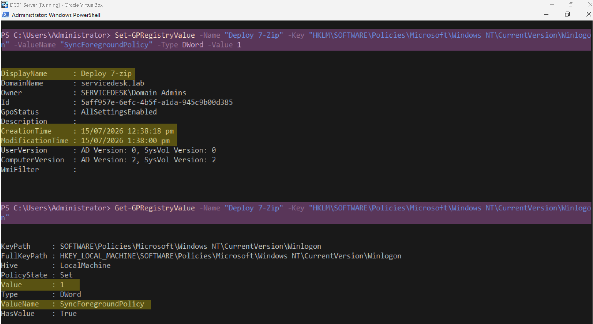
*Forcing synchronous foreground policy processing so software installation runs at boot.*

### Issue 3: Error 1612 — installation source absent

With sync processing enabled, the boot-time install **now ran** — and failed with a precise error. The Application Management Group Policy event log showed:

```
301: The assignment of application 7-Zip 26.02 (x64 edition) ... succeeded.
102: The install of application 7-Zip ... failed. The error was : %%1612
303: The removal of the assignment ... succeeded.   ← rolled back
```

**Error 1612 = ERROR_INSTALL_SOURCE_ABSENT** — the installer could not find the MSI. The Group Policy operational log confirmed the boot was now *Foreground synchronous*, so processing was correct — the source itself was the problem.

<!-- SCREENSHOT: event log showing 301 -> 102 (1612) -> 303 rollback -->
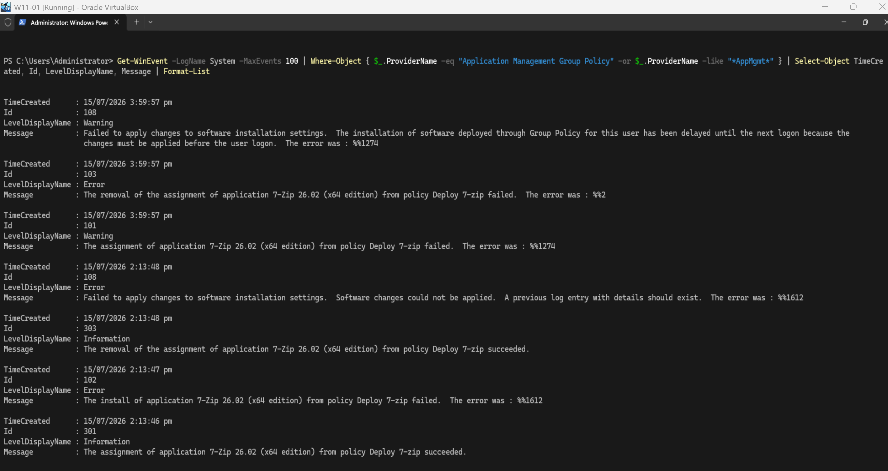
*The smoking gun: install fails with 1612 (source absent) and rolls the assignment back every boot.*

**Root cause:** the GPO had stored a **local path** for the package instead of the UNC path. The GPO report revealed it directly:

```xml
<q1:Path>C:\Software\7z2602-x64.msi</q1:Path>
```

The client was looking for the MSI on **its own** `C:\Software` — which doesn't exist on the client — so the source was absent. `Test-Path` from an admin session had passed only because it tested the *share*, not the path the *GPO recorded*.

**Fix:** removed the package from the GPO and re-added it, typing the full UNC path `\\AKL-DC01\Software\7z2602-x64.msi` in the File name box. Verified the stored path in the GPO report **before** rebooting:

```powershell
(Get-GPOReport -Name "Deploy 7-Zip" -ReportType Xml | Select-String -Pattern "<q1:Path>").ToString().Trim()
# <q1:Path>\\AKL-DC01\Software\7z2602-x64.msi</q1:Path>
```

<!-- SCREENSHOT: GPO report now showing the UNC path -->
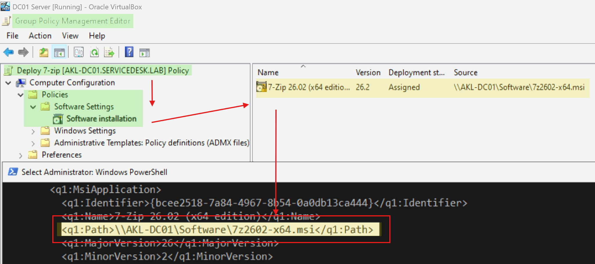
*Package path corrected to the UNC network path — the fix for error 1612.*

### Environment note: host virtualization

During the final reboots, WIN11-01 ran extremely slowly and hung on boot. Cause: host **Memory Integrity (VBS/HVCI)** was forcing VirtualBox into software emulation (no hardware virtualization). This was a host-level performance constraint, independent of the GPO configuration — the deployment was already validated correct. Once resolved on the host, the VM booted at normal speed and the install completed.

---

## Part 3 – Verification

After the corrected path and a clean boot, 7-Zip installed successfully for all users:

```powershell
Test-Path "C:\Program Files\7-Zip\7zFM.exe"   # True
Get-WinEvent -LogName System -MaxEvents 20 | Where-Object { $_.ProviderName -eq "Application Management Group Policy" } | Select-Object TimeCreated, Id, LevelDisplayName, Message | Format-List
# Event 308: Changes to software installation settings were applied successfully.
```

<!-- SCREENSHOT: Test-Path True + event 308 success -->
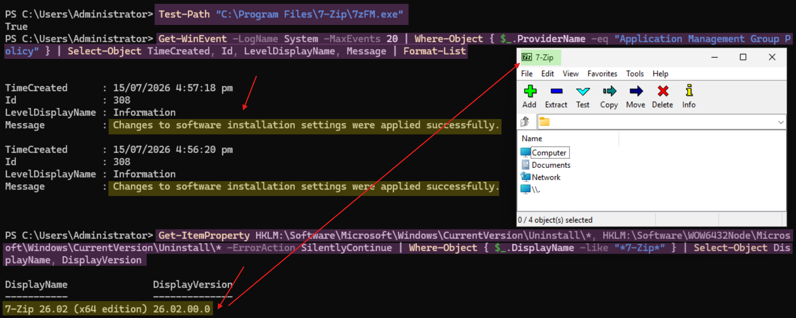
*7-Zip present on disk and event 308 confirms software installation applied successfully — no more 1612.*

---

## Ticket Closure

<!-- SCREENSHOT: osTicket resolved -->
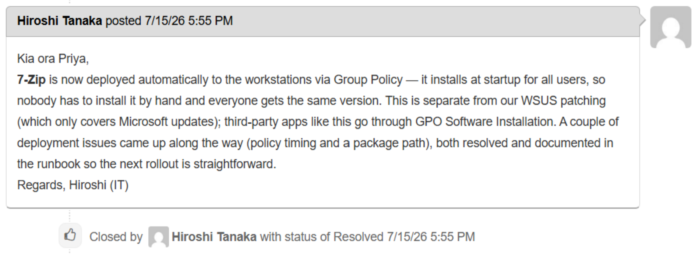
*Task resolved in osTicket.*

---

## Timeline

| Time | Event |
|---|---|
| T+0 | IT management requests 7-Zip installed across workstations |
| — | Created software share (Domain Computers read); staged the MSI |
| — | Created Deploy 7-Zip GPO, assigned the package, linked to Workstations OU |
| — | First reboot: nothing installed despite GPO applying and share reachable |
| — | Diagnosed Fast Logon Optimization; enabled synchronous foreground processing |
| — | Install ran but failed with error 1612 (source absent) |
| — | Root cause: GPO stored a local path, not the UNC path; corrected and verified |
| — | Clean boot: 7-Zip installed for all users; event 308 confirms success |

---

## Lessons Learned

- **WSUS patches Microsoft products; GPO Software Installation deploys third-party MSIs.** Different tools, different jobs — don't conflate them.
- **The package must be referenced by a UNC path**, not a local path. When adding the package, *type* `\\SERVER\Share\file.msi` — don't browse to the local folder. A stored `C:\...` path causes **error 1612 (source absent)** because the client looks on its own drive.
- **Verify the stored path in the GPO report *before* the first deployment reboot:** `Get-GPOReport ... | Select-String "<q1:Path>"`. `Test-Path` from an admin session proves the *share* works but says nothing about what path the *GPO recorded* — that gap cost several reboots.
- **Computer-assigned software needs synchronous foreground policy processing.** Windows 11's default async (Fast Logon) processing skips it — enable **"Always wait for the network at computer startup and logon"** (`SyncForegroundPolicy = 1`).
- **Link to where the *computer object* lives.** Computer-assigned GPOs follow the computer's OU (Workstations here), not the user's department OU.
- **Grant the share/NTFS read to Domain Computers**, not just users — the computer account performs the install at startup.
- **The Application Management Group Policy event log is the definitive source** for install failures — it names the exact error code (1612) and the assignment/removal sequence.

---

## Related

- [Software Deployment Runbook](../runbooks/software-deployment.md)
- Ticket: [WSUS Patch Compliance](../tickets/ticket-008-WSUS-patch-management.md) *(the patching counterpart — Microsoft updates vs third-party software)*